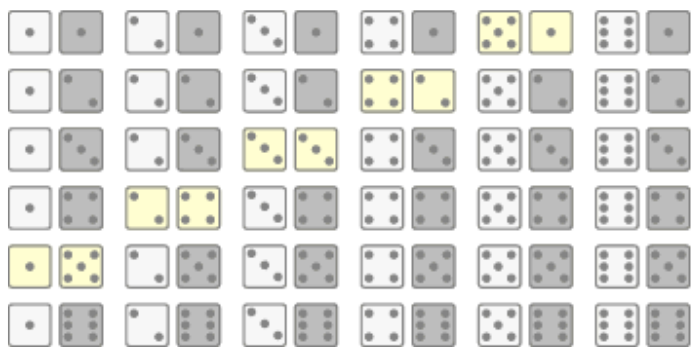
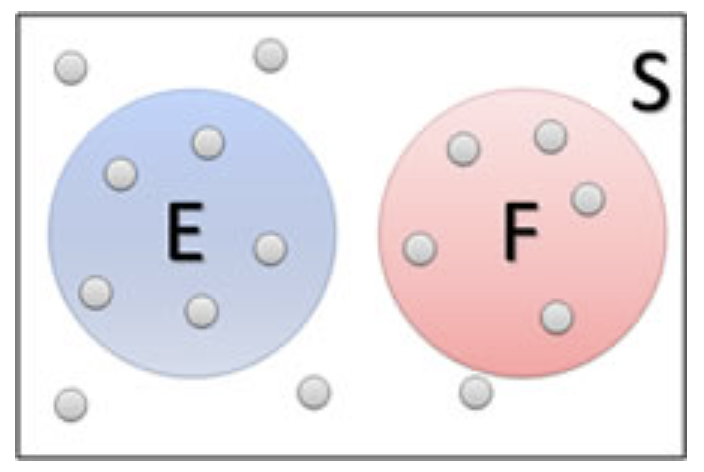
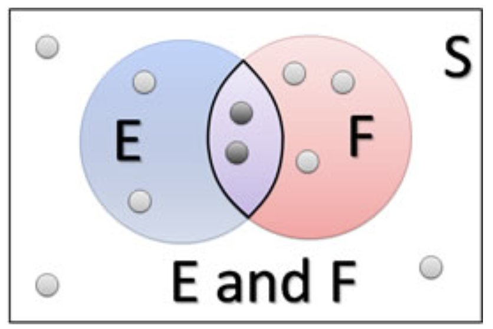
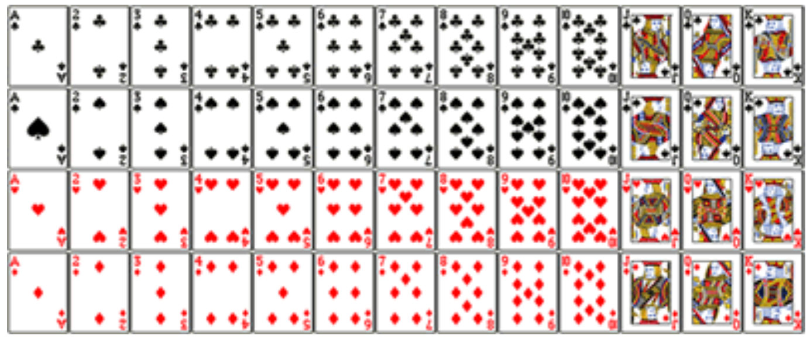
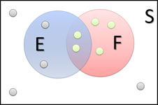
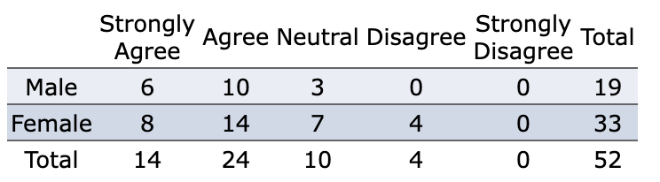
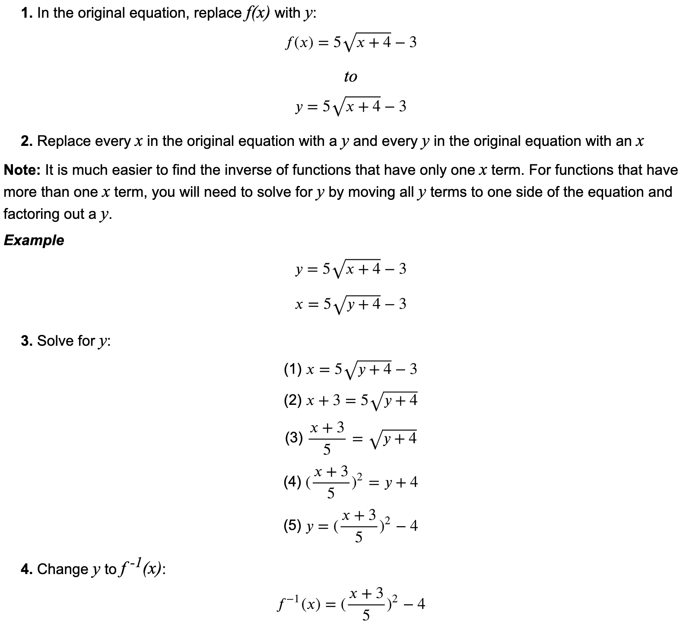

<style type="text/css">

div#TOC li {
    list-style:none;
    background-image:none;
    background-repeat:none;
    background-position:0;
}
h1.title {
  font-size: 24px;
  color: DarkRed;
  text-align: center;
}
h4.author { /* Header 4 - and the author and data headers use this too  */
    font-size: 18px;
  font-family: "Times New Roman", Times, serif;
  color: DarkRed;
  text-align: center;
}
h4.date { /* Header 4 - and the author and data headers use this too  */
  font-size: 18px;
  font-family: "Times New Roman", Times, serif;
  color: DarkBlue;
  text-align: center;
}

h1 { /* Header 3 - and the author and data headers use this too  */
    font-size: 20px;
    font-family: "Times New Roman", Times, serif;
    color: darkred;
    text-align: center;
}
h2 { /* Header 3 - and the author and data headers use this too  */
    font-size: 18px;
    font-family: "Times New Roman", Times, serif;
    color: navy;
    text-align: left;
}

h3 { /* Header 3 - and the author and data headers use this too  */
    font-size: 16px;
    font-family: "Times New Roman", Times, serif;
    color: navy;
    text-align: left;
}

</style>


```{r setup, include=FALSE}
# code chunk specifies whether the R code, warnings, and output 
# will be included in the output files.
if (!require("knitr")) {
   install.packages("knitr")
   library(knitr)
}

knitr::opts_chunk$set(echo = FALSE,       
                      warnings = FALSE,   
                      results = TRUE,   
                      message = FALSE,
                      fig.align='center', 
                      fig.pos = 'ht')
#knitr::opts_knit$set(root.dir = 'C:\\STA551\\wkdir0')
```


# Introduction

This note reviews the basic concepts of probability and important probability rules. 


# Definitions of Probability

In general, probability is a measure of the likelihood of some outcome. We use it not to describe what will happen in one particular event, but rather, what the long-term proportion of that outcome will occur.


## Experiments, Sample Space, and Event

In probability, **an experiment** is any process where the results are uncertain. We call the **sample space**, S, the collection of all possible outcomes. A **probability event** is any collection of outcomes from the experiment.


**Example 1**:  Suppose we have a family with three children, and we consider the sex of those three children. 

**Solution**: If we let B represent a boy and G represent a girl, here is the sample space:

$$S = \{ BBB, BBG, BGB, GBB, BGG, GBG, GGB, GGG\}$$

There are thus 8 outcomes in this experiment. One possible event might be:

E = the family has exactly two girls = $\{ BGG, GBG, GGB \}$


**Unusual Events**: Typically, we say that an event with a probability less than 5% is **unusual**, but this isn't a hard cutoff. It depends on the context


Suppose we're planning on making a decision one way unless the probability of a particularly "unusual" event is too high. For example, suppose we're planning a picnic on a nice summer day. If the risk of a rain shower isn't too high, we'll plan on the picnic. In this case, we might set our cutoff at 20% - anything less than that is too unusual (or unlikely) to happen, so we'll risk it.


## Calculation of Probability

There are two primary methods for calculating probabilities 

**Frequency Approach**: The first is to simply look at what has happened in the past and assume the probability is the same as the **relative frequency** of that particular outcome. This is called the empirical probability of that event.

\

P(E) $\approx$ relative frequency of E =  (frequency of E)/ (total number of trials)

\

**Example 2**: In a statistics class, 38 out of 50 students earned a grade of B or better (denoting this event as an event E). By the above definition, we have $P(E) \approx 33/60 = 0.55$.


**Classic Approach**: The second primary method for calculating probabilities is the **classical method**. The key to this method is to assume that all outcomes are equally likely.

\

P(E) = 	(number of ways E can occur)/(total number of possible outcomes)  =  N(E)/	N(S)

\

**Example 3**: Let's consider again the probability experiment of rolling two fair six-sided dice. Let the event E = the sum of the two dice is 6. Find P(E)

**Solution**  We first list the elements in the sample space.


```{r fig.align='center', fig.cap="Figure1. Sample space of the experiment of rolling two dice.", out.width = '50%'}

```

Since there are five ways to get a sum of 6, $P(E) = 5/36 \approx 0.14$.


# General Addition Rule

John Venn developed a great way to visualize sets. This visual is usually called the Venn diagram. Because events are sets of outcomes of an experiment, it works well to visualize probability as well. 

Here's an example of a Venn diagram showing two disjoint outcomes, E and F.

```{r fig.align='center', fig.cap="Figure 2. Venn diagram of two events in a sample space.", out.width = '30%'}

```


## Additive Rule

Let E and  F be defined in a sample space S of an experiment. The General Addition Rule is given by

$$P(E \mbox{ or } F) = P(E) + P(F) - P(E \mbox{ and } F)$$


The above general additive is depicted in the following Venn diagram

```{r fig.align='center', fig.cap="Figure 3. Venn diagram representation of additive rule.", out.width = '30%'}

```

**Example 4**: Consider a standard playing card. Suppose we draw one card at random from the deck and define the following events:

E = the card drawn is an ace

F = the card drawn is a king

Use these definitions to find P(E or F).


```{r fig.align='center', fig.cap="Figure 4. additive rule - playing card example.", out.width = '60%'}

```


**Solution**: Since E and F have no outcomes in common, we can use the Addition Rule for Disjoint Events:

$$P(E \mbox{ or } F) = P(E) + P(F) = 4/52 + 4/52 = 8/52 = 2/13.$$


## Special Cases

**Case #1**: If the two events are disjoint (mutually exclusive),  the general additive rule is reduced to


$$P(E \mbox{ or } F) = P(E) + P(F)$$

**Example 5**: Suppose we have a family with three children, and we consider the sex of those three children. If we let B represent a boy and G represent a girl, here is the sample space:

$$S = \{ BBB, BBG, BGB, GBB, BGG, GBG, GGB, GGG\}$$

let's define the following events:

E = the family has exactly two boys

F = the family has exactly one boy

Describe the event **E or F** and find its probability.

**Solution**:  **E or F** is the event that the family has either one or two boys.

Clearly, both of these events can't occur at the same time, so they are disjoint. The probability of the family having either one or two boys is then:

$$P(E \mbox{ or } F) = P(E) + P(F) = 3/8 + 3/8 = 6/8 = 3/4.$$


**Case #2** - The Complement Rule.

The complement of E, denoted by $E^c$, is all outcomes in the sample space that are not in E.


So essentially, the complement of E is everything but the outcomes in E. In fact, some texts actually write it as "not E". The following Venn diagram illustrates the event and its complement. 

```{r fig.align='center', fig.cap="Figure 5. Complementary events.", out.width = '30%'}

```


Since P(S) = 1. Clearly, E and $E^c$ are disjoint, so $P(E or E^c) = P(E) + P(E^c)$ . Combining those two facts, we get the following complementary Rule

$$P(E) + P(E^c) = 1$$


# Multiplicative Rule and Independence


Two events E and F are **independent** if the occurrence of event E does not affect the probability of event F.


**Disjoint vs. Independent**: It is very common for students to confuse the concepts of disjoint (mutually exclusive) events with independent events. Recall from the last section:

>Two events are disjoint if they have no outcomes in common. (Also commonly known as mutually exclusive events.)


```{r fig.align='center', fig.cap="Figure 6. Disjoint and independent events.", out.width = '30%'}

```


From the above figure, we can see very clearly that if event E occurs (that is, the outcome - gray circle- is in event E), it cannot possibly be in event F. So E and F are mutually exclusive. 


## Conditional Probability


The notation P(F|E) is read **the probability of F given E** and represents the probability that event F occurs, given that event E has already occurred. Mathematically, the probability of F giving E is given by

$$P(F|E) = P(E \mbox{ and } F) / P(E)$$


**Example 6**: The following Venn diagram illustrates conditional probability.

```{r fig.align='center', fig.cap="Figure 7. Conditional probability.", out.width = '30%'}

```

Based on the above Venn diagram, find P(E|F).

**Solution**: P(E|F) is the probability that event E occurs given that event F has already occurred. Let's change the image a bit. Since F has occurred, we can focus on just those **outcomes** in F. And then of those, we want the probability that the **outcome** is in E. Since there are 2 of those in E, and 5 total,

$$P(E|F) = P(E \mbox{ and } F) / P(F) = 2/5.$$


## General Multiplication Rule

The probability that two events E and F both occur can be obtained from the definition of conditional probability in the following form

$$P(E \mbox{ and } F) = P(E) \times P(F|E)$$

The general multiplicative rule essentially expresses the joint probability as the product of a conditional probability and the probability of the conditioning event.


**Example 7**. Let's try a new probability experiment. This time, consider a bag of marbles, containing 10 red, 20 blue, and 15 green marbles. Suppose that two marbles are drawn without replacement. (The first marble is not put back in the bag before drawing the second.)

What is the probability that both marbles drawn are red?

**Solution**: Let's define a couple of events:

E = first marble is red

F = second marble is red

We want P(E and F). Using the General Multiplication Rule, we see

$$P(E \mbox{ and } F) = P(E)  \times P(F|E) = (10/45) \times (9/44) \approx 0.0455.$$

## Checking Independence Using Additive Rule

Two events E and F are independent if event E's occurrence does not affect event F's probability.

Looking at this in terms of conditional probability, if the occurrence of E doesn't affect the probability of F, then P(F|E) = P(F). This is a good way to test for independence. In fact, we can redefine independence using this concept.

Two events E and F are independent if P(F|E) = P(F).


**Example 8**: Consider a survey given to 52 students in an introductory statistics class, with the following responses to the statement **I enjoy statistics.**

```{r fig.align='center', out.width = '45%'}

```

Suppose a student is selected at random from those surveyed and we define the events E and F as follows:

E = student selected is female

F = student enjoys math

Are events E and F independent?

**Solution**: To answer this, we'll need to see if P(F|E) = P(F).

$P(F) = 38/52 \approx 0.7308$

$P(F|E) = 22/33 \approx 0.6667$

Since $P(F) \ne P(F|E)$, events E and F are dependent.


## Bayes' Theorem 

Bayes' Theorem (also called Bayes Rule) is a way of finding a (posterior) probability when we know certain other (prior) probabilities.

The formula is:

$$P(A|B) =  P(A) \times P(B|A) = P(B)$$

**Which tells us**:	how often A happens given that B happens, written P(A|B),

**When we know**:	 	
* how often B happens given that A happens, written P(B|A)
* how likely A is on its own, written P(A)
* how likely B is on its own, written P(B)
 

Let us say P(Fire) means how often there is fire, and P(Smoke) means how often we see smoke, then:

P(Fire|Smoke) means how often there is fire when we can see smoke;

P(Smoke|Fire) means how often we can see smoke when there is fire

So the formula basically tells us **forward** P(Fire|Smoke) when we know **backward** P(Smoke|Fire)

\

**Example 9**: Picnic Day - Suppose we are planning a picnic today, but the morning is cloudy. 

Given the following prior information: 

* 50% of all rainy days start off cloudy!
* But cloudy mornings are common (about 40% of days start cloudy)
* And this is usually a dry month (only 3 of 30 days tend to be rainy, or 10%)

What is the chance of rain during the day?

**Solution**: We will use Rain to mean rain during the day, and Cloud to mean cloudy morning.

The chance of Rain given Cloud is written P(Rain|Cloud)

So let's put that in the formula:

P(Rain|Cloud) =  P(Rain) P(Cloud|Rain) / P(Cloud)
 

P(Rain) is Probability of Rain = 10%

P(Cloud|Rain) is the Probability of Cloud, given that Rain happens = 50%

P(Cloud) is Probability of Cloud = 40%

$P(Rain|Cloud) =  0.1 \times 0.5 /0.4  = .125$

Or a 12.5% chance of rain. Not too bad, let's have a picnic!


One of the famous uses for the Bayes Theorem is **False Positives and False Negatives**.


We use PCR test result of COVID-19 as an example to explain 

**False Positives** = A person's PCR is positive but was not infected with COVID-19.

**False Negatives** = A person's PCR is negative but was infected with COVID-19.

\

**Example 9**: Allergy or Not? - Hunter says she is itchy. There is a test for Allergy to Cats, but this test is not always right:

* For people that really do have the allergy, the test says **Yes** 80% of the time

* For people that do not have the allergy, the test says **Yes** 10% of the time (**false positive**)

* If 1% of the population has the allergy, and Hunter's test says **Yes**, what are the chances that Hunter really has the allergy?

We want to know the chance of having the allergy when the test says **Yes**, written P(Allergy|Yes)

**Solution**:  Let's get our formula:

P(Allergy|Yes) =  P(Allergy) P(Yes|Allergy) / P(Yes)
 

P(Allergy) is Probability of Allergy = 1%

P(Yes|Allergy) is the probability of the test saying **Yes** for people with allergy = 80%

We need to find P(Yes) is the probability of the test saying **Yes** (to anyone) = ??%


We can calculate it by adding up those with, and those without the allergy:

* 1% have the allergy, and the test says **Yes** to 80% of them

* 99% do not have the allergy and the test says **Yes** to 10% of them

Then  $P(Yes) = 1\% \times 80\% + 99\% \times 10\% = 10.7\%$,  which means that about 10.7% of the population will get a **Yes** result. Therefore,

$$P(Allergy|Yes) =  1\% \times 80\% / 10.7\% = 7.48\%$$

That is, $P(Allergy|Yes) \approx 7\%$.

\


\

<center>**Acknowledgment**</center>

‘The content of this note is based on <https://faculty.elgin.edu/dkernler/statistics/ch05/>


\

\

# Appendix: Calculus Review Topics

This appendix reviews the basics of single variable functions. 

## Notation, Domain, and Range

* **Notation**: Functions can also be written in the form of $f(x)$, pronounced **f of x**. When someone says **y is a function of x**, it means that the value of y is determined by the value of x. Here, y is the dependent variable and x is the independent variable. $f(x)$ is just the shortened form of **function of x**. 

**Example 10**: A function can be denoted in different forms. The following are the two forms of the same function.

$$
y = x^2 + 2	\mbox{   and   } f(x) = x^2 + 2$$


* **Domain**: The domain of a function is all the possible values of the independent variable, $x$, for which $y$ is defined. 


* **Range**: The range of a function is all the possible values of the dependent variable $y$.


**Example 11**: The given function $f(x) = x^2$ has a domain of all real numbers ($x$ can be anything) and a range that is greater than or equal to zero.


## Operations of Functions 

We can define new functions based on the existing functions using basic arithmetic operations. 

**Example 12** Let $f(x) = x^2 + 1$ and $g(x) = \sqrt{x+1}$. We can define the following new functions.

* $h_1(x) = f(x) + g(x) = x^2 + \sqrt{x+1} + 1$.

* $h_2(x) = f(x) - g(x) = x^2 + 1 -\sqrt{x+1}$.

* $h_3(x) = f(x)\times g(x) = (x^2 + 1)\times \sqrt{x+1}$.

* $h_4(x) = f(x) / g(x) = (x^2 + 1)/\sqrt{x+1}$.


## Composite Functions

A **composite function** is a function created when one function is used as the input value for another function. Essentially, the output of the inner function (the function used as the input value) becomes the input of the outer function (the resulting value).

* **Notation**:  For the functions $f(x)$ and $g(x)$, when $g(x)$ is used as the **input** of $f(x)$, the composite function is written as:

$$(f \circ g)(x)$$

The $\circ$ symbol denotes a composite function - it looks similar to the multiplication symbol, $\cdot$, but does not mean the same thing. $(f \circ g)(x)$ is the same thing as $f(g(x))$.


$(f \circ g)(x)$ is not the same thing as $(g \circ f)(x)$. $(g \circ f)(x)$ is the same thing as $g(f(x))$, which will often be different than $f(g(x))$.

You can use composite functions to check if two functions are inverses of each other because they will follow the rule:

$$(f \circ g)(x) = (g \circ f)(x) = x$$

We can find the composite of two functions by replacing every $x$ in the outer function with the equation for the inner function (the input).

 
**Example 13**: Given:  $f(x) = 4x2 + 3$ and  $g(x) = 2x + 1$.

$$(f \circ g)(x)	=	f(g(x)) = 4(2x + 1)^2 + 3
 	=	4(4x^2 + 4x + 1) + 3
 	=	16x^2 + 16x + 7$$


$$(g \circ f)(x)	=	g(f(x)) = 2(4x^2 + 3) + 1	=	8x^2 + 6 + 1$$


## Inverse Function

Inverse functions are a way to "undo" a function. In the original function, plugging in $x$ gives back $y$, but in the inverse function, plugging in $y$ (as the input) gives back $x$ (as the output). If a function were to contain the point (3,5), its inverse would contain the point (5,3).

If the original function is $f(x)$, then its inverse $f^{-1}(x)$ is **not the same as** $1/f(x)$ .

To find the inverse of a function, we need to do the opposite of what the original function does to $x$. To be more specific, we can use the following steps:

1. In the original equation, replace $f(x)$ with $y$;

2. Replace every $x$ in the original equation with a $y$ and every $y$ in the original equation with an $x$;

3.  Solve for $y$;

4. Change $y$ to $f^{-1}(x)$;

\

**Example 14**: Find the inverse function of $f(x) = 5\sqrt{x+4}-3$.

**Solution**. We follow the above steps to find the inverse function.

```{r fig.align='center', out.width = '80%'}

```

\

## Practice Exercises

The following link <https://github.com/pengdsci/WCUSTA504/raw/main/topic01/FunctionsWorksheet.pdf> gives a list of exercises that reflect the concepts reviewed in this appendix.


\

\

\


