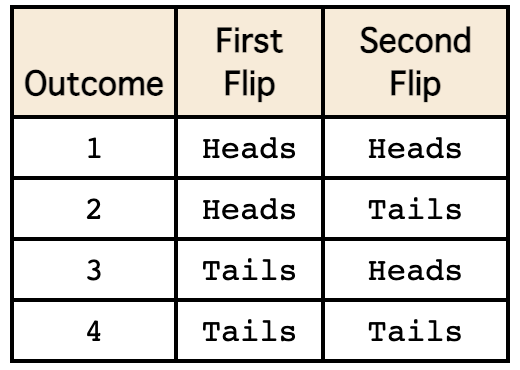
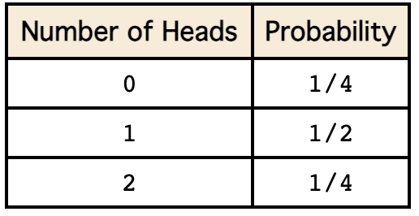
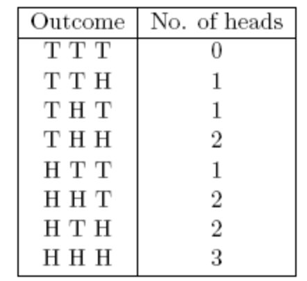
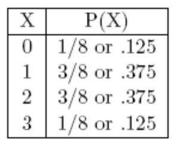
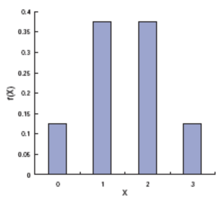
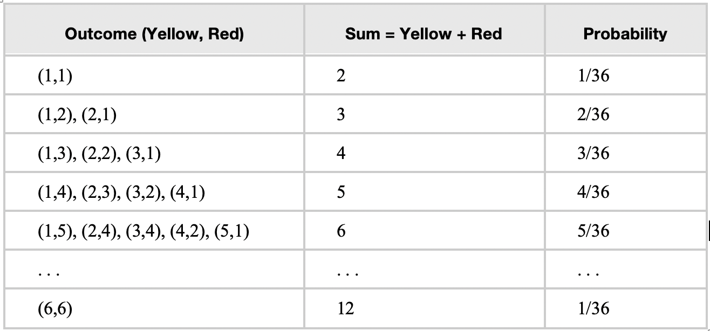
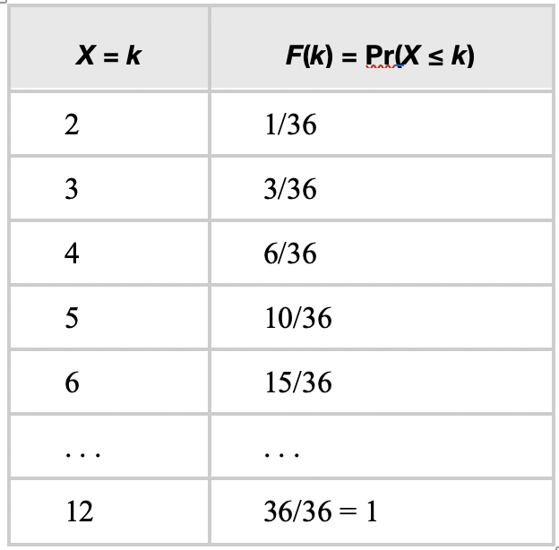

<style type="text/css">

div#TOC li {
    list-style:none;
    background-image:none;
    background-repeat:none;
    background-position:0;
}
h1.title {
  font-size: 24px;
  color: DarkRed;
  text-align: center;
}
h4.author { /* Header 4 - and the author and data headers use this too  */
    font-size: 18px;
  font-family: "Times New Roman", Times, serif;
  color: DarkRed;
  text-align: center;
}
h4.date { /* Header 4 - and the author and data headers use this too  */
  font-size: 18px;
  font-family: "Times New Roman", Times, serif;
  color: DarkBlue;
  text-align: center;
}

h1 { /* Header 3 - and the author and data headers use this too  */
    font-size: 20px;
    font-family: "Times New Roman", Times, serif;
    color: darkred;
    text-align: center;
}
h2 { /* Header 3 - and the author and data headers use this too  */
    font-size: 18px;
    font-family: "Times New Roman", Times, serif;
    color: navy;
    text-align: left;
}

h3 { /* Header 3 - and the author and data headers use this too  */
    font-size: 16px;
    font-family: "Times New Roman", Times, serif;
    color: navy;
    text-align: left;
}

</style>


```{r setup, include=FALSE}
# code chunk specifies whether the R code, warnings, and output 
# will be included in the output files.
if (!require("knitr")) {
   install.packages("knitr")
   library(knitr)
}

knitr::opts_chunk$set(echo = FALSE,       
                      warnings = FALSE,   
                      results = TRUE,   
                      message = FALSE,
                      fig.align='center', 
                      fig.pos = 'ht')
#knitr::opts_knit$set(root.dir = 'C:\\STA551\\wkdir0')
```


# Definition of Distribution of Random Variables

*(Textbook:  Section 3.1)*


A **random variable** is a real-valued function defined on the sample space S. Probabilities are assigned to the possible values of the random variable.   In other words, suppose Y is a random variable. Then 

*	Y takes on real numbers as values, i.e., $Y\in R$.
*	$P(Y\in B)$ is defined for any **measurable** set B of real numbers. 

**Example 1**: 	Examples of random variables

1.	Y  = the sum of the two numbers that come up on tossing two dice. 

2.	Y  = the amount of annual precipitation in inches for Portland.

3.	Y  = the number of students who will enroll in Math 282 after taking this class. 


**Example 2**: *Coin Toss experiment*. Assuming a fair coin, let Y  = 1 for a head, and Y = 0 for a tail. Then $P(Y=1) = P(Y=0) = 0.5$.
 
Note: $P(Y = 2) = 0$  In fact, $P(Y \notin \{0, 1 \}) = 0$.


**Example 3**: Number of Boys in a family with three children.

**Random sampling** is a method of sampling in which every possible sample of $n$ elements to be sampled has an equal probability of being selected. 


# Characterization of Distribution of Random Variables


*(Textbook:  Sections 3.2 and 3.3)*


**Discrete random variables** take on only a finite or countably infinite number of distinct values.

**The probability distribution of a random variable** provides information (using a formula, a table, or a graph) about the probability that a random value takes on each one of its possible values.


## Definition of RV


Let Y be a random variable, and $p(y) = P(Y =y)$, the probability of $Y$ taking value $y$.  Suppose that Y takes the values $\{ y_1, y_2, \cdots, y_k\}$  where k may be $\infty$. If both of the following conditions are satisfied,

1. $0 \le P(Y = y_i) \le 1$	

2. $\sum_{i=1}^k P(Y=y_i) = 1$.	 

$p(y) = P(Y =y)$ is called the probability distribution of random variable $Y$. `Note that $P(Y = y)$ could have an explicit expression in the form of a non-negative function.`


**Example 4**:  Toss a fair coin three times. Let Y denote the number of heads appearing.  Note that Y can take on only four values: 0, 1, 2, and 3. Then 

 $P(0) = P(Y = 0) = P(\{ TTT\}) = 1/8$
 
 $P(1) = P(Y = 1) = P(\{ HTT, THT, TTH\}) = 3/8$
 
 $P(2) = P(Y = 2) = P(\{ HHT, HTH, THH\}) = 3/8$
 
 $P(3) = P(Y = 3) = P(\{ HHH\}) = 1/8$
 
 We will revisit this example and provide a formula for $P(Y = y)$ for this example later.
 
 
 
##	Expectation and Variance

Let $Y$ be a discrete random variable. 

1.	The expectation or the expected value or the mean of Y is defined as $\mu = E[Y] =\sum_y yp(y)$, 
    where the index $y$ in the summation is for all possible values of $Y$. 

2.	The **expected value** of a function of Y, $g(Y)$,  is given by $E[g(Y)] =\sum_y g(y)p(y)$.
 
3.	The **variance** of a random variable Y is given by $\sigma^2 = V[Y] = E[(Y-\mu)^2]$, where $\mu = E[Y]$.


**Comment**: *An expectation of a random variable (or a function of a random variable) is simply the weighted average of the values (taking taken by the random variable/the function of the random variable). The weights are corresponding probability of $Y$ taking its distinct values*. 


**Example 5**: (use the experiment and the random variable in **example 4**).

$$\mu = E[X]  = 0\times 1/8 + 1\times (3/8) + 2\times (3/8) + 3\times (1/8)= 3(1+2+1)/8 = 3/2.$$

$$\sigma^2 = E[(X-\mu)^2]  = (0-1.5)^2\times (1/8) +(1-1.5)^2\times (3/8) + (2-1.5)^2\times (3/8) + (3-1.5)^2\times (1/8) = 0.75.$$

**Note**: In the above example, $(X-\mu)^2$ is considered as a function of random variable $Y$. 


## Some Properties of Expectation and Variance
     
 Let c be a constant and  $g(Y), g_1(Y)$ and $g_2(Y)$  be functions of random variable Y. Then

1.	 $E[c] = c.$

2.	 $E[cg(Y)] = cE[g(Y)]$

3.	 $E[g_1(Y) + g_2(Y)] = E[g_1(Y)] + E[g_2(Y)]$

4.	$\sigma^2 = V[Y] = E[(Y-\mu)^2] = E(Y^2) - \mu^2.$

**Proof**: The proofs are not difficult. You need to use the definition of the expectation to complete the these proof. You can find details from your textbook.


**Example 6**:  Roll two fair six-sided dice. Let X = sum of the outcomes of the dice. Find 

A). E[X]       
    
B). E[$X^2$]               

C). Var(X)

**Solution**  The above quantities can be calculated based on the following sample space.

```{r fig.align='center', out.width = '30%'}

```

and the following probability distribution table.

```{r fig.align='center', out.width = '30%'}

```


## Characterization of A Random Variable

To study the random behavior of a random variable, we need to follow the following three steps.


**Three-step Characterization Procedure**

1. Clearly define the random variable associated with the (random experiment).

2. Define the probability distribution of the random variable.

3. Calculation of moment (i.e., the expectation of the power of the random variable)


**Example 7**: We define a random variable based on an experiment of tossing three fair coins.

We follow the above three steps to define and characterize a random variable.

`Step 1`. Define $X = $ number of heads observed in an experiment of tossing a coin three times.

`Step 2`. The distribution of $X$ is characterized in the following table using the sample size
   
   $$S=\{HHH, HHT, HTH, THH, TTT, TTH, THT, HTT \}$$
   
   
   
```{r fig.align='center', out.width = '30%'}

```


The **probability distribution table** is given by
   
```{r fig.align='center', out.width = '30%'}

```
 
This distribution can also be defined using the following **probability distribution histogram**

```{r fig.align='center', out.width = '30%'}

```
 

Another way to define this distribution is to use a formula (also called **probability distribution function**).
$$
\displaystyle f(x) = \begin{cases} 
 1/8 & \text{if $x = 0,3$} \\  
 3/8 & \text{if $x = 1,2.$}  
 \end{cases}
$$
`Step 3`. The k-th moment is defined to be

$$\mu_k = E[X^k] = 0^k P(X=0) + 1^k P(X=1) + 2^k P(X=2) + 3^k P(X = 3) = 3/8 + 2^k (3/8) + 3^k (1/8) = 3(1+2^k+3^{k-1})/8.$$
Some special cases:

* $\mu = E[X] = 3(1 +2^1 +3^{1-1})/8 = 3\times 4 /8 = 1.5$.
* $\sigma^2 = E[X^2] - \mu^2 = 3(1+2^2 +3^{2-1})/8 - 1.5^2 = 3\times 8/8 - 2.25 = 3-2.25 = 0.75.$


# Special Discrete Distributions

There are many well-known discrete random variables. The textbook introduces binomial, geometric, hypergeometric, negative binomial, and Poisson distributions. In this section, we choose the two most commonly used ones as examples to illustrate how to characterize discrete random variables.


## Binomial Distribution

*(Textbook:  Section 3.4)*


The binomial distribution is one of the key distributions for several generalized linear models to be covered in subsequent courses.

Suppose there are $n$ identical and independent binary trials, each with a success probability $p$ (and failure probability $1-p$). Let $Y$ be the number of successes in $n$ trials. Then $Y$ is called a binomial random variable. Its probability distribution is called binomial distribution accordingly. 


The probability distribution of $Y$ is given by

$$
P(Y = y) = \frac{n!}{y!(n-y)!}p^y(1-p)^{n-y} = {n\choose y}p^y(1-p)^{n-y}
$$
where $y = 0, 1, \cdots, n$.


Note that there difference ways to denote **choosing y from n** in mathematics. For example

$$
{n\choose y}, \mbox{   } C_n^y, \mbox{   }  Cy^n,  \mbox{   }  _nCy,  \mbox{   }  C_{n,y}
$$

Since binomial distribution is a special discrete distribution, we can derive the following formulas of **expectation** and **variance** after some algebra.

$$\mu = E[Y] = np \hspace{3mm}\mbox{ and } \hspace{3mm}\sigma^2 = V[Y] = np(1-p)$$

Our textbook proves the above two formulas.


**Properties of binomial random variable**

1.	The experiment consists of n identical trials.

2.	Each trial results in one of two outcomes often referred to as success (S) and failure (F).

3.	The probability of success on a single trial is denoted by p and remains constant from trial to trial.  The probability of failure is often denoted by $q = 1 – p$.

4.	The outcomes of the trials are independent.

5.	The random variable that results from this random experiment is Y = the number of successes in the n trials.

These 5 properties are used to justify whether a random variable is a binomial random variable.


**Example 8**: Assuming that about 85% of students in a particular Statistics course are successful. Suppose 20 students are selected at random from all previous students in this course. What is the probability that 15 of them will have been successful in the course?

**Solution**: We first check the criteria for a binomial experiment to see if this fits.

* A fixed number of trials - The students are our trials.
* Each trial is independent of the others - Since they're randomly selected, we can assume they are independent of each other.
* There are only two outcomes - Each student either was successful or was not successful.
* The probability of each outcome remains constant from trial to trial. - Because the students were independent, we can assume this probability is constant.

If we let X = the number of students who were successful, it does look like X follows the binomial distribution. For this example, $n = 20$ and $p = 0.70$. Therefore,

$$
P(X=15) = \frac{20!}{5!15!} 0.7^{15} 0.3^5 =  0.1789.
$$

We can use **R functions** to find relevant quantities related to the binomial distribution.

```{}
dbinom(x, size, prob, log = FALSE)
pbinom(q, size, prob, lower.tail = TRUE, log.p = FALSE)
qbinom(p, size, prob, lower.tail = TRUE, log.p = FALSE)
rbinom(n, size, prob)
```


## Poisson Distribution

*(Textbook:  Section 3.8)*

*	**The Poisson Probability Distribution**. 

If Y is the random variable representing 'the number of occurrences in a given interval' for which the average rate of occurrences is $\lambda$, then Y is called a Poisson random variable.

**Example 9**: Real-world phenomena for which the Poisson distribution provides a reasonable probability model:

1.	The number of accidents at an intersection in a month
2.	The number of typographical errors on a page in a book
3.	The number of emitted particles from radioactive material in a fixed period of time


* **The Use of Poisson Distribution**

**Poisson distributions** can be used to model these situations because there are many “trials” and the probability of the event of interest occurring is small. For example, the large number of cars passing through an intersection in a year can be considered many “trials” and the probability of any car having an accident p is small. 


* **Requirements of Poisson Distribution**

1.	The random variable X is the number of occurrences of an event over a specified interval.  The interval could be time, distance, area, volume, etc.
2.	The occurrences must be random.
3.	The occurrences must be independent of each other.
4.	The occurrences must be uniformly distributed over the interval being used.


* **Properties of Poisson Distribution**

Let $Y$ be the Poisson random variable with mean $\lambda$.

1.	The distribution is given by
 
 $$
 P(Y=y) = \frac{\lambda^y e^{-y}}{y!}
 $$
 
 where y = 0, 1, 2, …., and  

2.	The mean and the variance are
 
 $$ E[Y] = V[Y] = \lambda $$
 **Proof**: It is easy to prove that the above expression gives a probability distribution based on the following identity 


* **R Functions for Poisson Distribution**

The following four functions are associated with Poisson distributions.

```{}
dpois(x, lambda, log = FALSE)
ppois(q, lambda, lower.tail = TRUE, log.p = FALSE)
qpois(p, lambda, lower.tail = TRUE, log.p = FALSE)
rpois(n, lambda)
```


# Cumulative Distributions

*(Textbook:  mentioned in Section 4.2)*

Given a probability density function, we define the cumulative distribution function (CDF) as follows.

## Definition and Notations

The cumulative distribution function (CDF) of a random variable X is denoted by $F(x)$, and is defined as $F(x) = P(X \le x)$. Using our identity for the probability of disjoint events, if X is a discrete random variable, we can write

$$
F(x) = \sum_{k=1}^n P(X = x_k)
$$

where $x_n$ is the largest possible value of $X$ that is less than or equal to $x$.


In other words, the cumulative distribution function for a random variable at x gives the probability that the random variable X is less than or equal to that number x. Note that in the formula for CDFs of discrete random variables, we always have $n \le N$, where $N$ is the number of possible outcomes of $X$.


Notice also that the CDF of a discrete random variable will remain constant on any interval of the form  $[x_{n-1}, x_n]$. That is, 


$$
F(x) = F(x_{n-1}) = \sum_{k=1}^{n-1} P(X = x_n)
$$
for any $x\in [x_{n-1}, x_n]$.


**Example 10**: Suppose that we have two fair six-sided dice, one yellow and one red as in the image below.


```{r fig.align='center', out.width = '30%'}

```

We roll both dice at the same time and add the two numbers that are shown on the upward faces.
Let $X$ be the discrete random variable associated with this sum.

1.	How many possible outcomes are there? That is, how many different values can $X$ assume?

2.	How is X distributed? That is, what is the PDF of $X$?

3.	What is the CDF of $X$?

4.	What is the probability that $X$ is less than or equal to 6?


**Solution**

1. There are 6 possible values each die can take. The two dice are rolled independently (i.e. the value on one of the dice does not affect the value on the other die), so we see that = there are $6 \times 6 = 36$ different outcomes for a single roll of the two dice. 

2. The distribution is given by

```{r fig.align='center', out.width = '50%'}

```

3. The cumulative distribution of $Y$ is given by

```{r fig.align='center', out.width = '28%'}

```

4. Using the above distribution table, we can easily find 
$$
P(X \le 6) = 15/36 = 5/12.
$$

\


# Appendix: Derivatives of Functions

The following subsections briefly review the derivative of a single variable function.

## Definitions and Notations

Assume $y = f(x)$ to be a real-valued function. The **average rate of change** of $y$ at $x$ is given by
$$
\frac{f(x+h) - f(x)}{h}.
$$
where $h$ is a small number close to 0.

The instantaneous rate of change at $x$ is given by

$$
f^\prime (x) = \lim_{h\to 0} \frac{f(x+h)-f(x)}{h}
$$

The derivative of function $f(x)$ at $x$ is the instantaneous rate of change of $f(x)$ at $x$.

## Rules of Calculus

This subsection lists the derivatives of commonly used functions.

1. $f(x) = c$ (c is a constant), $f^\prime(x) = 0$.

2. $f(x) = x$, $f^\prime (x) = 1.$

3. $f(x) = ax + c$, $f^\prime(x) = a$ (where a is a constant).

4. $f(x) = x^n$, $f^\prime(x) = nx^{n-1}$. [Power rule]

5. $f(x) = e^x$, $f^\prime (x) = e^x$.

  $5^\prime$. $f(x) = a^x$, $f^\prime (x) = a^x \ln(a)$, for $a > 0$ and $a \ne 1$. 

6. $f(x) = \ln (x)$, $f^\prime (x) = 1/x$ for $x > 0$.

  $6^\prime$. $f(x) = \log_a(x)$, $f^\prime(x) = 1/[x\ln(a)]$ for $a > 0$ and $a \ne 1$.

\

**Example 11**.  Find $f^\prime(x)$.

(1). $f(x) =  \frac{1}{x^2}$.

(2). $f(x) = \log_5(x)$.

(3). $f(x) = 2^x$.

**Solution**: 

(1). Since $f(x) = \frac{1}{x^2} = x^{-2}$, $f^\prime (x) = (-2)x^{-2-1} = -2x^{-3}.$

(2). $f^\prime (x) = 1/[x\ln(5)]$.

(3). $f^\prime (x) = 2^x \ln(2)$.


\

## Properties of Derivative

Let $f(x)$ and $g(x)$ be two real-valued functions. We have the following additive, multiplicative, quotient, and chain rules.

1. $[f(x) \pm g(x)]^\prime = f^\prime(x) \pm g^\prime(x)$

2. $[f(x)\times g(x)]^\prime = f^\prime (x)g(x) + f(x)g^\prime (x)$

3. $[f(x)/g(x)]^\prime = \frac{f^\prime (x)g(x) - f(x)g^\prime (x)}{g^2(x)}$

4. $[(f\circ g) (x)]^\prime = [f(g(x))]^\prime = f^\prime(g(x))g^\prime(x)$

\

**Example 12**. Let $f(x) = xe^{-(x-5)^2}$. Find $f^\prime (x)$.

**Solution**: We use the above rules and properties to find the derivative of $f(x)$.

$f^\prime(x) = (x)^\prime e^{-(x -5)^2} + x[e^{-(x-5)^2}]^\prime$ [multiplicative rule]

$\hspace{9mm}= e^{-(x -5)^2} +x e^{-(x -5)^2}[-(x-5)^2]^\prime$ [chain rule in the last step]

$\hspace{9mm}= e^{-(x -5)^2} +x e^{-(x -5)^2}[-2(x-5)]$

$\hspace{9mm}= e^{-(x -5)^2}[1 -2x(x-5)]$

$\hspace{9mm}= e^{-(x -5)^2}[1 +10x -2x^2]$.

\

## Practice Exercises

\

Worksheets #7 - #11 are related to the above review topics of derivatives in the following calculus worksheets bundle.

<https://pengdsci.github.io/WCUSTA504/Worksheet%20Bundle.pdf>

\

worksheet 7. Definition of the derivative................................................. 16

worksheet 8. Computing derivatives........................................................ 19

worksheet 9. Product and quotient rules .................................................. 21

worksheet 10. The chain rule, and derivatives as the rate of change ............. 24

worksheet 11. Derivatives of logarithmic, and exponential functions ……..... 27

Please ignore all problems related to trigonometric functions in the above worksheets.


\


