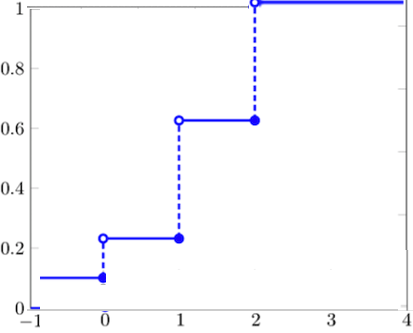

<style type="text/css">

div#TOC li {
    list-style:none;
    background-image:none;
    background-repeat:none;
    background-position:0;
}
h1.title {
  font-size: 24px;
  color: DarkRed;
  text-align: center;
}
h4.author { /* Header 4 - and the author and data headers use this too  */
    font-size: 18px;
  font-family: "Times New Roman", Times, serif;
  color: DarkRed;
  text-align: center;
}
h4.date { /* Header 4 - and the author and data headers use this too  */
  font-size: 18px;
  font-family: "Times New Roman", Times, serif;
  color: DarkBlue;
  text-align: center;
}

h1 { /* Header 3 - and the author and data headers use this too  */
    font-size: 20px;
    font-family: "Times New Roman", Times, serif;
    color: darkred;
    text-align: center;
}
h2 { /* Header 3 - and the author and data headers use this too  */
    font-size: 18px;
    font-family: "Times New Roman", Times, serif;
    color: navy;
    text-align: left;
}

h3 { /* Header 3 - and the author and data headers use this too  */
    font-size: 16px;
    font-family: "Times New Roman", Times, serif;
    color: navy;
    text-align: left;
}

</style>


```{r setup, include=FALSE}
# code chunk specifies whether the R code, warnings, and output 
# will be included in the output files.
if (!require("knitr")) {
   install.packages("knitr")
   library(knitr)
}

knitr::opts_chunk$set(echo = TRUE,       
                      warnings = FALSE,   
                      results = TRUE,   
                      message = FALSE,
                      fig.align='center', 
                      fig.pos = 'ht')
#knitr::opts_knit$set(root.dir = 'C:\\STA551\\wkdir0')
```


#	Introduction to Continuous Random Variables

 *(Sections 4.1 – 4.3)*
     
**Continuous random variables** take on an uncountably infinite number of values.

**Example 1**. The following are examples of the continuous random variable.

1.	The amount of electricity generated by a nuclear plant in a day

2.	The lifetime of an electronic component

	
The **cumulative distribution function (CDF)** of a random variable Y is defined as 

 $$
 F(y) = P(Y \le y)
 $$
where  $- \infty < y < \infty$.

We have discussed the CDF for discrete random variables in the previous section. The following is another example.

**Example 2**:  Toss a fair coin three times. Let Y denote the number of heads appearing.  Noting that 

$P(Y=0) = 1/8, P(Y=1) = 3/8, P(Y =2) = 3/8, P(Y=3) = 1/8.$
    
then the CDF is given by 

$F(0) = P(Y \le 0) = 1/8$.

$F(1) = P(Y \le 1) = P(Y=0) +P(Y=1) = 1/8 + 3/8 = 1/2$.

$F(2) = P(Y \le 2) = P(Y=0) +P(Y=1) + P(Y =2) = 1/8 + 3/8 + 3/8 = 7/8$.

$F(3) = P(Y \le 3) = P(Y=0) +P(Y=1) + P(Y =2) = 1/8 + 3/8 + 3/8 + 1/8 = 1$.


The CDF is explicitly given by 


$$
\displaystyle F_X(x) = \begin{cases} 
 1/8,  & x \le 0 ;   \\  
 4/8,  & 0 < x \le 1;  \\
 7/8,  & 1 < x \le 2 ; \\
 1,    & 2 < x \le 3;  \\
 1,    & x > 3.
 \end{cases}
$$

and the plot of the CDF is given by

```{r echo = FALSE, fig.align='center', out.width = '30%'}

```


**Properties of the CDF**

$$\lim_{y \to \infty} F(y) = 1$$            

$$\lim_{y \to -\infty} F(y) = 0$$            

Furthermore, a CDF is a non-decreasing function of y (see the above figure) and is discontinuous for discrete random variables.


## CDF of Continuous Random Variable


A random variable X having a continuous CDF $F(x)$ is a continuous random variable. The probability density function (pdf) of a continuous random variable Y is defined as 
 ,
$$
f(x) = \frac{dF(x)}{dx} = F^\prime(x)
$$
where $-\infty < x < \infty$.  Thus, 

$$
F(x) = \int_{-\infty}^x f(u)du.
$$
The geometry of the above integral is depicted in the following figure.

```{r echo = FALSE, fig.align='center', out.width = '60%'}
include_graphics("topic03/CDFvsPDF.png")
```

The area of the shaded region is the CDF of $X$ evaluated at $u = 8$. On the right-hand side is the curve of area vs x. 

\

The following animated graph show the relationship between probability density and cumulative probability distribution.


```{r echo=FALSE, fig.align ="center",  out.width = '40%'}
if (knitr:::is_latex_output()) {
  knitr::asis_output('\\url{https://github.com/pengdsci/STA504/blob/main/topic03/w04-PDFvsCDF.gif?raw=true}')
} else {
  knitr::include_graphics("topic03/w04-PDFvsCDF.gif")
}
```


## Properties of CDF and CDF of Continuous R.V.

**Properties**

Let $f(x)$ be a real-valued function. If

1. $f(x) \ge 0$ and

2. $\int_{-\infty}^\infty f(x) dx = 1$,

$f(x)$ is a probability density function (PDF) of random variable $X$.


**Events and Probability of Continuous random variable**:
 
An event based on the continuous RV is defined to be an interval (including the union of a set of individual values and subintervals). 

**Example 3**: Let X be a continuous random variable with probability density function (pdf) $f(x)$. Define event $E = (a, b)$, then

$$
P[a < X < b] = \int_a^b f(x)dx = F(b) - F(a)
$$
This event and the probability distribution are depicted in the following figure.

```{r echo = FALSE, fig.align='center', out.width = '60%'}

```

The probability that $X$ is between a and b is the area of the shaded region.

 
**Example 4**: The length of time to failure (in hundreds of hours) for a transistor is a random variable Y with distribution function given by
 $$
\displaystyle F(y) = \begin{cases} 
 0,  & y < 0 ;   \\  
 1-e^{-y^2},    & y \ge 0.
 \end{cases}
$$
a Show that $F(y)$ has the properties of a distribution function.

b Find the $.30$-quantile, $\phi_{0.30}$, of $Y$.

c Find $f(y)$.

d Find the probability that the transistor operates for at least 200 hours.

e Find $P (Y > 100|Y \le 200)$.
 
**Solution**: see the *board-work* in class. 
 
 
 \
 
 
## Expectation and Variance

Let X be a continuous random variable. 

1.	The expectation or the expected value or the mean of X is defined as 
 
$$
\mu = E[X] = \int_{-\infty}^\infty yf(y)dy
$$

2.	The expected value of a function of X, denoted by $g(x)$, is given by
 
$$
E[g(X)] = \int_{-\infty}^\infty g(y)f(y)dy
$$

3.	The variance of a random variable Y is given by 

 $$
 V[X] = E[(X-\mu)^2] = \int_{-\infty}^\infty (y-\mu)^2f(y)dy
 $$

The results for the expectation for discrete random variables still hold for continuous random variables (because of the linearity of the integral operator). Let c be a constant and $g(X), g_1(X)$, and $g_2(x)$ be functions of random variable X. Then

1. $E[c] = c$,

2. $E[cg(X)] = c E[g(X)]$,

3. $E[g_1(X) + g_2(X)] = E[g_1(X)] + E[g_2(X)]$,

4. $\sigma^2 = V[X] = E[(X-\mu)^2] = E[Y^2] - \mu^2$


**Example 5**: Daily total solar radiation for a specified location in Florida in October has probability density
function given by

 $$
\displaystyle f(y) = \begin{cases} 
 c(y-2)(6-y),  & 2 \le y \le 6;   \\  
 0,    & \text{ elsewhere}.
 \end{cases}
$$
with measurements in hundreds of calories.

a. Find the value of $c$ to make $f(y) a valid density function.

b. Find the expected daily solar radiation for October.

c. Find the variance of the daily solar radiation for October.


**Solution**  See the *board-work* in class.


\

We will present concrete examples when discussing special continuous random variables in the subsequent sections.


\

# Uniform Probability Distribution

*(Section 4.4)*

Suppose X can take on any value within the interval $[a, b]$ , and each value in the interval is “equally likely” to be chosen (to be more exact, all non-overlapping sub-intervals of the same length that partition the interval $[a, b]$ are equally likely to be selected).  Then $X$ has a uniform probability distribution, and its pdf is given by 


$$
\displaystyle f(x) = \begin{cases} 
 1/(b-a) & \text{if $a < x < b$} \\  
 0 & \text{otherwise}  
 \end{cases}
$$

The PDF plot is given by

```{r echo = FALSE, fig.align='center', out.width = '40%'}

```

The CDF and its plot are given below.

```{r echo = FALSE, fig.align='center', out.width = '60%'}

```

**Expectation and Variance**

The mean and variance of the uniform distribution defined on the interval $[a, b]$ are given by
 
$$
\mu = E[X] = \int_a^b x\times \frac{1}{b-a}dx = \frac{1}{b-a}\int_a^b xdx = \frac{1}{b-a}(\frac{b^2}{2} - \frac{a^2}{2}) = \frac{a + b}{2}
$$

and 

$$
\sigma^2 = V[X] = \int_a^b [x-(a+b)/2]^2 \frac{1}{b-a}dx = \cdots = \frac{(b-a)^2}{12}
$$

**A General Remark**: Finding probability and finding quantile are two practical questions for all distributions. 

\

**Example 6**: [*Finding Probabilities*] Suppose the time a friend of yours will show up for a social appointment is uniformly distributed between 5 minutes before and half an hour after the appointed time. 

1.	What is the probability that he will not be late? 

2.	What is the probability that he will be at least ten minutes late?

3.	What is the probability that he will be at least 20 minutes late, given that he still has not yet arrived five minutes after the appointed time?


**Solution**: Let $X$ be the *difference between the scheduled time and the arrival time*, then, based on the definition, $X$ is a uniform random variable on $[-5, 30]$. Therefore, the probability density function is given by $f(x) = 1/[30 - (-5)] = 1/35$ for $ -5 < x < 30$; otherwise, $f(x) = 0$.

1. The event "not late" is $[-\infty, 0]$ (arriving at the place before or on time). Therefore, 
$P[-\infty< X <0] = P(-5 < X < 0) = [0 -(-5)]/[30 -(-5)] = 5/35 = 1/7.$

2. The event "at least 10 minutes late" = $X > 10$. Therefore, $P(X > 10) = P(10 < X < 30) = [30-10]/[30-(-5)] = 20/35 = 4/7.$

3. This is a conditional probability (pay attention to the "magic word" - **given that**)! We define two events: $A =$ not yet arrived five minutes after the appointed time $= X > 5$ = $[5, 30]$, B = at least 20 minutes late = $X > 20$ = $[20, 30]$. Therefore, the joint event $A \mbox{ and } B = [20, 30]$ (overlapped part).  Note that $P[A \mbox{ and } B] = (30 - 20)/35 = 10/35 = 2/7$, $P(A) = (30-5)/35 = 25/35 = 5/7$. Therefore, using the definition of conditional probability

$$
P(B|A) = (2/7)/(5/7) = 2/5.
$$

\


# Calculus Review: Integrals of Functions


Finding the integral of a function is an **opposite** process of finding a derivative of a function - **antiderivative**. 

## Antiderivatives

An antiderivative (sometimes also called `inverse derivative`) of a function f is a differentiable function $F(x)$ whose derivative is equal to the original function $f(x)$. 


**Example 1**. Let $f(x) = 2x$. From the power rule of derivative, we know that $[x^2]^\prime = 2x$. This means that $F(x) = x^2$ is the antiderivative of $f(x) = 2x$. Note also that, $[x^2 + 5]^\prime = 2x$, that is $G(x) = x^2 +5$.  Therefore, the antiderivative of a function not unique. In general, the difference between two antiderivatives of the same original function is a constant.  


## Rules and Properties of Integral

### Basic Rules

The following are rules of integrals. $C$ is a real number and called **coefficient of integral**.

1. $f(x) = a$, then $F(x) = \int f(x)dx = ax + C$
 
2. $f(x) = x^k$ (k is a constant and $k \ne -1$), then $F(x) = \int x^k dx = x^{k+1}/(k+1) + C.$  

3. $f(x) = 1/x = x^{-1}$, then $F(x) = \int (1/x) dx = \ln(x) + C$

4. $f(x) = e^x$, then $F(x) = \int e^x dx = e^x +C$

4.1. $f(x) = a^x$ ($a > 0$ and $a \ne 1$), then $F(x) = a^x \ln(a)$

5. $f(x) = \ln(x)$, then $F(x) = \int \ln(x) dx = x\ln(x) - x + C$

\

### Properties of Integrals

1. Multiplying a constant: $\int af(x)dx = a\int f(x)dx$

2. Additive property: $\int [f(x) + g(x)]dx = \int f(x)dx + \int g(x)dx$

3. Difference property: $\int [f(x) - g(x)]dx = \int f(x)dx - \int g(x)dx$

4. Integral by parts: $\int f(x)dg(x) = f(x)g(x) - \int g(x)df(x)$

5. Change of variable (substitution): $\int f[g(x)] g^\prime(x)dx = \int f[g(x)] dg(x) = \int f(u)du$, where substitution $u = g(x)$.

\

### Definite Integrals

This is the type integrals we used to calculate the probability of an event (i.e., the union of intervals) defined based on a continuous distribution.

A **Definite Integral** has start and end values: in other words there is an interval $[a, b]$. $a$ and $b$ (called limits, bounds or boundaries) are put at the bottom and top of the integral sign $\int$, 

```{r echo = FALSE, fig.align='center', out.width = '50%'}
include_graphics("topic03/Definite-Indefite.png")
```

Let $F(x) = \int_{-\infty}^x f(t) dt$, then definite integral $\int_a^b f(t)dt = F(b) - F(a)$. This is called the **Fundamental Theorem of Calculus**. It is used to calculate the definite integral for a given function and the two integral limits.

\

**Some Properties and Rules of Integrals**

1. $\int_a^b [f(x) \pm g(x)]dx = \int_a^b f(x)dx \pm \int_a^b g(x)dx$

2. $\int_a^b f(x)dx = -\int_b^a f(x) dx$

3. $\int_a^b f(x)dx = \int_a^c f(x)dx + \int_c^b f(x)dx$ for any constant $c$ ($c$ is not necessarily between $a$ and $b$).

\

## Practice Exercises

There two set of exercises you can practice. Ignore all problems involves trigonometric functions.

1. Exercises with answer keys. <https://github.com/pengdsci/WCUSTA504/raw/main/topic03/Basic-Integration-Problems.pdf>

2. Worksheets: <https://pengdsci.github.io/WCUSTA504/Worksheet%20Bundle.pdf>

* Worksheet #20: Fundamental Theorem of Calculus.

* Worksheet #21: Definite Integrals


\

\


