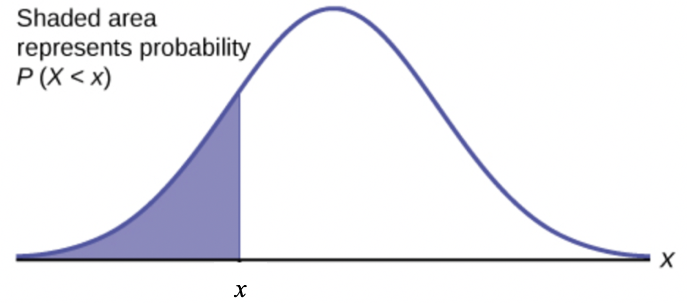
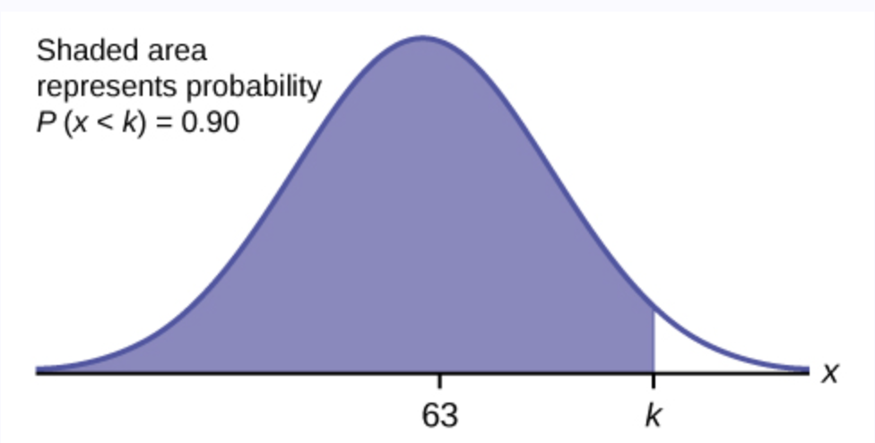
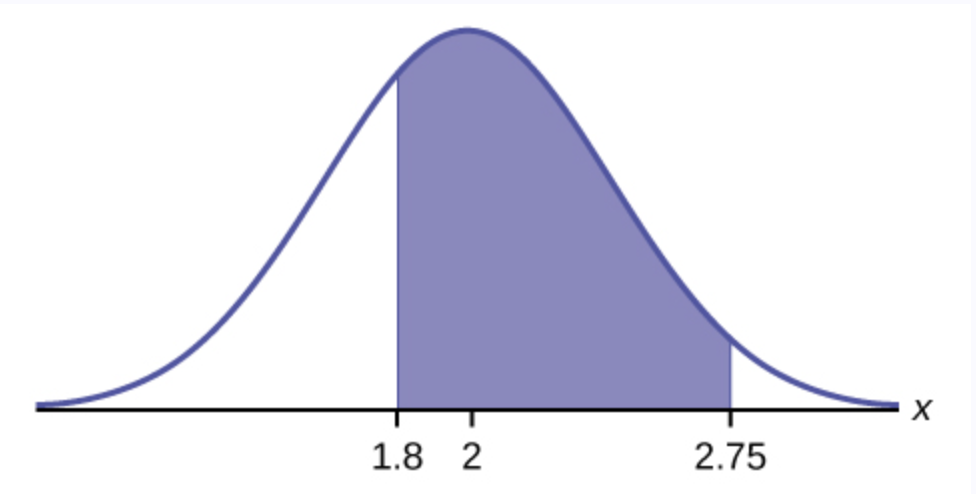

<style type="text/css">

div#TOC li {
    list-style:none;
    background-image:none;
    background-repeat:none;
    background-position:0;
}
h1.title {
  font-size: 24px;
  color: DarkRed;
  text-align: center;
}
h4.author { /* Header 4 - and the author and data headers use this too  */
    font-size: 18px;
  font-family: "Times New Roman", Times, serif;
  color: DarkRed;
  text-align: center;
}
h4.date { /* Header 4 - and the author and data headers use this too  */
  font-size: 18px;
  font-family: "Times New Roman", Times, serif;
  color: DarkBlue;
  text-align: center;
}

h1 { /* Header 3 - and the author and data headers use this too  */
    font-size: 20px;
    font-family: "Times New Roman", Times, serif;
    color: darkred;
    text-align: center;
}
h2 { /* Header 3 - and the author and data headers use this too  */
    font-size: 18px;
    font-family: "Times New Roman", Times, serif;
    color: navy;
    text-align: left;
}

h3 { /* Header 3 - and the author and data headers use this too  */
    font-size: 16px;
    font-family: "Times New Roman", Times, serif;
    color: navy;
    text-align: left;
}

</style>


```{r setup, include=FALSE}
# code chunk specifies whether the R code, warnings, and output 
# will be included in the output files.
if (!require("knitr")) {
   install.packages("knitr")
   library(knitr)
}

knitr::opts_chunk$set(echo = TRUE,       
                      warnings = FALSE,   
                      results = TRUE,   
                      message = FALSE,
                      fig.align='center', 
                      fig.pos = 'ht')
#knitr::opts_knit$set(root.dir = 'C:\\STA551\\wkdir0')
```


\

#	Introduction 

We have introduced the procedures for characterizing the general continuous random variables and used the simplest well-known uniform distribution and some not-well-known distributions as examples to illustrate the properties/requirements of continuous distributions.

The following is a summary.

* **Requirements for a probability density function (pdf)**

If function $f(x)$ is a density function some random variable $X$ *if and only if* both of the following conditions are satisfied

  1. $f(x) \ge 0$;
  
  2. $\int_{-\infty}^\infty f(x) dx = 1$.


* **Definition of cumulative distribution function (CDF)**

Let $f(x)$ be a pdf of random variable $X$, and the CDF of $X$ is defined to be

$$
P(X \le x) = F(x) = \int_{-\infty}^x f(t)dt.
$$

Note that the above CDF is defined based on the cumulative probability. Therefore, we should consider using the CDF to address problems probability associated with continuous random variables.

\

  
* **Requirements for cumulative distribution function (CDF)**  
  
if function $F(x)$ is a CDF of a random variable $X$ *if and only if* all of the following conditions are satisfied.

  1. $0 \le F(x) \le 1$;
  
  2. $F(x)$ is non-decreasing;
  
  3. $\lim_{x \to -\infty}F(x) = 0$ and $\lim_{x \to \infty}F(x) = 1$.
  

* **Relationship between pdf and CDF**

The relationship between pdf and CDF can be easily observed from the definition of CDF: $F^\prime(x) = f(x)$.


* **Expectations and Properties**

Let $f(x)$ be the density function of $X$ and $g(X)$ is a function of random variable $X$. Apparently, $G(X) is also a random variable.

  1. Expectation of $X$ is defined as $\mu = E[X] = \int_{-\infty}^\infty x f(x)dx$.
  
  2. The expectation of $g(X)$ is defined to be $E[g(X)] = \int_{-\infty}^\infty g(x) f(x)dx$.

As a special case of the above property 2. We can find the variance of $X$ in the following

  3. $V[X] = E[(X - \mu)^2] = \int_{-\infty}^\infty (X - \mu)^2f(x)dx = E[X^2] - \mu^2.$ 

\

The next example is related to a very well-known distribution. We need to use two important rules of integral: integral by part and substitution.

**Example 1**: A random variable $Y$ has the density function

$$
\displaystyle f(y) = \begin{cases} 
 \theta e^{-\theta y} & \text{if $y \ge 0$}, \\  
 0 & \text{otherwise}.
 \end{cases}
$$

a). Prove that $f(y)$ is a valid density function.

b). Find the CDF of $Y$.

c). Find $E[Y]$ and $V[Y]$.

d). Find $E[e^{3Y/2}]$.


**Solution** See the *board work* in the class.

a). $\int_0^\infty f(y)dy = \int_0^\infty \theta e^{-\theta y} dy = - \int_0^\infty e^{-\theta y} d(\theta y) = -\theta e^{-\theta y}|_0^\infty = - (0 - 1) = 1$. This implies that the given function is a valid density function for $\theta >0$.

We have used substitution in the above derivation (the first equation): if letting $w = -\theta y$ (substitution!), then $\int_0^\infty e^{-\theta y} d(-\theta y) = \int_0^\infty e^wdw = e^w|_0^\infty$.


b). The CDF for $Y$ is defined to be
$$
F(y) = \int_{-\infty}^y f(x)dx = \int_0^y \theta e^{-\theta x} dx = -\int_0^y e^{-\theta y}d(-\theta y) = -e^{-\theta y}|_0^y = -(e^{-\theta y} - 1) = 1 - e^{-\theta y}.
$$

for $y \ge 0$. $F(x) = 0$ if $y<0$. We have used substitution in the above derivation (the third equation) implicitly.  


c). $E[Y] = \int_0^\infty y \theta e^{-\theta y}dy =-\int_0^\infty y e^{-\theta y}d(-\theta y)$  (substitution)<br>
    $= -y \int_0^\infty y d(e^{-\theta y}) = -[ye^{-\theta y}|_0^\infty-\int_0^\infty e^{-\theta y} dy]$ (integral by parts)<br>
    $= -[(0 - 0) - \int_0^\infty e^{-\theta y} dy] = (1/\theta) \int_0^\infty \theta e^{-\theta y} dy = 1/\theta.$


Note that the variance $V[Y] = E[Y^2] - \mu^2$. To find the variance, we only need to calculate the second moment.
$$
E[Y^2] = \int_0^\infty y^2 \theta e^{-\theta y}dy = -\int_0^\infty y^2 e^{-\theta y}d(-\theta y)dy = -\int_0^\infty y^2 d(e^{-\theta y})dy \\ =  -[y^2e^{-\theta y}|_0^\infty -\int_0^\infty e^{-\theta y }dy^2] = \int_0^\infty e^{-\theta y}(2y)dy = 2\int_0^\infty ye^{-\theta y}dy \\ = \frac{2}{\theta} \int_0^\infty y \theta e^{-\theta y}dy 
 = \frac{2}{\theta} \times \frac{1}{\theta} = \frac{2}{\theta^2}
 $$

Therefore,
$$
V[Y] = E[Y^2] - \mu^2 = \frac{2}{\theta^2} - (\frac{1}{\theta})^2 = \frac{1}{\theta^2}.
$$

d). $E[e^{3Y/2}] = \int_0^\infty e^{3y/2} \theta e^{-\theta y} dy = \int_0^\infty \theta e^{3y/2-\theta y}dy = \int_0^\infty \theta e^{-(\theta - 3/2)y}dy$ $= \frac{\theta}{\theta-3/2} \int_0^\infty (\theta-3/2)e^{-(\theta-3/2)y} dy = \frac{\theta}{\theta - 3/2}$.


\


# Normal Distribution

*(Section 4.5)*

Let $X$ be a normal random variable or is normally distributed with mean  $\mu$ and variance  $\sigma^2$ if the pdf of $X$ is given by
 
 $$
 f(x) = \frac{1}{\sqrt{2\pi}\sigma} e^{-\frac{(x-\mu)}{2\sigma^2}}
 $$
with  $-\infty < x < \infty$.


After some algebra, we can check the expectation and variance of X in the following.

$$
E[X] = \int_{-\infty}^\infty xf(x)dx = \mu
$$
and

$$
V[X] = \int_{-\infty}^\infty (x-\mu)^2f(x)dx = \sigma^2 
$$


The density curve of the normal distribution has the following form

```{r echo = FALSE, fig.align='center', out.width = '40%'}
include_graphics("topic03/normalDensity.png")
```


**Special Case - Standard Normal Distribution**: 

When $\mu = 0$ and $\sigma = 1$, the general normal distribution reduces to the standard normal distribution.


\

The two basic types of questions: finding probability and finding quantile 

\

```{r echo = FALSE, fig.align='center', out.width = '40%'}

```


**Finding Probabilities**

Finding $P(X < x)$ (i.e., the left-tail area) for given $x$.

**Finding Percentiles**

Finding $x$ from $P(X<x) = p$ for given $p$ (the left-tail area).


There are no formulas for finding probability and quantile based on the normal distribution. We can use either **software programs** or the **standard normal table** to answer the above two types of questions.

In R, there are functions to find probabilities and quantiles.


```{}
dnorm(x, mean = 0, sd = 1, log = FALSE)
# left-tail probability
pnorm(q, mean = 0, sd = 1, lower.tail = TRUE, log.p = FALSE)   
# quantile for given left-tail probability
qnorm(p, mean = 0, sd = 1, lower.tail = TRUE, log.p = FALSE)   
rnorm(n, mean = 0, sd = 1)
```

**Example 2**.  The final exam scores in a statistics class were normally distributed with a mean of 63 and a standard deviation of five.

1. Find the probability that a randomly selected student scored more than 65 on the exam.

2. Find the probability that a randomly selected student scored less than 85.

3. Find the 90th percentile (that is, find the score $k$ that has 90% of the scores below $k$ and 10% of the scores above $k$).

4. Find the 70th percentile (that is, find the score $k$ such that 70% of scores are below $k$ and 30% of the scores are above $k$).

**Solution**: We will use R functions to answer the above questions.

1. We want to find the right-tail area. R function `pnorm` can be used to find either left-tail or right-tail area. By default, it yields the left-tail area.

```{r echo = FALSE, fig.align='center', out.width = '40%'}
include_graphics("topic03/exmple5-1.jpg")
```

```{r}
pnorm(q = 65, mean = 63, sd = 5, lower.tail = FALSE)
```

2. This probability is equal to the left-tail area and can be found in the following R function

```{r}
pnorm(q = 85, mean = 63, sd = 5)
```

3. We need to use R quantile function `qnorm()` to find the quantile.

```{r echo = FALSE, fig.align='center', out.width = '40%'}

```

```{r}
qnorm(p = 0.9, mean = 63, sd = 5)
```

4. 70th percentile can be found using the following R command.

```{r}
qnorm(p = 0.7, mean = 63, sd = 5)
```

\

**Example 3**.  A personal computer is used for office work at home, research, communication, personal finances, education, entertainment, social networking, and a myriad of other things. Suppose that the average number of hours a household personal computer is used for entertainment is two hours per day. Assume the times for entertainment are normally distributed and the standard deviation for the times is half an hour.

1. Find the probability that a household personal computer is used for entertainment between 1.8 and 2.75 hours per day.

2. Find the maximum number of hours per day that the bottom quartile of households uses a personal computer for entertainment.


**Solution**. We still use R functions to answer these two questions.

1. We find probability $P(1.8 < X < 2.75)$.

```{r}
pnorm(q = 2.75, mean = 2, sd = 0.5) - pnorm(q = 1.8, mean = 2, sd = 0.5)
```

```{r echo = FALSE, fig.align='center', out.width = '40%'}

```

The probability that a household personal computer is used between 1.8 and 2.75 hours per day for entertainment is 0.5886.

2. This is percentile question. R function `qnorm()` will be used.

```{r}
qnorm(p = 0.25, mean = 2, sd = 0.5)
```

```{r echo = FALSE, fig.align='center', out.width = '40%'}
include_graphics("topic03/example6-2.png")
```

The maximum number of hours per day that the bottom quartile of households uses a personal computer for entertainment is 1.66 hours.


\

# Gamma Distribution

*(Section 4.6)*

The gamma distribution contains two special and practically important members: exponential and $\chi^2$ distributions. The PDF of gamma involves a special gamma function.

## The Gamma Function 

The gamma function is defined by

$$
\Gamma(r) = \int_0^\infty r^{r-1}e^{-t}dt, r > 0.
$$

It has the property that 

$$
\Gamma(r+1) = r\Gamma(r), r > 1.
$$
For a positive integer $n$, $\Gamma(n+1) = n\Gamma(n) = \cdots = n!$.

\.

## Definition of Gamma Density

Gamma distribution has two different forms (reparameterization). Our textbook uses the following form

$$
\displaystyle f(x) = \begin{cases} 
 \frac{x^{\alpha-1}e^{-x/\beta}}{\beta^\alpha\Gamma(\alpha)} & \text{if $0 < x < \infty$} \\  
 0 & \text{otherwise}  
 \end{cases}
$$


Density curves with various values of parameters $\alpha$ (shape) and $\beta$ (scale).

The CDF is defined as

$$
F(x) = \int_0^y \frac{y^{\alpha-1}e^{-y/\beta}}{\beta^\alpha\Gamma(\alpha)} dy
$$


The following figures show the density curves and their corresponding CDF curves based on different values of gamma parameters.

```{r echo = FALSE, fig.align='center', out.width = '70%'}
include_graphics("topic03/gammaCDF-PDF.png")
```

\

## Expectation and Variance

Using the definition of expectation and variance, we can derive the formulas of the expectation and variance of gamma distribution in the following:

$$
E[X] = \int_0^\infty x \frac{x^{\alpha-1}e^{-x/\beta}}{\beta^\alpha\Gamma(\alpha)} dx = \alpha\beta
$$
and 

$$
V[X] = \int_0^\infty (x-\alpha\beta)^2 \frac{x^{\alpha-1}e^{-x/\beta}}{\beta^\alpha\Gamma(\alpha)} dx = \alpha\beta^2
$$

The detailed derivation of the above two formulas can be found on page 187 of the textbook.

\

## Special Cases

* If $\alpha = 1$, the gamma distribution is reduced to the well-known exponential distribution with the following density function.

$$
\displaystyle f(x) = \begin{cases} 
 \frac{e^{-x/\beta}}{\beta} & \text{if $0 < x < \infty$} \\  
 0 & \text{otherwise}  
 \end{cases}
$$

The expectation and variance of the exponential distribution are $E[X] = \beta$ and $V[X] = \beta^2$.

The exponential distribution has been widely used in reliability and survival analysis as a base model since it is mathematically simple.


* If $a = \nu/2$ and $\beta = 2$, the gamma distribution is reduced to the well-known $\chi^2$ distribution with $\nu$ degrees of freedom. We define the $\chi^2$ from the normal distribution in subsequent notes.

The expectation and variance of $\chi_\nu^2$ is simple: $E[X] = \nu$ and $V[X] = 2\nu$.

\

## Use of Technology

The exponential and $\chi^2$ distributions are special members of the gamma family. R has standalone sets of functions for these distributions.

Special attention should be paid to the form (reparameterization) of the gamma and exponential distributions. R uses the same form as what we used in this note. We will use several examples to show how to use these R functions.

### Related R Functions for Gamma Distributions

*(Help document: <https://stat.ethz.ch/R-manual/R-devel/library/stats/html/GammaDist.html>)*

```{}
dgamma(x, shape, rate = 1, scale = 1/rate, log = FALSE)
pgamma(q, shape, rate = 1, scale = 1/rate, lower.tail = TRUE, log.p = FALSE)
qgamma(p, shape, rate = 1, scale = 1/rate, lower.tail = TRUE, log.p = FALSE)
rgamma(n, shape, rate = 1, scale = 1/rate)
```

**Example 4**. Engineers designing the next generation of space shuttles plan to include two fuel pumps —one active, the other in reserve. If the primary pump malfunctions, the second is automatically brought online. Suppose that the time to failure of the first pump, denoted by $X$, is a gamma distribution with a mean of 200 and a variance of 20000. What are the chances that such a fuel pump system would not remain functioning for the full 50 hours?

**Solution**. Since $E[X] = \alpha\beta = 200$ and $V[X] = \alpha \beta^2 = 20000$, we solve the shape ($\alpha$) and scale ($\beta$) and obtain $\alpha = 2$ and $\beta = 100$. Therefore, the density function of this gamma distribution is given by

$$
f(x) = \frac{1}{100^2\Gamma(2)}e^{-x/100} x^{2-1} = \frac{1}{10000}ye^{-x/100}, \mbox{ for } x \ge 0.
$$
The probability $P(X < 50)$ can be found using R function `pgamma()`.

```{r}
pgamma(q=50, shape = 2, scale = 100)
```

The area of the shaded region in the following density curve is the probability.

```{r echo = FALSE, fig.align='center'}
plot(0:600, dgamma(0:600, shape =2, scale = 100), type ="l", col = "blue", lwd =2, 
     xlab="Time to Failure", ylab = "Gamma density",
     main = "density of the time to failure of the first pump")
x0 = 0:50
y0 = dgamma(0:50, shape =2, scale = 100)
polygon(c(0, x0, 50), c(0, y0, 0), col = "#1b98e0")   
abline(h = 0, col = "blue")
```
\

### Related R Functions for Exponential Distributions

*(Help Document: <https://stat.ethz.ch/R-manual/R-devel/library/stats/html/Exponential.html>)*


```{}
dexp(x, rate = 1, log = FALSE)
pexp(q, rate = 1, lower.tail = TRUE, log.p = FALSE)
qexp(p, rate = 1, lower.tail = TRUE, log.p = FALSE)
rexp(n, rate = 1)
```


**Example 5**. The number of miles that a particular car can run before its battery wears out is exponentially distributed with an average of 10,000 miles. The owner of the car needs to take a 5000-mile trip. What is the probability that he will be able to complete the trip without having to replace the car battery?

**Solution**: In R, the exponential related R function uses the following form
$$
f(x) = \lambda e^{-\lambda x}, \mbox{ for } x \ge 0.
$$
 
Based on the above density form, we have $E[X] = 1/\lambda$. Since $1/\lambda = 10000$, $\lambda = 1/10000$. Therefore, the desired probability $P(X > 5000)$ (upper tail) can be found using the following R function.


```{r}
pexp(5000, rate = 1/10000,  lower.tail = FALSE)
```
```{r echo = FALSE, fig.align='center'}
plot(0:15000, dexp(0:15000, rate = 1/10000), type ="l", col = "blue", lwd =2, 
     xlab="Number of miles", ylab = "Exponential density",
     main = "density of the number of miles")
x0 = 5000:15000
y0 = dexp(5000:15000, rate = 1/10000)
polygon(c(5000, x0, 15000), c(0, y0, 0), col = "#1b98e0")   
abline(h = 0, col = "blue")
```

\


### Related R Functions for $\chi_{df}^2$ Distributions

*(Help Document: <https://stat.ethz.ch/R-manual/R-devel/library/stats/html/Chisquare.html>)*


```{}
dchisq(x, df, ncp = 0, log = FALSE)
pchisq(q, df, ncp = 0, lower.tail = TRUE, log.p = FALSE)
qchisq(p, df, ncp = 0, lower.tail = TRUE, log.p = FALSE)
rchisq(n, df, ncp = 0)
```

The $\chi^2$ distribution is one of the most commonly used distributions and will be used to define the $\chi^2$ test. We will not present examples in this note. But it will be used later.


\

# Calculus Review: Integrals of Functions


Finding the integral of a function is an **opposite** process of finding a derivative of a function - **antiderivative**. 

## Antiderivatives

An antiderivative (sometimes also called `inverse derivative`) of a function f is a differentiable function $F(x)$ whose derivative is equal to the original function $f(x)$. 


**Example 1**. Let $f(x) = 2x$. From the power rule of derivative, we know that $[x^2]^\prime = 2x$. This means that $F(x) = x^2$ is the antiderivative of $f(x) = 2x$. Note also that, $[x^2 + 5]^\prime = 2x$, that is $G(x) = x^2 +5$.  Therefore, the antiderivative of a function not unique. In general, the difference between two antiderivatives of the same original function is a constant.  


## Rules and Properties of Integral

### Basic Rules

The following are rules of integrals. $C$ is a real number and called **coefficient of integral**.

1. $f(x) = a$, then $F(x) = \int f(x)dx = ax + C$
 
2. $f(x) = x^k$ (k is a constant and $k \ne -1$), then $F(x) = \int x^k dx = x^{k+1}/(k+1) + C.$  

3. $f(x) = 1/x = x^{-1}$, then $F(x) = \int (1/x) dx = \ln(x) + C$

4. $f(x) = e^x$, then $F(x) = \int e^x dx = e^x +C$

4.1. $f(x) = a^x$ ($a > 0$ and $a \ne 1$), then $F(x) = a^x \ln(a)$

5. $f(x) = \ln(x)$, then $F(x) = \int \ln(x) dx = x\ln(x) - x + C$

\

### Properties of Integrals

1. Multiplying a constant: $\int af(x)dx = a\int f(x)dx$

2. Additive property: $\int [f(x) + g(x)]dx = \int f(x)dx + \int g(x)dx$

3. Difference property: $\int [f(x) - g(x)]dx = \int f(x)dx - \int g(x)dx$

4. Integral by parts: $\int f(x)dg(x) = f(x)g(x) - \int g(x)df(x)$

5. Change of variable (substitution): $\int f[g(x)] g^\prime(x)dx = \int f[g(x)] dg(x) = \int f(u)du$, where substitution $u = g(x)$.

\

### Definite Integrals

This is the type integrals we used to calculate the probability of an event (i.e., the union of intervals) defined based on a continuous distribution.

A **Definite Integral** has start and end values: in other words there is an interval $[a, b]$. $a$ and $b$ (called limits, bounds or boundaries) are put at the bottom and top of the integral sign $\int$, 

```{r echo = FALSE, fig.align='center', out.width = '50%'}
include_graphics("topic03/Definite-Indefite.png")
```

Let $F(x) = \int_{-\infty}^x f(t) dt$, then definite integral $\int_a^b f(t)dt = F(b) - F(a)$. This is called the **Fundamental Theorem of Calculus**. It is used to calculate the definite integral for a given function and the two integral limits.

\

**Some Properties and Rules of Integrals**

1. $\int_a^b [f(x) \pm g(x)]dx = \int_a^b f(x)dx \pm \int_a^b g(x)dx$

2. $\int_a^b f(x)dx = -\int_b^a f(x) dx$

3. $\int_a^b f(x)dx = \int_a^c f(x)dx + \int_c^b f(x)dx$ for any constant $c$ ($c$ is not necessarily between $a$ and $b$).

\

## Practice Exercises

There two set of exercises you can practice. Ignore all problems involves trigonometric functions.

1. Exercises with answer keys. <https://github.com/pengdsci/WCUSTA504/raw/main/topic03/Basic-Integration-Problems.pdf>

2. Worksheets: <https://pengdsci.github.io/WCUSTA504/Worksheet%20Bundle.pdf>

* Worksheet #20: Fundamental Theorem of Calculus.

* Worksheet #21: Definite Integrals


\

\


