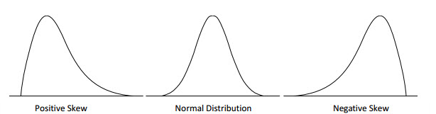
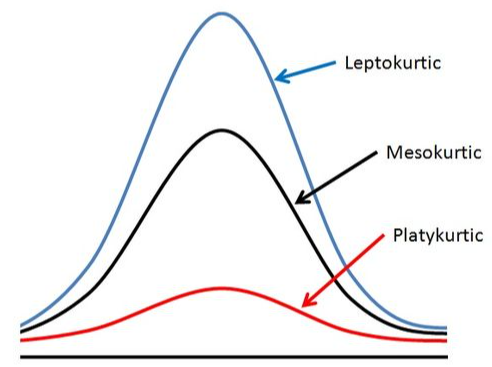

```{=html}
<style type="text/css">

div#TOC li {
    list-style:none;
    background-image:none;
    background-repeat:none;
    background-position:0;
}
h1.title {
  font-size: 24px;
  color: DarkRed;
  text-align: center;
}
h4.author { /* Header 4 - and the author and data headers use this too  */
    font-size: 18px;
  font-family: "Times New Roman", Times, serif;
  color: DarkRed;
  text-align: center;
}
h4.date { /* Header 4 - and the author and data headers use this too  */
  font-size: 18px;
  font-family: "Times New Roman", Times, serif;
  color: DarkBlue;
  text-align: center;
}

h1 { /* Header 3 - and the author and data headers use this too  */
    font-size: 20px;
    font-family: "Times New Roman", Times, serif;
    color: darkred;
    text-align: center;
}
h2 { /* Header 3 - and the author and data headers use this too  */
    font-size: 18px;
    font-family: "Times New Roman", Times, serif;
    color: navy;
    text-align: left;
}

h3 { /* Header 3 - and the author and data headers use this too  */
    font-size: 16px;
    font-family: "Times New Roman", Times, serif;
    color: navy;
    text-align: left;
}

</style>
```
```{r setup, include=FALSE}
# code chunk specifies whether the R code, warnings, and output 
# will be included in the output files.
if (!require("knitr")) {
   install.packages("knitr")
   library(knitr)
}

knitr::opts_chunk$set(echo = TRUE,       
                      warnings = FALSE,   
                      results = TRUE,   
                      message = FALSE,
                      fig.align='center', 
                      fig.pos = 'ht')
```


\

# Introduction

**Moment generating functions (MGF)** are useful for several reasons, one of which is their application to the analysis of sums of random variables such as sample means to make inferences of a population mean. The other application of MGF is to develop methods for estimating population parameters. From the theoretical perspective, it can be used to completely characterize the distribution of random variables. In this note, we briefly introduce the concepts of MGF and derive the MGF of some of the basic distributions.

# Moments of RV and MGF

We have defined the k-th moment of a random variable $Y$ with a distribution function. There are different moments we can define for a random variable. We first briefly review these moments and then define the MGF.

## Various Moments Revisited

Recall that the k-th moment of a random variable is defined to be of the following form

$$
\displaystyle E[Y^k] = \begin{cases} 
 \int_{-\infty}^{\infty} y^k f(y)dy & \text{if $y$ is continuous}, \\  
 \sum_y y^kP(Y=y) & \text{otherwise}.
 \end{cases}
$$

where $f(y)$ and $P(Y=y)$ are probability density function and probability distribution function (probability mass function) respectively.

The k-th central moment of $Y$ is defined to be

$$
\displaystyle E[(Y-\mu)^k] = \begin{cases} 
 \int_{-\infty}^{\infty} (y-\mu)^k f(y)dy & \text{if y is continuous}, \\  
 \sum_y (y-\mu)^kP(Y=y) & \text{otherwise}.
 \end{cases}
$$

where $\mu = E[Y]$. As a special case, when $k=2$, the second central moment $E[(Y-E[Y])^2]$ is the variance of $Y$.

In general, if $g(Y)$ is a function of random variable $Y$, then we have the general expectation in the following form

$$
\displaystyle E[g(Y)] = \begin{cases} 
 \int_{-\infty}^{\infty} g(y) f(y)dy & \text{if y is continuous}, \\  
 \sum_y g(y)P(Y=y) & \text{otherwise}.
 \end{cases}
$$

## MGF

The MGF is a special case of the expectation of a function of a random variable. Let $Y$ be a random variable with density $f(y)$ (if $Y$ is continuous) or $P(Y=y)$ (if $Y$ is discrete). Then the moment generating function of $Y$ is defined to be

$$
\displaystyle m_Y(t) = E[e^{tY}] = \begin{cases} 
 \int_{-\infty}^{\infty} e^{ty} f(y)dy & \text{if $y$ is continuous}, \\  
 \sum_y e^{ty}P(Y=y) & \text{otherwise}.
 \end{cases}
$$

MGF of $Y$ is a function of $t$ ($t$ is any real number).

\

# Properties of MGF

To study MGF, we need some basic concepts of series and Taylor expansion.

## Review of Taylor Series

In mathematics, it is common in many situations in which we use (mathematically) simple functions to approximate complicated mathematical functions. The well-known Taylor expansion is such an example.

The general Taylor expansion of a function $f(x)$ at a given value $x_0$ is given by

$$
f(x) = f(x_0) + f^{(1)}(x_0)(x-x_0) + \frac{f^{(2)}(x_0)}{2!}(x-x_0)^2 
$$

$$
+ \frac{f^{(3)}(x_0)}{3!}(x-x_0)^3 + \cdots + \frac{f^{(n)}(x_0)}{n!}(x-x_0)^n +\cdots 
$$

Note that the right-hand side of the above expansion is a polynomial with infinite degrees. If we keep only finite terms and drop the rest of the higher order terms, we will obtain the approximation of $f(x)$.

$$
f(x) \approx f(x_0) + f^{(1)}(x_0)(x-x_0) + \frac{f^{(2)}(x_0)}{2!}(x-x_0)^2
$$

$$
+ \frac{f^{(3)}(x_0)}{3!}(x-x_0)^3 + \cdots + \frac{f^{(n)}(x_0)}{n!}(x-x_0)^n 
$$

**Example 1**. Let $f(x) = \sqrt{x}$. Find the Taylor expansion of $f(x)$ at $x = 1$.

**Solution**: Note that $\sqrt{x} = x^{1/2}$, we use the power rule of derivative repeatedly to expand $f(x)$. For convenience, I list the first few high-order derivatives of $\sqrt{x}$ in the following

$$
[\sqrt{x}]^{(1)} = \frac{1}{2}x^{1-1/2} = \frac{1}{2}x^{-1/2}
$$

$$
[\sqrt{x}]^{(2)} =  [\frac{1}{2}x^{-1/2}]^\prime = \frac{1}{2}(-\frac{1}{2})x^{-1/2-1} = -\frac{1}{4}x^{-3/2}
$$

$$
[\sqrt{x}]^{(3)} = [-\frac{1}{4}x^{-3/2}]^\prime =-\frac{1}{4}(-\frac{3}{2})x^{-3/2-1} = \frac{3}{8}x^{-5/2}
$$

$$
[\sqrt{x}]^{(4)}  = [\frac{3}{8}x^{-5/2}]^\prime = \frac{3}{8}(-\frac{5}{2})x^{-5/2-1} = -\frac{15}{16}x^{-7/2}
$$

By the above Taylor expansion formula, we write the first few terms of the expansion in the following

$$
\sqrt{x} = \sqrt{1} + \frac{\frac{1}{2}x^{-1/2}|_{x=1}}{1!}(x-1) + \frac{-\frac{1}{4}x^{-3/2}|_{x=1}}{2!}(x-1)^2 
$$

$$
+ \frac{\frac{3}{8}x^{-5/2}|_{x=1}}{3!}(x-1)^3 + \frac{-\frac{15}{16}x^{-7/2}|_{x=1}}{4!}(x-1)^4 + \cdots 
$$

$$
=\sqrt{1} +\frac{1}{2}(x-1) - \frac{1}{8}(x-1)^2 + \frac{1}{16}(x-1)^3 - \frac{5}{128}(x-1)^4 +\cdots
$$

**Example 2**: Let $f(x) = e^x$. Expand $f(x)$ at $x = 0$.

**Solution**: Since the derivative of the natural base exponential $f(x) = e^x$ is equal to itself. In other words, $f^{(n)}(x) = [e^x]^{(n)} = e^x$. The Taylor expansion of $e^x$ is given below.

$$
f(x) = e^0 + \frac{e^0}{1!}x + \frac{e^0}{2!}x^2+\frac{e^0}{3!}x^3 + \frac{e^0}{4!}x^4 + \cdots
$$

$$
= 1 + x + \frac{x^2}{2!} + \frac{x^3}{3!} + \frac{x^4}{4!} + \frac{x^5}{5!}  +\cdots
$$

## How MGF Generates Moments?

Next, we show how MGF generates moments. Note that the MGF is the expectation of random variable $e^{tY}$ (t is the regular variable and $Y$ is a random variable with density function $f(y)$). We first expand the **random** function $e^{tY}$ (as a function of $t$) at $t = 0$ by noting that

$$
[e^{tY}]^{(1)} = \frac{d e^{tY}}{dt} = Ye^{tY} 
$$

$$
[e^{tY}]^{(2)}  = \frac{d (Ye^{tY})}{dt} = Y^2e^{tY}
$$

$$
[e^{tY}]^{(3)}  = \frac{d (Y^2e^{tY})}{dt} = Y^3e^{tY} 
$$

$$
\cdots \cdots \cdots \cdots \cdots \cdots
$$

$$
e^{tY} = e^0 + \frac{Ye^{0\times Y}}{1!}(t-0) + \frac{Y^2e^{0\times Y}}{2!}(t-0)^2 + \frac{Y^3e^{0\times Y}}{3!}(t-0)^3 + \cdots \\ = 1 + Yt + \frac{Y^2}{2!}t^2 + \frac{Y^3}{3!}t^3 + \cdots
$$

The MGF is defined by

$$
m_Y(t) = E[e^{tY}]=E[1 + Yt + \frac{Y^2}{2!}t^2 + \frac{Y^3}{3!}t^3 + \cdots] \\ = 1 + tE[Y] + \frac{t^2}{2!}E[Y^2] + \frac{t^3}{3!}E[Y^3] + \cdots
$$

We can see from the above expression that the coefficients of MGF contain moments. Next, we find the first few moments of Y based on $m_Y(t)$.

$$
[m_Y(0)]^{(1)}=\frac{d[m_Y(t)]}{dt}|_{t=0} = [1 + tE[Y] + \frac{t^2}{2!}E[Y^2] + \frac{t^3}{3!}E[Y^3] + \cdots]^\prime_{t=0} \\
= [E[Y] + tE[Y^2] + \frac{t^2}{2!}E[Y^3] + \cdots]_{t=0} = E[Y]
$$

We keep taking derivatives and evaluate them at $t = 0$ to obtain other moments. In general,

$$
[m_Y(0)]^{(k)} = E[Y^k]
$$

# MGF of Some Special Distributions

In this section, we find MGFs of several well-known distributions.

## Exponential Distribution

Let $X$ be a random variable with the following density function

$$
\displaystyle f(y) = \begin{cases} 
 \lambda e^{-\lambda y} & \text{if $y \ge 0$}, \\  
 0 & \text{otherwise}.
 \end{cases}
$$

The moment generating function is given by

$$
m_Y(t) = E[e^{tY}] = \int_0^\infty e^{ty} \lambda e^{-\lambda y}dy = \int_0^\infty \lambda e^{-(\lambda-t)y}dy
$$

$$
=\frac{\lambda}{\lambda -t}\int_0^\infty (\lambda -t)e^{-(\lambda-t)y}dy = \frac{\lambda}{\lambda -t}
$$

## Normal Distribution

The moment generating function (MGF) for the standard normal random variable with density function.

$$
f(x) = \frac{1}{\sqrt{2\pi}}e^{-\frac{x^2}{2}}
$$

By the definition,

$$
m_Y(t) = E[e^{tY}] = \int_{-\infty}^\infty e^{ty} \frac{1}{\sqrt{2\pi}}e^{-\frac{y^2}{2}}dy =\int_{-\infty}^\infty \frac{1}{\sqrt{2\pi}}e^{-\frac{x^2}{2}+ty}dy
$$

$$
=\int_{-\infty}^\infty \frac{1}{\sqrt{2\pi}}e^{-\frac{y^2-2ty}{2}}dy = \int_{-\infty}^\infty \frac{1}{\sqrt{2\pi}}e^{-\frac{y^2-2ty+t^2 - t^2}{2}}dy
$$

$$
= e^{\frac{t^2}{2}}\int_{-\infty}^\infty \frac{1}{\sqrt{2\pi}}e^{-\frac{y^2-2ty+t^2}{2}}dy = e^{\frac{t^2}{2}}\int_{-\infty}^\infty \frac{1}{\sqrt{2\pi}}e^{-\frac{(y-t)^2}{2}}d(y-t) = e^{\frac{t^2}{2}}
$$\

\

# Use of MGF - Shape Analysis

**Shape analysis** of distribution plays an important role in many applications such as quality control, process monitoring, reliability modeling, etc. Skewness and kurtosis are the two most commonly used metrics in shape analysis. They are defined based on the moments of standardized random variable $(Y-\mu)/\sigma$, where $\mu = E[Y]$ and $\sigma = \sqrt{E(Y-\mu)^2}$. In this section, we define both metrics at the population level. In data analysis, we can convert these metrics to their corresponding sample versions to assess the skewness and kurtosis of the data.

## Skewness

**Skewness** is a measure of symmetry, or more precisely, the lack of symmetry. A distribution, or data set, is symmetric if it looks the same to the left and right of the center point. The exact definition is given by

$$
Skew(Y) = E\left[ \left(\frac{Y-\mu}{\sigma}\right)^3\right]=\frac{E[Y^3] -3\mu E[Y^2] + 3\mu^2 E[Y]-\mu^3}{\sigma^3}
$$.

-   Negative skew indicates that the tail is on the left side of the distribution, which extends towards more negative values.

-   Positive skew indicates that the tail is on the right side of the distribution, which extends towards more positive values.

-   A value of zero indicates that there is no skewness in the distribution at all, meaning the distribution is perfectly symmetrical.

```{r echo = FALSE, fig.align='center', out.width = '70%'}

```

**Example 3**: Use the method of finding moments from MGF (Section 3.2 of this note) to find the skewness of the standard normal distribution.

**Solution**: For the standard normal distribution (denoted by $Z$), $\mu =0$ and $\sigma =1$. The skewness of the standard normal distribution is reduced to

$$
Skew(Z) = E[Y^3]
$$

Next, we take the third order derivative of its moment generating function $m_Z(t) = e^{-t^2/2}$ introduced in 4.2 and evaluate the result at 0 to get the third moment.

$$
\frac{d m_Z(t)}{dt} =te^{t^2/2},  \frac{d^2 m_Z(t)}{dt^2} =\frac{d(te^{t^2/2})}{dt}=(t^2+1)e^{t^2/2}
$$

$$
\frac{d^3 m_Z(t)}{dt^3} =\frac{d[(t^2+1)e^{t^2/2}]}{dt} = [2t+t(t^2+1)]e^{t^2/2} = t(t^2+3)e^{t^2/2}
$$

Therefore, for the standard normal distribution

$$
skew(Z) = E[Z^3] = \frac{d^3 m_Z(0)}{dt^3} = t(t^2+3)e^{t^2/2}|_{t = 0} = 0.
$$

This confirms the symmetry of the standard normal distribution.

## Kurtosis

**Kurtosis** is a measure of whether the distributions are heavy-tailed or light-tailed relative to a normal distribution. That is, distributions with high kurtosis tend to have heavy tails, or outliers relative to **normal distributions**. Distributions with low kurtosis tend to have light tails or lack outliers. A uniform distribution would be the extreme case.

$$
kurt(Y) = E\left[ \left(\frac{Y-\mu}{\sigma}\right)^4\right]=\frac{E[Y^4]-4\mu E[Y^3] + 6\mu^2E[Y^2]-3\mu^4}{\sigma^4}
$$.

-   The kurtosis of a normal distribution is 3 (see the following **Example 4**). When discussing kurtosis, we use normal distributions as a reference.

-   If a given distribution has a kurtosis less than 3, it is said to be playkurtic, which means it tends to produce fewer and less extreme outliers than the normal distribution.

-   If a given distribution has a kurtosis greater than 3, it is said to be leptokurtic, which means it tends to produce more outliers than the normal distribution.

```{r echo = FALSE, fig.align='center', out.width = '40%'}

```

\

**Example 4**: Find the kurtosis of the standard normal distribution.

**Solution**: Note that $\mu = 0$ and $\sigma = 1$ in the standard normal distribution. Therefore, the kurtosis of the standard normal distribution is reduced to

$$
Kurt(Z) = E[Y^4].
$$

Next, we continue the process in **example 3** to find the 4-th derivative of the MGF of Z.

$$
\frac{d^4 m_Z(t)}{dt^4} =\frac{d\{(3t+t^3)e^{t^2/2}\}}{dt} = [(3+3t^2)+t(3t+t^3)]e^{-t^2/2}=(t^4+6t^2+3)e^{t^2/2}
$$

Therefore, $Kurt(Z) = E[Z^4] = \frac{d^4 m_Z(0)}{dt^4} = (t^4+6t^2+3)e^{t^2/2}|_{t=0} = 3$.

\


