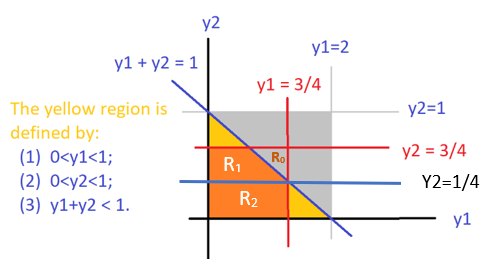

```{=html}
<style type="text/css">

div#TOC li {
    list-style:none;
    background-image:none;
    background-repeat:none;
    background-position:0;
}
h1.title {
  font-size: 24px;
  color: DarkRed;
  text-align: center;
}
h4.author { /* Header 4 - and the author and data headers use this too  */
    font-size: 18px;
  font-family: "Times New Roman", Times, serif;
  color: DarkRed;
  text-align: center;
}
h4.date { /* Header 4 - and the author and data headers use this too  */
  font-size: 18px;
  font-family: "Times New Roman", Times, serif;
  color: DarkBlue;
  text-align: center;
}

h1 { /* Header 3 - and the author and data headers use this too  */
    font-size: 20px;
    font-family: "Times New Roman", Times, serif;
    color: darkred;
    text-align: center;
}
h2 { /* Header 3 - and the author and data headers use this too  */
    font-size: 18px;
    font-family: "Times New Roman", Times, serif;
    color: navy;
    text-align: left;
}

h3 { /* Header 3 - and the author and data headers use this too  */
    font-size: 16px;
    font-family: "Times New Roman", Times, serif;
    color: navy;
    text-align: left;
}

</style>
```


```{r setup, include=FALSE}
# code chunk specifies whether the R code, warnings, and output 
# will be included in the output files.
if (!require("knitr")) {
   install.packages("knitr")
   library(knitr)
}

knitr::opts_chunk$set(echo = TRUE,       
                      warnings = FALSE,   
                      results = TRUE,   
                      message = FALSE,
                      fig.align='center', 
                      fig.pos = 'ht')
```

\

# Introduction

This note is dedicated to the joint and marginal distributions of multivariate variables. The primary emphasis will be the bivariate distributions (both continuous and discrete). **The first three sections of chapter 5** in the textbook cover these topics.

# Joint Distribution of Categorical Variables

For ease of simplicity, we only discuss the joint distribution of two categorical variables. If both categorical variables are ordinal, we can encode labels and treat the encoded categorical variables as discrete numerical variables and use the same method to be discussed in the next section to define joint and cumulative distributions. But the numerical measures such as those associated with moments are NOT well defined.

Next, we use an example to illustrate the joint distribution of two categorical variables.

**Example 1**: If we want to know the relationship between the **attitude of life** and **marital status** by exploring the distribution of these two variables. We assume the following two-way contingency table was constructed based on a random sample from a population.

```{r echo = FALSE, fig.align='center', out.width = '40%'}

```

We can easily convert the above two-way contingency table to a joint probability distribution table in the following.

```{r echo = FALSE, fig.align='center', out.width = '55%'}
include_graphics("topic06/twoNominalCateJointDistTables.png")
```

We can define the joint probability distribution for a specific event based on the table

$$
p_{ij} = P[X= row \ number, Y = column \ number]
$$

Assume that $X$ has $I$ categories and $Y$ has $J$ categories. The following two requirements analogous to that required in univariate distributions are also satisfied.

1.  $0 \le p_{ij} \le 1$ for $1 \le i \le I$ and $1 \le j \le J$.

2.  $\sum_{i=1}^I \sum_{j = 1}^J p_{ij} = 1.$

It is important to note that the cumulative probability distribution (CDF) of categorical variables is defined based on **ordered** categorical variables. Therefore, for nominal categorical variables, the CDF of the joint distribution is **NOT** defined.

We can define **bivariate** events using discrete sets. For example, $E = \left[ X\in\{'Married',\ 'Never \ Married'\}\right] \cap \left[Y\in\{'Dull',\ 'Never \ Exciting'\} \right]$ is a bivariate event defined based on the distribution table in **Example 1** (see the following table with highlighted cells).

```{r echo = FALSE, fig.align='center', out.width = '55%'}
include_graphics("topic06/twoNominalCateJointDistEventProb.png")
```

We can easily find the probability of observing event $E$

$$
P(E) = 0.021 + 0.252 + 0.011 + 0.109 = 0.393.
$$

In general, a bivariate event is defined in the form of

$$
E = \bigr[ X\in \{ set \ of \ category \ labels \ of \ X\} \bigr]\bigcap \bigr[ Y\in \{ set \ of \ category \ labels \ of \ Y\} \bigr]
$$

The objective of studying the joint distribution of the categorical variables is to see whether they are independent of each other. For example, the well-known $\chi^2$ test of independence was developed for this purpose. More details on the theory behind this test will be discussed in the next note.

In the next two sections, we discuss bivariate numerical distributions.

\

# Discrete Bivariate Distributions

Recall that the probability distribution of univariate random variable $X$ (assuming $X$ taking values $\{x_1, x_2, \cdots, x_n, \cdots \}$) can be graphically represented in the following.

```{r echo = FALSE, fig.align='center', out.width = '60%'}

```

that satisfies

1.  $0 \le P(x_i) \le 1$ for $i=1, 2, \cdots$

2.  $\sum_i P(x_i) = 1$.

We also note that the definition of expectation and variance are given by

-   $\mu = E[X] = \sum_i x_iP(X = x_i)$.

-   $V[X] = \sum_i (x_i - \mu)^2P(X=x_i)$.

The cumulative distribution function (CDF) is defined to be

$$
P[X \le x] = \sum_{x_i \le x} P(X = x_i)
$$

## Joint Distribution and Properties

For a bivariate distribution, we use the following example to demonstrate the definition of the joint distribution. Consider an experiment of rolling a six-sided **fair** dice and flipping an **imbalanced** coin. Let $Y =$ the number of dots facing up when rolling a die and $X =$ the outcome observed ($X = 1$ if a Heads is observed and $X = 2$ if a Tails is observed). Then the following two-way contingency table illustrates the joint distribution of random variables $X$ and $Y$.

```{r echo = FALSE, fig.align='center', out.width = '70%'}
include_graphics("topic06/discreteBivariateJointDistTable.png")
```

We can also use the following 3-D chart to represent the above joint distribution

```{r echo = FALSE, fig.align='center', out.width = '80%'}

```

**Joint Probability**: The *height* of each vertical bar that is equal to the corresponding cell of the contingency table represents the joint probability of observing the two corresponding values respectively. For example, $P[X=2, Y =3] = 3/60$ (see the marked cell in the table and labeled bar in the figure).

The above table is called the **joint probability distribution table** of random variables $X$ and $Y$.

We can also call the above chart **joint probability distribution histogram**.

Similarly, we observe the following requirements that are analogous to the univariate distributions.

1.  $0 \le P(X=x_i, Y=y_j) = p_{ij} \le 1$;

2.  $\sum_i\sum_j P(X=x_i, Y=y_j) = 1$.

The **cumulative distribution function (CDF)** is defined to be of the following form

$$
F(x,y) = \sum_{x_i < x} \sum_{y_i < y} P(X=x_i, Y=y_i)
$$

The following figure shows how to calculate $F(2,3)$.

```{r echo = FALSE, fig.align='center', out.width = '80%'}

```

The value of $F(2,3)$ is equal to the sum of the heights of all vertical bars in the top-left corner of $xy$-plane. That is,

$$
F(2,3) = 3\times\frac{7}{60} + 3\times \frac{3}{60} = \frac{30}{60} = 0.5.
$$

Similarly, we can find $F(1.5, 4.5) = 4\times (7/60) = 28/60 =7/15$.

**A Cautionary Note:** We have numerically encoded the outcome labels of the trial of flipping a coin (Heads = 1 and Tails = 2). The encoded values have a natural order. So we can define the CDF of using the standard form $F(x,y) = P(X \le x, Y \le y )$ that involves **'**$\le$'


## Marginal Distributions

Notice that row and column totals in the margins of the following joint probability distribution table satisfy the distribution of discrete univariate random variables. For this reason, we call the row totals the **marginal distribution** of $X$, and the column totals the **marginal distribution** of $Y$.

```{r echo = FALSE, fig.align='center', out.width = '80%'}

```

Graphically, the marginal distribution histograms are given in the following figure.

```{r echo = FALSE, fig.align='center', out.width = '80%'}

```

\

# Continuous Bivariate Distributions

We can similarly generalize the univariate distribution to multivariate distribution. Recall that the probability density function (*pdf*) $f(x)$ of a continuous random variable meets the following two conditions.

1.  $f(x) \ge 0$,

2.  $\int_{D} f(x) dx = 1$, where $D$ is the domain of the density function $f(x)$.

The cumulative distribution function (CDF) is defined to be

$$
F(x) = \int_{-\infty}^x f(t)dt.
$$

The following figure illustrates the two requirements and the definition of the CDF.

```{r echo = FALSE, fig.align='center', out.width = '50%'}
include_graphics("topic06/univariateContinuoudDistCurve.png")
```


## Continuous Bivariate Distribution

Let $X$ and $Y$ be two continuous variables. The probability density function of the distribution is a function of two variables $f(x,y)$ that satisfies the following two conditions.

1.  $f(x,y) \ge 0$

2.  $\iint_D f(x,y) dxdy = 1$, where $D$ is the domain of $f(x,y)$. Geometrically, this condition implies that the volume between the density surface and $xy$-plane is equal to 1.

The following figure is the density surface of a bivariate normal distribution which is an optional topic for this course (see section 5.10 of the textbook for more information).

```{r echo = FALSE, fig.align='center', out.width = '40%'}
include_graphics("topic06/bivariateNormalDist.png")
```

The CDF is defined as

$$
F(x,y) = \int_{-\infty}^x\int_{-\infty}^y f(s,t)ds dt
$$

The value of $F(x,y)$ is part of the total volume specified in the above condition 2 and is demonstrated in the following figure.

```{r echo = FALSE, fig.align='center', out.width = '50%'}

```

A bivariate event associated with bivariate distribution is defined by a region within the domain of the bivariate density function. As an illustrative example, the following figure shows such an event and its probability is the volume that is of the part of the surface and the shaded region.

$$
P[(x,y) \in C] = \iint_C f(x,y)dA.
$$

```{r echo = FALSE, fig.align='center', out.width = '30%'}
include_graphics("topic06/probOverARegionC.png")
```

where $A$ is an arbitrarily small region inside $C$.

\

<font color = "darkred">**Example 2**</font> Suppose that a radioactive particle is randomly located in a square with sides of unit length. That is, if two regions within the unit square and of equal area are considered, the particle is equally likely to be in either region. Let $Y_1$ and $Y_2$ denote the coordinates of the particle's location. A reasonable model for the relative frequency histogram for $Y_1$ and $Y_2$ is the bivariate analog of the univariate uniform density function:

$$
\displaystyle f(y_1, y_2) = \begin{cases} 
 1 & \text{if $0 \le y_1 \le 1$, $0 \le y_2 \le 1$}, \\  
 0 & \text{otherwise}.
 \end{cases}
$$

a.  Sketch the probability density surface.
b.  Find the CDF of $f(x,y)$. As a special case, find $F(.2, .4)$.
c.  Find $P(.1 \le Y_1 \le .3, 0 \le Y_2 \le .5)$.

**Solution**: (a). The probability surface of this example is given below (the top blue plane). It is a bivariate uniform distribution defined over a square on the $xy$-axis: $0 \le x \le 1, 0 \le y \le 1$.

```{r echo = FALSE, fig.align='center', out.width = '60%'}
include_graphics("topic06/bivariateUnifExample02.png")
```

(b). Referring to the above figure, we define the CDF in the following different cases

1.  if $y_1 <0$ or $y_2 <0$, then $F(y_1,y_2) = 0$

2.  if $y_1 > 1$ and $y_2 < 1$, then $F(y_1, y_2) = y_2$

3.  if $y_1 < 1$ and $y_2 > 1$, then $F(y_1, y_2) = y_1$

4.  if $y_1 < 1$ and $y_2 < 1$, then $F(y_1, y_2) = y_1y_2$

5.  if $y_1 > 1$ and $y_2 > 1$, then $F(y_1, y_2) = 1$

The following figure shows the different regions used in the definition of the above CDF.

```{r echo = FALSE, fig.align='center', out.width = '50%'}
include_graphics("topic06/bivariateUnifExample02Part02.png")
```

$$
F(0.2, 0.4) = 0.08
$$ That is the volume of the cube shown in the figure in part (a).

(c). 
$$P(.1 \le Y1 \le .3, 0 \le Y2 \le .5) =\iint_{\{D: \ \ 0.1 \le Y_1 \le 0.3, \ \ 0 \le Y_2 \le 0.5\}}f(y_1, y_2)dA
$$

$$
 = \int_0^5\int_{0.1}^{0.3}1dy_1dy_2 = 1\times (0.5-0)\times (0.3-0.1) = 0.01
$$

which is the volume of the cube in the following figure.

```{r echo = FALSE, fig.align='center', out.width = '50%'}

```

\

## A Review of Double Integral

Double integral is the generalization of the univariate integration. Let $Y_1$ and $Y_2$ be two random variables with joint density distribution function $f(y_1, y_2)$. Assume further that the domain of the bivariate density function $f(y_1, y_2)$ is $\mathcal{R}$, a region on the $y_1y_2$-plane. We have defined the CDF and the probability of events associated with bivariate variables are **double integral**. Recall that the definite integral of a univariate function is the area between the curve and the horizontal axis. Similarly, the definite integral of a bivariate function $f(y_1, y_2)$ is the volume between the surface of $f(y_1, y_2)$ and the domain of $f(y_1, y_2)$, a region in $y_1y_2$-plane.

In the previous example, our bivariate density function is a uniform distribution with a rectangular domain, we can find the CDF and the probability of **rectangular bivariate** events easily using the volume formula of the rectangular prism. In general, the density function is not necessarily uniform (i.e., $f(y_1, y_2)$ is not necessarily a constant function).

```{r echo = FALSE, fig.align='center', out.width = '50%'}

```

To logic for evaluating a double integral is similar to the approximation used in the univariate integral. We partition the domain into many small rectangles and then define many rectangular prisms as shown in the above figure and use the sum of the volumes of all small rectangular prisms to approximate the double integral. The following figure illustrates the process of this approximation process.

```{r echo = FALSE, fig.align='center', out.width = '90%'}

```

The objective of a double integral is to find the value

$$
V = \iint_{\mathcal{R}} f(y_1, y_2)dA
$$

Before introducing the steps for setting up the double to iterative integral, we look at the following example.

<font color = "darkred">**Example 3**</font>. Let $Y_1$ and $Y_2$ be the proportions of two types of components in a sample from a mixture of chemicals used as an insecticide. Suppose that $Y_1$ and $Y_2$ have the joint density function given by

$$
\displaystyle f(y_1, y_2) = \begin{cases} 
 2 & \text{if $0 \le y_1 \le 1$, $0 \le y_2 \le 1$, $0 \le y_1 +y_2 \le 1$} \\  
 0 & \text{otherwise}.
 \end{cases}
$$

Verify that the above bivariate function is a valid density function of the joint distribution of $(X, Y)$.


**Solution**. This example is different from the previous example in that the domain is not a rectangular region. The question is how to set up the lower and upper limits of the iterative limits converted from the double limits.

Before finding the probabilities in a) and b), we first sketch the region (domain) given in the density function in the following (the yellow region is the domain of the density function) and the density surface in the following figures.

```{r echo = FALSE, fig.align='center', out.width = '40%'}

```

```{r echo = FALSE, fig.align='center', out.width = '40%'}
include_graphics("topic06/example03DensitySurface.png")
```

This bivariate distribution is still uniform but with a triangular domain. To validate the density function, we evaluate the following double integral by converting it into an iterative integral.

$$
\iint_D f(y_1,y_2)dy_1dy_2 = \int_0^1 \left[ \int_0^{1-y_2}2 dy_1 \right] dy_2 
$$

$$
= \int_0^1\left[2y_1\Big|_0^{1-y_2}\right]dy_2 = \int_0^1 \left[2(1-y_2) -0\right]dy_2 = -(1-y_2)^2\Big|_0^1 = 1.
$$

Therefore, $f(y_1,y_2)$ is a valid bivariate density function.

In the above calculation, one of the most important steps is to rewrite the double integral

$$
\iint_D f(y_1,y_2)dy_1dy_2 = \int_0^1 \left[ \int_0^{1-y_2}2 dy_1 \right] dy_2
$$

$\int_0^{1-y_2}2 dy_1$ is called inner integral. $\int_0^1 \left[ \cdot \right] dy_2$ is called outer integral. The integral limits of the outer integral MUST be scalars.

Next, we focus on how to rewrite a double integral to an iterative integral. For ease of illustration, we consider bivariate function $f(x,y)$ and an associated with a region $\mathcal{R}$. Whether a double integral can be rewritten as an iterative integral is dependent on whether the integral region is one of the following two types of **regular** regions

### Type I Region

The first type of region that we may need to integrate over has the form $\mathcal{R} =\{(x,y):a \le x \le b, g_1(x) \le y \le g_2(x)\}$. This type of domain is sometimes called y-simple domains/regions. Note that $\mathcal{R}$ represents the area trapped between the continuous curves $y=g_1(x)$ and $y=g_2(x)$ for $a \le x \le b$. The type I region is shown below.

```{r echo = FALSE, fig.align='center', out.width = '30%'}
include_graphics("topic06/typeOneRegion.png")
```

Because region $\mathcal{R}$ is bounded by two vertical lines ($a \le x \le b$) and two curves ($g_1(x) \le y \le g_2(x)$), when re-express double integral into iterative integral, the outer integral (with respect to $y$) **must** have scalar lower and upper limits and the inner integral should have variable $x$ in the lower and upper limits. That is,

$$
\iint_{\mathcal{R}}f(x,y)dA = \int_a^b\int_{g_1(x)}^{g_2(x)} f(x,y)dydx = \int_a^b \left[\int_{g_1(x)}^{g_2(x)} f(x,y)dy\right]dx.
$$

The second term is called iterative integral (pay attention to the order of $dx$ and $dy$). The third term implicitly gives the order of calculation: inner integral first and outer integral second.

\

<font color = "darkred">**Example 4** [Example 3 revisited]</font>. The domain of $f(y_1, y_2)$ in **Example 3** is $\mathcal{R} = D$ (see the following figure).

```{r echo = FALSE, fig.align='center', out.width = '40%'}

```

We can consider $D$ to be bounded by two vertical line $0 \le y_1 \le 1$ and two curves $y_2 =0$ and $y_2 = 1 -y_1$, that is, $0 \le y_2 \le 1 -y_1$. Therefore, we can also rewrite the iterative integral in the following form.

$$
\iint_D f(y_1,y_2)dA = \int_0^1 \left[ \int_0^{1-y_1}2 dy_2 \right] dy_1 
$$

\

### Type II Region

The second type of region that we may need to integrate over would be in the form $\mathcal{R} =\{(x,y):h_1(y) \le x \le h_2(y),c \le y \le d\}$. These types of domains are sometimes called x-simple domains/regions. Note that here, D represents the area trapped between the continuous curves $x=h_1(y)$ and $x=h_2(y)$ for $c \le x \le d$.

```{r echo = FALSE, fig.align='center', out.width = '30%'}

```

Because region $\mathcal{R}$ is bounded by two vertical lines ($c \le y \le d$) and two curves ($h_1(y) \le x \le h_2(y)$), when re-express double integral into iterative integral, the outer integral (with respect to $y$) **must** have scalar lower and upper limits and the inner integral should have variable $x$ in the lower and upper limits. That is, $h_1(y) \le x \le h_2(y)$.

\

<font color = "darkred">**Example 5** [Example 3 revisited]</font>. We can also consider $D$ in **Example 3** to be a region bounded by two parallel lines $0 \le y_2 \le 1$ and two *curves* $y_1 = 0$ and $y_1 = 1 - y_2$, that is , $0 \le y_1 \le 1 - y_2$. The iterative integral in **Example 3** is based on the type II region.

$$
\iint_D f(y_1,y_2)dA = \int_0^1 \left[ \int_0^{1-y_2}2 dy_1 \right] dy_2 
$$

\

### Summarizing Steps for Setting up Iterative Integrals

The following are suggested steps for correctly setting up the iterative integrals 

1. Sketch the region $\mathcal{R}$.

2. Sketch the region where $f(x, y) > 0$. In the integral the region where $f(x, y) = 0$ does not matter.

3. Sweep the region Horizontally or Vertically.

4. Get bounds for x and y, depending on the order of sweeping.

5. Set up the double integral as a repeated integral.

6. In some cases, might need multiple intervals.

Note that, for horizontal sweeping, y is fixed with constant bounds, but bounds on x might depend on y. While for vertical sweeping, x is fixed with constant bounds, but bounds on y might depend on x.

\

<font color = "darkred">**Example 6**</font>. Set up a double integral of $f(x, y)$ over the region given by $0 < x < 1$ and $x < y < x + 1$.

**Solution**: We follow the suggested steps and sketched region $\mathcal{R}$ in the following


```{r echo = FALSE, fig.align='center', out.width = '30%'}

```

Apparently, $\mathcal{R}$ is a type I region. Therefore, we can convert the double integral to the iterative integral in the following.

$$
\iint_{\mathcal{R}} f(x,y)dA = \int_0^1\int_x^{x+1} f(x,y)dydx.
$$

<font color = "darkred">**Example 7**</font>. Evaluate

$$
\iint_{\mathcal{R}}e^{-x-2y}dA
$$

where $\mathcal{R}$ is the region in the first quadrant with $x \le y$.


**Solution**. We first sketch region $\mathcal{R}$ in the following.

```{r echo = FALSE, fig.align='center', out.width = '30%'}

```

```{r echo = FALSE, fig.align='center', out.width = '40%'}
include_graphics("topic06/calcReviewExample7Surface.png")
```


Just like the region in **Example 3**, $\mathcal{R}$ can be viewed as both types I and II region. So we can evaluate the double integral in the following

$$
\iint_{\mathcal{R}} e^{-x-2y}dA = \int_0^1 \int_x^1 e^{-x-2y} dydx = \int_0^1\int_0^y e^{-x-2y} dx dy
$$
We now evaluate the double integral using the last iterative integral. Using the rules of substitution, we have 


$$
\int_0^y e^{-x-2y} dx =  -\int_0^ye^{-(x+2y)} d[-(x+2y)] 
$$

$$
= -\int_0^y d e^{-(x+2y)} = -e^{-(x+2y)}\Big|_0^y
$$

$$
=-\left[ e^{-(y+2y)} - e^{-(0+2y)}\right] = e^{-2y}-e^{-3y}.
$$


Therefore,

$$
\iint_{\mathcal{R}} e^{-x-2y}dA= \int_0^1\int_0^y e^{-x-2y} dx dy=\int_0^1(e^{-2y}-e^{-3y})dy
$$

$$
= -\left[ \frac{1}{2}e^{-2y} + \frac{1}{3}e^{-3y} \right]\Big|_0^1=\frac{5-3e^{-2}-2e^{-3}}{6}
$$


\

<font color = "darkred">**Example 7**</font>. Evaluate

$$
\iint_{\mathcal{R}}e^{-x-2y}dA
$$

Evaluate
$$
\iint_{\mathcal{R} }(x^2 + y^2)dA,
$$

where R is the region $0 < x < y < L$.


**Solution**. We first sketch the surface and the region $0 < x < y < L$ on $xy$-plane.


```{r echo = FALSE, fig.align='center', out.width = '60%'}
include_graphics("topic06/calcReviewExample8Surface.png")
```

$\mathcal{R} = \{(x,y): 0 < x < y < L \}$ is both type I and type II region. We convert the double integral into an iterative integral in the following

$$
\iint_{\mathcal{R}} (x^2+y^2)dA = \int_0^L\int_0^y(x^2+y^2)dxdy
$$

$$
= \int_0^L\left[ (\frac{x^3}{3}+xy^2)\Big|_0^y \right] dy =\int_0^L\frac{4y^3}{3}dy=\frac{y^4}{3}\Big|_0^L =\frac{L^4}{3}.
$$

\

Sometimes, an integral region $\mathcal{R}$ is neither type I nor type II, then we need to partition it into the union of two or more type I or/type II subregions and then evaluate the double integral on these partitioned regions separately.

\

<font color = "darkred">**Example 8** [continuation of Example 3] </font>. Consider the bivariate distribution

$$
\displaystyle f(y_1, y_2) = \begin{cases} 
 2 & \text{if $0 \le y_1 \le 1$, $0 \le y_2 \le 1$, $0 \le y_1 +y_2 \le 1$}\\  
 0 & \text{otherwise}.
 \end{cases}
$$

Find probability $P[Y_1 \le 3/4, Y_2 \le 3/4]$.

\

**Solution**. As always, we first sketch the region on $y_1y_2$-plane that is associated with the probability.


```{r echo = FALSE, fig.align='center', out.width = '70%'}

```

The orange region is neither type I nor a type II region. We split it into $\mathcal{R}_1$ (type II region) and $\mathcal{R}_2$ (both type I and type II regions). We can then set up the double integral in the following

$$
\iint_{\mathcal{R} = \mathcal{R_1} \cup \mathcal{R_2}} f(y_1,y_2)dA = \iint_{\mathcal{R_1}} f(y_1,y_2)dA + \iint_{\mathcal{R_2}} f(y_1,y_2)dA
$$


$$
=\int_0^{3/4}\int_0^{1/4} f(y_1, y_2)  dy_2dy_1 + \int_{1/4}^{3/4}\int_0^{1-y_2} f(y_1,y_2) dy_1dy_2.
$$

For this example, there is a shortcut we may want to consider. Note that $S = \mathcal{R_0} \cup \mathcal{R_1} \cup \mathcal{R_2}$ is a square with side length $3/4$. So we can re-express the double integral as

$$
\ \iint_{\mathcal{S}} f(y_1,y_2)dA - \iint_{\mathcal{R_0}} f(y_1,y_2)dA
$$

$$
=\int_0^{3/4}\int_0^{3/4} f(y_1, y_2)  dy_2dy_1 - \int_{1/4}^{3/4}\int_{1-y_1}^{3/4} f(y_1,y_2) dy_2dy_1.
$$
The calculation of the iterative integrals is straightforward and will leave it to you as exercises. The answer is $P[Y_1 \le 3/4, Y_2 \le 3/4] = 7/8$.


## Marginal Distributions

A marginal distribution of $(X,Y)$ will density function $f(x,y)$ is the distribution of $X$ or $Y$. We know that the marginal distributions of a discrete bivariate distribution are the marginal totals (row or column totals).

We can similarly define the marginal distributions of $z = f(x,y)$ that are geometric projections of the density surface to $zx$ and $zy$ respectively. The following figure demonstrates the two marginal distribution

```{r echo = FALSE, fig.align='center', out.width = '60%'}
include_graphics("topic06/bivariateMarginalDistribution.png")
```


Suppose that random variables $X$ and $Y$ are continuous with joint density $f(x,y)$. They are also individually continuous with density functions $f_X(x)$ and $f_Y(y)$, then

$$
f_X(x) = \int_{-\infty}^\infty f(x,y) dy, \ \  f_Y(y) = \int_{-\infty}^\infty f(x,y)dx 
$$

The functions $f_X(x)$ and $f_Y(y)$ are called marginal density functions of $X$ and $Y$ respectively.

\

<font color = "darkred">**Example 9**</font>. let

$$
\displaystyle f(y_1, y_2) = \begin{cases} 
 2y_1 & \text{if $0 \le y_1 \le 1$, $0 \le y_2 \le 1$}\\  
 0 & \text{otherwise}.
 \end{cases}
$$

 
 
(1). Find the two marginal density functions.


(2). Find the CDF for the two marginal distributions. 


**Solution** We first sketch the density surface in the following.


```{r echo = FALSE, fig.align='center', out.width = '60%'}
include_graphics("topic06/calcReviewExampl8Surface.png")
```

Next, using the definition of the marginal distribution, we have

$$
f_{Y_1}(y_1) = \int_{-\infty}^\infty f(y_1, y_2) dy_2 = \int_0^1 2y_1dy_2 = 2y_1y_2\Big|_0^1 = 2y_1.
$$
$$
f_{Y_2}(y_2) = \int_{-\infty}^\infty f(y_1, y_2) dy_1 = \int_0^1 2y_1dy_1 = y_1^2\Big|_0^1 = 1.
$$

We can easily check that both $f_{Y_1}(y_1)$ and $f_{Y_2}(y_2)$ are valid univariate density functions. In fact, $f_{Y_2}(y_2)$ is a uniform distribution defined on interval $[0, 1]$.


\

The following PDF file has more practical exercises on how to convert double integrals into iterative integrals with various types of regions. <https://pengdsci.github.io/WCUSTA504/topiv06-doubleIntegralRevex.pdf>


\

\


## Marginal Distributions

A marginal distribution of $(X,Y)$ will density function $f(x,y)$ is the distribution of $X$ or $Y$. We know that the marginal distributions of a discrete bivariate distribution are the marginal totals (row or column totals).

We can similarly define the marginal distributions of $z = f(x,y)$ that are geometric projections of the density surface to $zx$ and $zy$ respectively. The following figure demonstrates the two marginal distribution

```{r echo = FALSE, fig.align='center', out.width = '60%'}
include_graphics("topic06/bivariateMarginalDistribution.png")
```


Suppose that random variables $X$ and $Y$ are continuous with joint density $f(x,y)$. They are also individually continuous with density functions $f_X(x)$ and $f_Y(y)$, then

$$
f_X(x) = \int_{-\infty}^\infty f(x,y) dy, \ \  f_Y(y) = \int_{-\infty}^\infty f(x,y)dx 
$$

The functions $f_X(x)$ and $f_Y(y)$ are called marginal density functions of $X$ and $Y$ respectively.

\

<font color = "darkred">**Example 9**</font>. let

$$
\displaystyle f(y_1, y_2) = \begin{cases} 
 2y_1 & \text{if $0 \le y_1 \le 1$, $0 \le y_2 \le 1$}\\  
 0 & \text{otherwise}.
 \end{cases}
$$

 
 
(1). Find the two marginal density functions.


(2). Find the CDF for the two marginal distributions. 


**Solution** We first sketch the density surface in the following.


```{r echo = FALSE, fig.align='center', out.width = '60%'}
include_graphics("topic06/calcReviewExampl8Surface.png")
```

Next, using the definition of the marginal distribution, we have

$$
f_{Y_1}(y_1) = \int_{-\infty}^\infty f(y_1, y_2) dy_2 = \int_0^1 2y_1dy_2 = 2y_1y_2\Big|_0^1 = 2y_1.
$$
$$
f_{Y_2}(y_2) = \int_{-\infty}^\infty f(y_1, y_2) dy_1 = \int_0^1 2y_1dy_1 = y_1^2\Big|_0^1 = 1.
$$

We can easily check that both $f_{Y_1}(y_1)$ and $f_{Y_2}(y_2)$ are valid univariate density functions. In fact, $f_{Y_2}(y_2)$ is a uniform distribution defined on interval $[0, 1]$.


