```{=html}
<style type="text/css">

div#TOC li {
    list-style:none;
    background-image:none;
    background-repeat:none;
    background-position:0;
}
h1.title {
  font-size: 24px;
  color: DarkRed;
  text-align: center;
}
h4.author { /* Header 4 - and the author and data headers use this too  */
    font-size: 18px;
  font-family: "Times New Roman", Times, serif;
  color: DarkRed;
  text-align: center;
}
h4.date { /* Header 4 - and the author and data headers use this too  */
  font-size: 18px;
  font-family: "Times New Roman", Times, serif;
  color: DarkBlue;
  text-align: center;
}

h1 { /* Header 3 - and the author and data headers use this too  */
    font-size: 20px;
    font-family: "Times New Roman", Times, serif;
    color: darkred;
    text-align: center;
}
h2 { /* Header 3 - and the author and data headers use this too  */
    font-size: 18px;
    font-family: "Times New Roman", Times, serif;
    color: navy;
    text-align: left;
}

h3 { /* Header 3 - and the author and data headers use this too  */
    font-size: 16px;
    font-family: "Times New Roman", Times, serif;
    color: navy;
    text-align: left;
}

</style>
```


```{r setup, include=FALSE}
# code chunk specifies whether the R code, warnings, and output 
# will be included in the output files.
if (!require("knitr")) {
   install.packages("knitr")
   library(knitr)
}

knitr::opts_chunk$set(echo = TRUE,       
                      warnings = FALSE,   
                      results = TRUE,   
                      message = FALSE,
                      fig.align='center', 
                      fig.pos = 'ht')
```

\

# Introduction

This note is dedicated to the conditional distributions and independence between joint random variables. **Sections 3 and 4 of chapter 5** in the textbook cover these topics.

# Conditional Distribution of Categorical Variables

We still use a two-way contingency table as an example to illustrate the conditional distribution of two random variables.

<font color = "red">**Example 1** </font>. A Safety Officer for an auto insurance company in Connecticut was interested in learning how the extent of an individual's injury in an automobile accident relates to the type of safety restraint the individual was wearing at the time of the accident. As a result, the Safety Officer used statewide ambulance and police records to compile the following two-way (flat) table of joint probabilities.

```{r echo=FALSE, fig.align='center',out.width = '65%', fig.cap= "A flat two-way contingency table of joint probability distribution"}
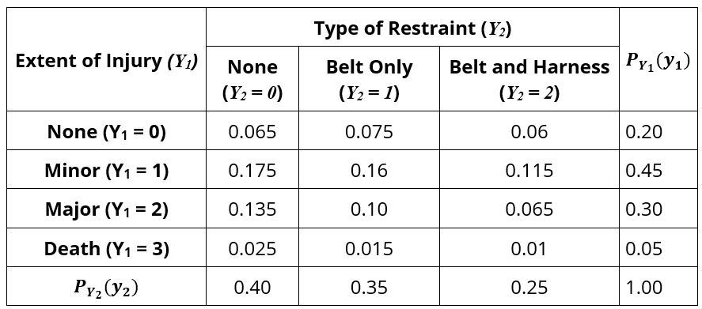
```


The row totals define the marginal distribution of $Y_1$ and the column totals define the marginal distribution of $Y_2$. Note that we can also reshape the above two-way table in the following *long table*.

```{r echo=FALSE, fig.align='center',out.width = '65%'}
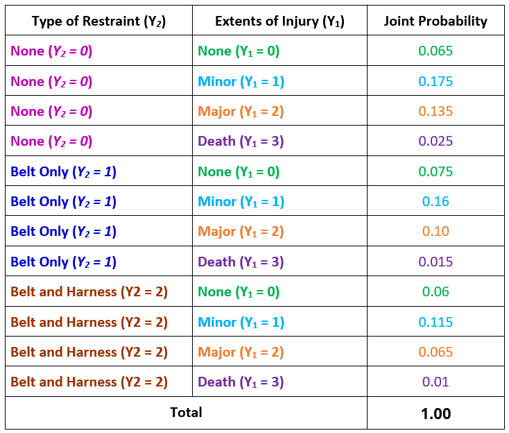
```


**A conditional distribution** is a distribution of values for one variable that exists specifying the values of other variables. In other words, for random variables ($Y_1, Y_2$), we can find the distribution of $Y_1$ when $Y_2 = y_2^0$ ($y_2^0$ is a value in the domain of $Y_2$).


<font color="red">**Example 2**</font>. Find the distribution of $Y_1|Y_2 = 1$. This means, we want to find the probability distribution of **Extent of Injury ($Y_1$)** for the *subpopulation* of individuals using **Seat-belts Only** (see the following shaded column). 

```{r echo=FALSE, fig.align='center',out.width = '65%'}
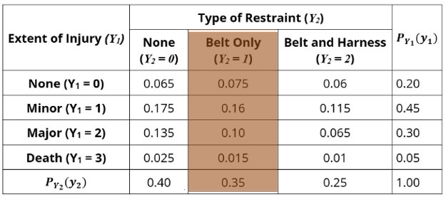
```

However, the joint probabilities in the shaded column do not sum up to unity. This does not meet the requirements of a discrete variable. We need to **normalize** the column to make a valid probability distribution by using the definition of the conditional distribution. 

In this example, we need to calculate the following conditional probabilities.

$$
P(Y_1=0|Y_2 = 1) = \frac{P(Y_1 =0, Y_2=1)}{P(Y_2=1)} = \frac{0.075}{0.35}= 0.2143
$$
$$
P(Y_1=1|Y_2 = 1) = \frac{P(Y_1 =1, Y_2=1)}{P(Y_2=1)} = \frac{0.16}{0.35} = 0.4571
$$
$$
P(Y_1=2|Y_2 = 1) = \frac{P(Y_1 =2, Y_2=1)}{P(Y_2=1)} = \frac{0.1}{0.35}=0.2857
$$
$$
P(Y_1=3|Y_2 = 1) = \frac{P(Y_1 =3, Y_2=1)}{P(Y_2=1)} = \frac{0.015}{0.35}=0.0429
$$
The above conditional probabilities form a probability distribution that is summarized in the following table

```{r echo=FALSE, fig.align='center',out.width = '65%'}
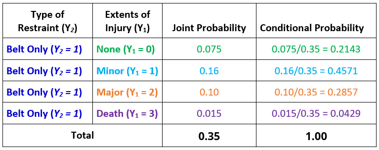
```

We can similarly find the conditional distribution of $Y_1$ by conditioning on values of $Y_2$.


\


# Independence Between Two Discrete Random Variables

\

We have learned the independence of two events: **A** and **B** are independent if and only if $P(A|B) = P(A)$ which is equivalent to $P(A\cap B) = P(A)P(B)$. 


For two discrete categorical variables, $Y_1 =y_1^i$ ($1 \le i \le I$) and $Y_2=Y_2^j$ ($1 \le j \le J$), **$Y_1$ and $Y_2$ are independent** *if and only if* $P(Y_1=y_1^i, Y_2=y_2^j) = P(Y_1 =y_1^i)P(Y_2 = y_2^j)$ for all $1 \le i \le I$ and $1 \le j \le J$. This implies that *$Y_1$ and $Y_2$ are independent if and only if <font color = "red"><b>every joint probability</b> </font> is equal to the product of the two corresponding marginal probabilities*. Otherwise, the two random variables are dependent.


\


<font color="red">**Example 3**</font>. (Example 1 revisited) Are **Extent of Injury ($Y_1$)** and **Type of Restraint ($Y_2$)** independent?

**Solution**: Based on the above definition of independence of two categorical random variables, if one of the joint probabilities is NOT equal to the product of the corresponding marginal probabilities, then the two discrete random variables are **dependent**.  Since $0.065 = P(Y_1 =0, Y_2 = 0) \ne P(Y_1=0)P(Y_2 =0) = 0.2\times 0.4 = 0.08$, therefore, $Y_1$ and $Y_2$ are dependent.

\


<font color="red">**Example 4**</font>. Let $Y_1$ be the status of watching online advertisements and $Y_2$ be the status of planning a vacation in New York City next year. Based on a hypothetical survey, we obtain an empirical joint distribution table.


```{r echo=FALSE, fig.align='center',out.width = '65%'}
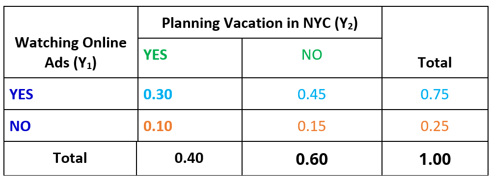
```


Are the categorical variables "a randomly selected person watched the online ad" and "a randomly selected person plans to vacation in New York within the next year" independent or not independent? Justify your answer using probabilities calculated from the information in the table.

**Solution**: We need to check the 

$$
P[Y_1 =YES|Y_2 = YES] = \frac{P[Y_1=YES\cap Y_2=YES]}{P[Y_2=YES]} = \frac{0.30}{0.40} = 0.75 =P[Y_1=YES]
$$

$$
P[Y_1 =NO|Y_2 = YES] = \frac{P[Y_1=NO\cap Y_2=YES]}{P[Y_2=YES]} = \frac{0.10}{0.40} = 0.25 =P[Y_1=NO]
$$

This means, the conditional distribution of $(Y_1, Y_2$ conditioning on $Y_2 = YES$ is equal to the marginal distribution of $Y_1$. Similarly, we can show that the conditional distribution of $(Y_1, Y_2$ conditioning on $Y_2 = NO$ is also equal to the marginal distribution of $Y_1$. Therefore, $Y_1$ and $Y_2$ are independent.

\

**In summary, to check the independence of two categorical random variables, we have one of the following equivalent conditions**:

1. The joint probability is equal to the product of the two corresponding marginal probabilities.

2. The conditional distribution of one variable conditioning on any level of the other variable is identical to the marginal distribution of the variable.


\

# Discrete Bivariate Distributions

For discrete bivariate distributions, We can define the distribution using tables, charts, and formulas.


<font color="red">**Example 5**</font>.  Consider the following bivariate joint distribution table.

```{r echo=FALSE, fig.align='center',out.width = '45%'}
# URL works for HTML but not PDF
# include_graphics("https://pengdsci.github.io/WCUSTA504/topic07/example05DiscreteDist.png") 
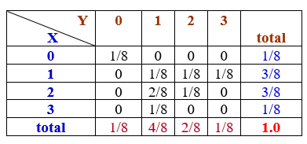
```

For illustrative purposes, we define the conditional distribution of $X$ conditioning on $Y=1$ in the following

$$
P[X=0|Y=1] = \frac{P[X=0, Y=1]}{P[Y=1]} = \frac{0}{4/8} = 0
$$
$$
P[X=1|Y=1] = \frac{P[X=1, Y=1]}{P[Y=1]} = \frac{1/8}{4/8} = \frac{1}{4}
$$
$$
P[X=2|Y=1] = \frac{P[X=2, Y=1]}{P[Y=1]} = \frac{2/8}{4/8} = \frac{1}{2}
$$
$$
P[X=3|Y=1] = \frac{P[X=3, Y=1]}{P[Y=1]} = \frac{2/8}{4/8} = \frac{1}{4}
$$

The conditional distribution of $X|Y=1$ is: $\{0, 1/4, 1/2, 1/4\}$.

We can simply find the conditional distributions of $X$ conditioning on the other values of $Y$ and conditional distributions of $Y$ conditioning on the values of $X$ as well.

Similar to what we commented earlier, conditional distributions can be obtained by dividing the corresponding marginal probability by the cell probabilities labeled by the value of the conditioning variable. In **Example 5**, we found the conditional probability of $X$ conditioning on $Y=1$ by dividing the cell probabilities in the column labeled with $Y=1$ by its marginal probability $P(Y=1) = 4/8$ (see the following shaded column in the table).

```{r echo=FALSE, fig.align='center',out.width = '45%'}
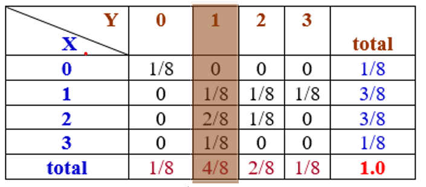
```


## Definition of Conditional Distributions
 

For discrete random variables $X$ and $Y$, the conditional probability distribution functions of $X$ given $Y$ and vice versa are defined as

$$
p_{X|Y}(x_i|y_j)=\frac{p_{XY}(x_i,y_j)}{p_Y(y_j)}, \ \ \  p_{Y|X}(y_j|x_i)=\frac{p_{XY}(y_j,x_i)}{p_Y(x_i)}
$$
for any $x_i \in R_X$ and $y_j\in R_Y$.  Furthermore,

$$
p_{X|Y}(x_i|y_j) = P[X=x_i|Y=y_j]
$$
$$
p_{XY}(x_i,y_j)=P[X=x_i, Y=y_j]
$$
$$
p_Y(y_j)=P[Y=y_j], \ \ \ p_X(x_i) = P[X=x_i]
$$


## Definition of Independence


**Independence of two discrete random variables** is defined in the same way as in the bivariate categorical distributions. That is, the cell probability is equal to the product of the two corresponding marginal probabilities.


<font color="red">**Example 6**</font>.  Consider the following bivariate joint distribution table.

```{r echo=FALSE, fig.align='center',out.width = '45%'}

```
Are $X$ and $Y$ independent?

**Solution**: We observe that $1/8 = P[X=0, Y=0] \ne P[X=0]\times P[Y=0] (1/8)\times(1/8) = 1/64$. This implies that $X$ and $Y$ are dependent.

\

Some technical rules can be used to test independence between two random variables. For example, if the probability distribution of discrete bivariate random variables ($X,y$) exists, say, $p(x,y)$, we use the following result to test the independence of $X$ and $Y$:

* If $p(x,y) = p(x)p(y)$, then $X$ and $Y$ are independent, where $p(x)$ and $p(y)$ are probability distributions of $X$ and $Y$ respectively. This means that if you can *decompose* the joint probability distribution function into the product of the corresponding marginal probability distributions, the two underlying random variables are independent.


* For a given the joint CDF of ($X, Y$), say, $F(x,y)$, if we can decompose the CDF as $F(x,y) = F(x)\times F(y)$, where $F(x)$ and $F(y)$ are the corresponding CDFs of $X$ and $Y$, then $X$ and $Y$ are independent. Otherwise, they are dependent.


\

<font color="red">**Example 7**</font>. Consider an experiment of tossing two imbalanced coins A and B. Assume that both coins have the sample probability ($p$) of observing *heads*.	Let $Y_1$ and $Y_2$ be the corresponding number of trials needed to observe the corresponding first *heads*. The joint distribution of discrete random variables $Y_1$ and $Y_2$ is as follows

$$
p( y_1, y_2) = (1-p)^{y1 + y2 - 2} p^2    
$$
 for $y_1, y_2  =  1, 2, \cdots,$. Are $Y_1$ and $Y_2$ independent?
 
 
 **Solution**: We first look at the probability distribution of $Y_1$. It is the number of trials needed to observe the first *heads*. This means that, before observing the *heads*, we only observed *tails*. Therefore the probability distribution function of $Y_1$ is given by
 
 $$
 P[Y_1 = y_1] = (1-p)^{y_1-1}p
 $$
where $(1-p)^{y_1-1}$ is the probability of observing first $y_1-1$ *tails* and $p$ is probability of observing the first *heads*. Similarly,

$$
P[Y_2=y_2] = (1-p)^{y_2-1}p
$$
With the above two marginal probability distribution functions, we can decompose the joint probability function as

$$
p(y_1, y_2) = (1-p)^{y_1+y_2-2}p^2 = (1-p)^{y_1-1}p \times (1-p)^{y_2-1}p = p_{Y_1}(y_1) p_{Y_2}(y_2)
$$
Therefore, $Y_1$ and $Y_2$ in this example are independent.

\

# Conditioning and Independence between Two Variables

The definitions of conditional distribution and independence of two continuous random variables are similar to that of discrete random variables. The difference is that all definitions will be based on the joint density functions.

## Conditional Distributions

Let $Y_1$ and $Y_2$ be continuous random variables with joint density function $f(y_1, y_2)$ and CDF $F(x,y)$. Furthermore, $f_{Y_1}(y_1) = \int_{D_2}f(y_1, y_2)dy_2$ and $f_{Y_2}(y_2) = \int_{D_1}f(y_1, y_2)dy_1$ are the two marginal distributions. We define the conditional probability density distributions as follows

$$
f_{Y_1|Y_2}(y_1|y_2) = \frac{f(y_1, y_2)}{f_{Y_2}(y_2)}, \ \ \ f_{Y_2|Y_1}(y_2|y_1) = \frac{f(y_1, y_2)}{f_{Y_1}(y_1)}
$$

\

<font color="red">**Example 8**</font>. Consider the following bisvariate density function of $Y_1$ and $Y_2$.

$$
\displaystyle f(y_1, y_2) = \begin{cases} 
 2y_1 & \text{if $0 \le y_1 \le 1$, $0 \le y_2 \le 1$}, \\  
 0 & \text{otherwise}.
 \end{cases}
$$

Find the conditional distributions of $Y_2$ conditioning on $Y_1=y_1$ and $Y_1$ conditioning on $Y_2 =y_2 $.

**Solution**: We first find the marginal distribution of $Y_1$ in the following
$$
f_{Y_1}(y_1) = \int_0^1f(y_1, y_2)dy_2=\int_0^12y_1dy_2 = 2y_1\int_0^1dy_2=2y_1.
$$
Therefore, the conditional density function of $Y_2|Y_1=y_1$ is given by

$$
f_{Y_2|Y_1}(y_1,y_2) = \frac{2y_1}{2y_1} = 1, \ \ 0 \le y_1 \le 1, 0 \le y_2 \le 1.
$$


Similarly, 

$$
f_{Y_2}(y_2) = \int_0^1f(y_1, y_2)dy_1 = \int_0^1 2y_1dy_1 = y_1^2\Big|_0^1 = 1.
$$
Therefore,
$$
f_{Y_1|Y_2}(y_1) = \frac{f(y_1,y_2)}{f_{Y_2}(y_2)} = 2y_1, \ \ \ 0 \le y_1 \le 1, 0 \le y_2 \le 1.
$$

\

<font color="red">**Example 9**</font>. Consider the bivariate distribution of $Y_1$ and $Y_2$ with joint density function

$$
\displaystyle f(y_1, y_2) = \begin{cases} 
 30y_1y_2^2 & \text{if $y_1-1 \le y_2 \le 1- y_1$, $0 \le y_1 \le 1$}, \\  
 0 & \text{otherwise}.
 \end{cases}
$$

a). Derive the marginal density functions of $Y_1$ and $Y_2$.

b). Derive the conditional density of $Y_2$ given $Y_1 = y_1$.

c). Find $P(Y_2 > 0|Y_1 = .75)$.


**Solution**: We first draw the domain of the joint density function in the following
```{r echo=FALSE, fig.align='center',out.width = '45%'}
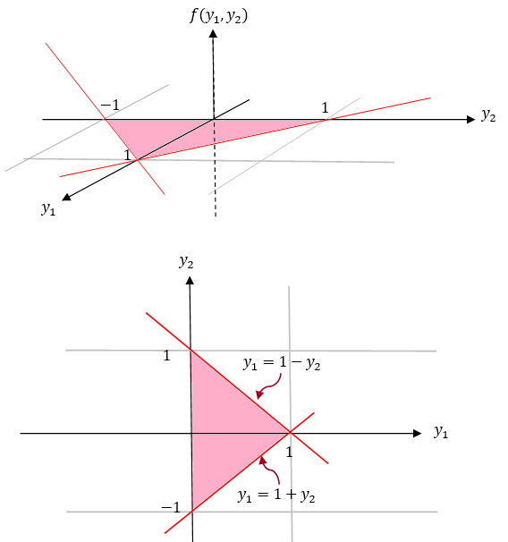
```

**(a)**.  First of all, we find the marginal function $Y_{Y_2}(y_2)$ using the shape of the domain that is an isosceles triangle. Note that $Y_1$ starts at $y_1=0$ and ends with two sides of the isosceles triangle. So we need two equations to reflect the two parts of the ending boundary of the domain.   

**Case 1**: $0 \le y_2 \le 1$ 

$$
f_{Y_2}(y_2) = \int_0^{1-y_2} 30y_1y_2^2dy_1 = 30y_2^2\int_0^{1-y_2}y_1dy_1 =15y_2^2(1-y_2)^2 
$$


**Case 2**: $-1 \le y_2 \le 0$ 

$$
f_{Y_2}(y_2) = \int_0^{1+y_2} 30y_1y_2^2dy_1=30y_2^2\int_0^{1+y_2}y_1dy_1 =15y_2^2(1+y_2)^2 
$$
\

The marginal distribution of $Y_1$ given $Y_2 = y_2$ is given below with lower and upper integral limits set up based on the following shape.

```{r echo=FALSE, fig.align='center',out.width = '55%'}
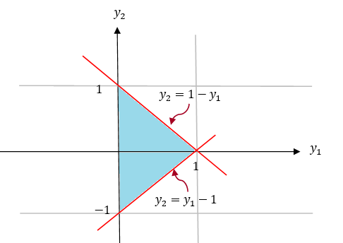
```

$$
f_{Y_1}(y_1) = \int_{-1+y_1}^{1-y_1}30y_1y_2^2dy_2 =10y_1\left[y_2^3\Big|_{-(1-y_1)}^{1-y_1}\right]10y_1\left[ (1-y_1)^3 -(1-y_1)^3\right]=20y_1(1-y_1)^3
$$

\

**(b)**. By definition, the conditional distribution of $Y_2$ given $Y_1=y_1$ is given by

$$
f_{Y_2|Y_1}(y_2|y_1) = \frac{f(y_1,y_2)}{f_{Y_1}(y_1)} = \frac{30y_1y_2^2}{20y_1(1-y_1)^3} = \frac{3y_2^2}{2(1-y_1)^3},
$$

where $y_1 -1 < y_2 < 1 - y_1.$

\

**(c)**. We substitute $y_1 = 0.75$ in the conditional density function and obtain
$$
f_{Y_2|Y_1}(y_2|y_1=0.75) =\frac{3y_2^2}{2(1-0.75)^3}=96y_2^2
$$
where $0.75-1 < y_2 < 1-0.75$, i.e, $-0.25 < y_2 < 0.25$.  The density curve of the above conditional distribution is given below.


```{r echo=FALSE, fig.align='center',out.width = '55%'}
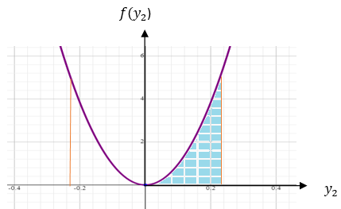
```


Therefore, using the definition of the probability of the event defined based on the univariate continuous distribution, we have.

$$
P[Y_2 > 0|Y_1 = 0.75] = \int_0^{0.25}96y_2^2dy_2 = 32y_2^3\Big|_0^{1/4} = 32\times(1/4)^3 = 0.5.
$$

\

## Independence of Random Variables

We restate the independence of two continuous random variables $Y$ and $Y$.

**Definition**: Two discrete random variables X and Y are independent *if and only if*
$$
f_{XY}(x,y)=f_X(x)f_Y(y), 
$$
for all $x$ and $y$. Equivalently, X and Y are independent *if and only if*
$$
F_{XY}(x,y)=F_X(x)F_Y(y), 
$$

for all $x$ and $y$.

\

**Example 10**: Consider the random variables $Y_1$ and $Y_2$ with the following joint density function
$$
\displaystyle f(y_1, y_2) = \begin{cases} 
 2 & \text{if  $0 \le y_2 \le y_1 \le 1$}, \\  
 0 & \text{otherwise}.
 \end{cases}
$$

Are $Y_1$ and $Y_2$ independent?

**Solution**. We use the above definitions to check whether the random variables are independent. The shape of the domain is given by


```{r echo=FALSE, fig.align='center',out.width = '45%'}
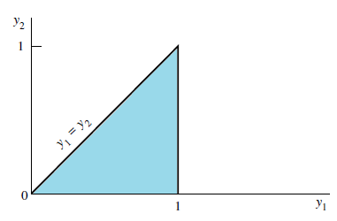
```

The two marginal distributions are given by respectively,
$$
f_{Y_1}(y_1) = \int_{0 \le y_2 \le y_1} 2dy_2 = 2\int_0^{y_1}dy_2=2y_1
$$
and
$$
f_{Y_2}(y_2) = \int_{y_2 \le y_1 \le 1} 2dy_1 = 2\int_{y_2}^{1}dy_2=2(1-y_2).
$$

However,

$$
f_{Y_1}(y_1)\times f_{Y_2}(y_2) = 2y_1\times 2(1-y_2)=4y_1(1-y_2) \ne 2 = f(y_1, y_2).
$$

Therefore, $Y_1$ and $Y_2$ are dependent.


**Example 11**: Consider the random variables $Y_1$ and $Y_2$ with the following joint density function
$$
\displaystyle f(y_1, y_2) = \begin{cases} 
 (1/8)y_1e^{-(y_1+y_2)/2} & \text{if  $ y_1 > 0,  y_2 > 0$}, \\  
 0 & \text{otherwise}.
 \end{cases}
$$

Are Y1 and Y2 independent?


**Solution**: The domain of the joint density function is the first quadrant.

$$
f_{Y_1}(y_1) = \int_{y_1>0}  (1/8)y_1e^{-(y_1+y_2)/2} dy_2 = \frac{y_1e^{-y_1/2}}{4}\int_0^\infty \frac{1}{2}e^{-y_2/2}dy_2=\frac{y_1e^{-y_1/2}}{4}
$$

and 

$$
f_{Y_2}(y_2) = \int_{y_2>0}  (1/8)y_1e^{-(y_1+y_2)/2} dy_1 = \frac{e^{-y_2/2}}{2}\int_0^\infty \frac{y_1^{2-1}e^{-y_1/2}}{2^2\Gamma(2)}dy_1=\frac{e^{-y_2/2}}{2}
$$

Observe that,

$$
f_{Y_1}(y_1) \times f_{Y_2}(y_2) = \frac{y_1e^{-y_1/2}}{4} \times \frac{e^{-y_2/2}}{2} = \frac{y_1e^{-(y_1+y_2)/2}}{8}=f(y_1, y_2).
$$

By definition, $Y_1$ and $Y_2$ are independent.


