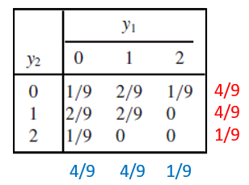
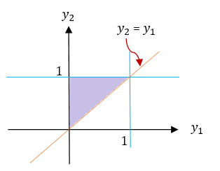
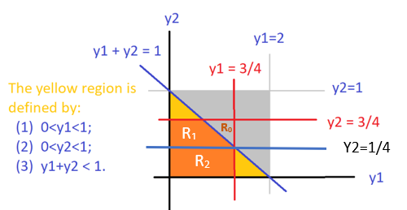
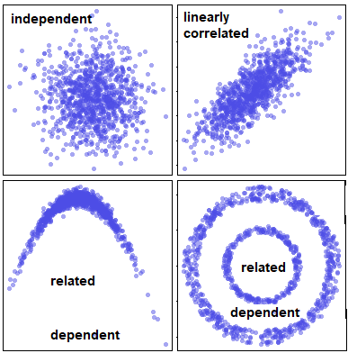
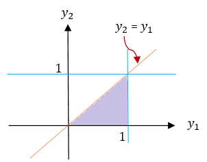
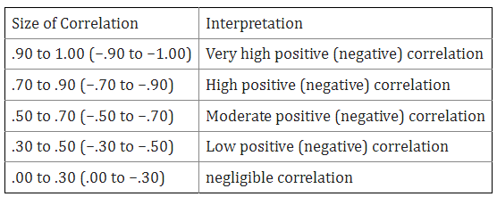
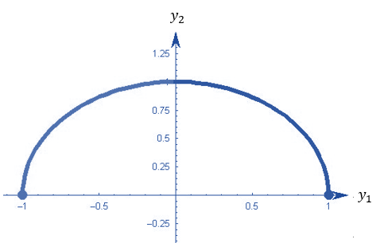

```{=html}
<style type="text/css">

div#TOC li {
    list-style:none;
    background-image:none;
    background-repeat:none;
    background-position:0;
}
h1.title {
  font-size: 24px;
  color: DarkRed;
  text-align: center;
}
h4.author { /* Header 4 - and the author and data headers use this too  */
    font-size: 18px;
  font-family: "Times New Roman", Times, serif;
  color: DarkRed;
  text-align: center;
}
h4.date { /* Header 4 - and the author and data headers use this too  */
  font-size: 18px;
  font-family: "Times New Roman", Times, serif;
  color: DarkBlue;
  text-align: center;
}

h1 { /* Header 3 - and the author and data headers use this too  */
    font-size: 20px;
    font-family: "Times New Roman", Times, serif;
    color: darkred;
    text-align: center;
}
h2 { /* Header 3 - and the author and data headers use this too  */
    font-size: 18px;
    font-family: "Times New Roman", Times, serif;
    color: navy;
    text-align: left;
}

h3 { /* Header 3 - and the author and data headers use this too  */
    font-size: 16px;
    font-family: "Times New Roman", Times, serif;
    color: navy;
    text-align: left;
}

</style>
```


```{r setup, include=FALSE}
# code chunk specifies whether the R code, warnings, and output 
# will be included in the output files.
if (!require("knitr")) {
   install.packages("knitr")
   library(knitr)
}

knitr::opts_chunk$set(echo = TRUE,       
                      warnings = FALSE,   
                      results = TRUE,   
                      message = FALSE,
                      fig.align='center', 
                      fig.pos = 'ht')
```


\

# Introduction

This note discusses the expectation of functions of random variables and covariance between joint random variables. **Sections 5, 6, and 7 of chapter 5** in the textbook cover these topics.

\

# Expectations

Let $X$ be the random variable and $g(X)$ the function of $X$. We have defined the expectation of a function of a univariate random variable in the following


$$
\displaystyle E[g(X)] = \begin{cases} 
 \sum_{x} g(x)p(x) & \text{if $X$ is a discrete random variable with probability distirbution function $p(x)$}, \\  
 \int_D g(x) f(x) & \text{if $X$ is a continuous random variable with probability density function $f(x)$}.
 \end{cases}
$$


For multivariate random variables, we can define the expectation of a function of multiple random variables using the joint probability distribution. For convenience, we restrict our discussion to bivariate distributions.


## Discrete Distributions

Let $p(x,y)$ be the joint probability distribution function of discrete random variables $X$ and $Y$ and $g(X, Y)$ be a function of $X$ and $Y$. Assume that $X$ and $Y$ take values from sets $D_X$ and $D_Y$ respectively. The expectation of $g(X,Y)$ is defined to be

$$
E_{XY}[g(X,Y)] = \sum_{x\in D_X} \sum_{y\in D_Y} g(x,y) p(x,y)
$$


<font color = "red"><b>Example 1</b></font> Assume that the joint distribution of Y1, the number of contracts awarded to firm A, and Y2, the number of contracts awarded to firm B, is given by the entries in the following table (two marginal distributions are also attached to the table).


```{r echo=FALSE, fig.align='center',out.width = '35%'}

```

Find (1). E[$Y_1$]; (2). E[$Y_1-Y_2$]


**Solution** For part (1), we use the joint distribution table and marginal distribution to find the expectation. Part (2) involves both random variables, we use the above definition to find the expected value of $Y_1-Y_2$. Note that the subscript of the expectation operator $E$ indicates which distribution is used in the calculation.

**(1)**  Using the joint distribution table (equivalent to the marginal table).

$$
E_{Y_1Y_2}[Y_1] = 0\times [1/9 + 2/9 + 1/9] + 1\times[2/9 + 2/9 + 0] + 2\times [1/9 + 0 + 0]  = 2/3.
$$

**(2)**. Using the definition and the joint table, we have
$$
E_{Y1Y2}[Y_1-Y_2] = (0-0)(1/9) + (0-1)(2/9) + (0-2)(1/9)
$$

$$
+ (1-0)(2/9) + (1-1)(2/9) + (1-2)0 
$$
$$
+ (2-0)(1/9) + (2-1)0 + (2-2)0 
$$
$$
= -4/9 + 2/9 + 2/9  = 0.
$$


An alternative and easy way to find the above expectation is to break down the expectation into two expectations of marginal distributions.

$$
E_{Y_1Y_2}[Y_1 - Y_2] = E_{Y_1}[Y_1] - E_{Y_2}[Y_2] = 0
$$

since both marginal distributions are identical.


\


## Expectations of Bivariate Continuous Distribution


Let $X$ and $Y$ be continuous variables with joint probability distribution $f(x,y)$ and $g(X, Y)$ be a function of $X$ and $Y$. Assume further that the domain of $f(x,y)$ is $D_{XY}$. Then the expectation of $g(X, Y)$ under the joint distribution is given by

$$
E_{XY}[g(X,Y)] = \iint_{D_{XY}} g(x,y) f(x,y)dA
$$

The calculation of the above expectation is essentially the evaluation of a double integral. This means we need to follow the same steps we introduced before to convert the double integral to an iterative integral and then use the techniques in the univariate integral to find the expectation. The crucial step is to draw the domain of $f(x,y)$ and based on the shape of $D_{XY}$ to set up the lower and upper limits of the iterative integral.


<font color = "red"><b>Example 2</b></font> Consider random variables $Y_1$ and $Y_2$ with joint density function

$$
\displaystyle f(y_1,y_2) = \begin{cases} 
 6(1-y_2) & \text{$0 \le y_1 \le y_2 \le 1$}, \\  
 0 & \text{elsewhere}.
 \end{cases}
$$


Find (1). $E[Y_1]$;  (2). $V[Y_2]$; (3). $E[Y_1-3Y_2]$.


**Solution** We first find the marginal densities of $Y_1$ and $Y_2$ respectively and then use them to find the expectation of $Y_1$ and variance of $Y_2$. The domain of the density function $f(y_1, y_2)$ is sketched below.

```{r echo=FALSE, fig.align='center',out.width = '35%'}

```

$$
f_{Y_1}(y_1) = \int_{y_1}^16(1-y_2) dy_2 = \int_{y_1}^1 6dy_2 - 6\int_{y_1}^1y_2dy_2 = 6(1-y_2)-3(1-y_1^2) = 3(y_1-1)^2.
$$
and

$$
f_{Y_2}(y_2) = \int_0^{y_2} 6(1-y_2)dy_1 = 6(1-y_2)\int_0^{y_2}dy_1 = 6y_2(1-y_2)
$$

Both marginal density functions have the same domain $[0, 1]$. 


**(1)**. We use the marginal distribution derived early to calculate the expectation

$$
E_{Y_1}[Y_1] = \int_0^1 y_1\times 3(1-y_1)^2dy_1 = -\int_0^1 y_1d (1-y_1)^3 
$$

$$
= -y_1(1-y_1)^3\Big|_0^1+\int_0^1 (1-y_1)^3dy_1 
$$
$$
= 0 -  \frac{(1-y_1)^4}{4}\Big|_0^1 = \frac{1}{4}.
$$


**(2)** We first calculate the expectation of $Y_2$ in the following


$$
E_{Y_2}[Y_2] = \int_0^1 y_2\times 6y_2(1-y_2) dy_2 = \int_0^1 (6y_2^2 - 6y_2^3)dy_2
$$


$$
=(2y_2^3-(6/4)y_2^4)\Big|_0^1 = 2-3/2 = 1/2
$$


The second moment is given by

$$
E[Y_2] = \int_0^1 y_2^2\times 6y_2(1-y_2) dy_2 = \int_0^1 (6y_2^3-6y_2^4)dy_2
$$


$$
=(\frac{6}{4}y_2^4 -\frac{6}{5}y_2^5)\Big|\_0^1 = \frac{6}{4}-\frac{6}{5} = 6(\frac{5-4}{20}) = 3/10.
$$

Therefore, the variance is given by

$$
V[Y_2] = E[Y_2^2] - \{E[Y_2] \}^2 = \frac{3}{10} - \frac{1}{4} = \frac{12-10}{40} = \frac{1}{20}.
$$


**(3)**. Note the domain of $f(y_2, y_2)$ is both types I and II regions. We convert the double integral to the iterative integral based on the type I region. The expectation of $Y_1-3Y_2$ is given by

$$
E_{Y_1Y_2}[Y_1-3Y_2] = \iint_D (y_1-3y_2)\times 6(1-y_2) dA = \int_0^1 \left[\int_{y_1}^1 6(y_1-3y_2)(1-y_2)dy_2\right]dy_1
$$
$$
=  \int_0^1 \left[\int_{y_1}^1 [6y_1-6(y_1+3)y_2 + 18y_2^2] dy_2\right]dy_1 =\int_0^1  \left[6y_1y_2-3(y_1+3)y_2^2 + 6y_2^3]\Big|_{y_2=y_1}^{y_2=1} \right]dy_1 
$$
$$
=\int_0^1  -3\left[y_1^3 -y_1^2 -y_1 +1 \right]dy_1 = -3\left[\frac{y_1^4}{4} - \frac{y_1^3}{3} -\frac{y_1^2}{2}+y_1 \right]\Bigg|_0^1 = -\frac{5}{4}.
$$

\

*Remark*: We can also use $E[Y_1 - 3Y_2] = E[Y_1] -3E[Y_2]$ to get the results. Some more general properties are given in the next section.

\


Sometimes, we may need to partition $D_{XY}$ into two more sub-regions that are either type I or type II regions. For example,  Consider the bivariate distribution

$$
\displaystyle f(y_1, y_2) = \begin{cases} 
 2 & \text{if $0 \le y_1 \le 1$, $0 \le y_2 \le 1$, $0 \le y_1 +y_2 \le 1$}\\  
 0 & \text{otherwise}.
 \end{cases}
$$

The shape of the domain is sketched in the following.

```{r echo = FALSE, fig.align='center', out.width = '50%'}

```

The orange region is neither type I nor a type II region. We split it into $\mathcal{R}_1$ (type II region) and $\mathcal{R}_2$ (both type I and type II regions). We can then convert the double integral into two iterative integrals based on the sub-regions.


\


# Some Properties of Expectations

We have mentioned some properties of expectation in the previous examples that can reduce the computation effort in finding the expectations of some form of functions of random variables under joint distributions.  In this section, we list some of the commonly used properties of expectations.


**Property 1.** Let $c$ be a constant.  Then $E[c] = c.$

**Property 2.** Let $g(Y_1, Y_2)$ be a function of two random variables $Y_1$ and $Y_2$ with joint density function $f(y_1, y_2)$. Them $E_{Y_1Y_2}[cg(Y_1, Y_2)] = c E_{Y_1Y_2}[g(Y_1,Y_2)]$.

**Property 3.** Let $Y_1$ and $Y_2$ be random variables and $g_1(Y_1, Y_2), g_2(Y_1, Y_2), \cdots, g_k(Y_1, Y_2)$
be functions of $Y_1$ and $Y_2$. Then

$$
E_{Y_1Y_2}\left[g_1(Y_1, Y_2) + g_2(Y_1, Y_2)+ \cdots + g_k(Y_1, Y_2)\right] = E_{Y_1Y_2}[g_1(Y_1, Y_2)] + E_{Y_1Y_2}[g_2(Y_1, Y_2)]+ \cdots + E_{Y_1Y_2}[g_k(Y_1, Y_2)].
$$

Using the above simple properties of expectation, we can see the short-cut approaches in the remarks in the previous examples 


The next property assumes that the two random variables are independent.

**Property 4.**  Let $Y_1$ and $Y_2$ be independent random variables and $g(Y_1)$ and $h(Y_2)$ be functions of only $Y_1$ and $Y_2$, respectively. Then
$$
E_{Y_1Y_2}[g(Y_1)h(Y_2)] = E_{Y_1}[g(Y_1)]E_{Y_1}[h(Y_2)],
$$
provided that the expectations exist.


*Remark*. The above property basically says that if the random variables are independent, $E_{Y_1Y_2}[g(Y_1)h(Y_2)]$ can be evaluated in the two univariate expectations. This could reduce the computation significantly since the two corresponding univariate distributions can be decomposed from the joint density function if two random variables are independent.


\


# Covariance - Measuring Linear Correlation

One of the objectives to study multivariate distribution is to find the relationship between random variables. There are different types of relationships between random variables. In the bivariate case, we are primarily interested in one special relationship: linear relationship. In this section, we define covariance to measure the linear relationship between two random variables - which is called a linearly correlated relationship.

```{r echo=FALSE, fig.align='center',out.width = '40%'}

```

The top left panel indicates that the two variables are uncorrelated and also independent. The top-right panel shows the typical linear correlation between the two random variables. The bottom two panels indicate a nonlinear correlated relationship, They are apparently dependent on each other.


To measure the linear correlation, we define the following covariance and its standardized version (i.e., the well-known Pearson correlation coefficient).

\

## Covariance

**Definition**: Let $Y_1$ and $Y_2$ be the two random variables with $\mu_1 = E[Y_1]$ and $\mu_2 = E[Y_2]$, the covariance of $Y_1$ and $Y_2$ is defined to be
$$
\text{COV}(Y_1,Y_2) = E_{Y_1Y_2}\left[(Y_1-\mu_1)(Y_2-\mu_2) \right]
$$

* If both $Y_1$ and $Y_2$ are discrete, then

$$
\text{COV}(Y_1,Y_2) = \sum_{(y_1,y_2) \in D_{Y_1Y_2}} (y_1-\mu_1)(y_2-\mu_2)p(y_1,y_2),
$$

where $p(y_1,y_2)$ is the joint probability distribution function and $D_{Y_1Y_2}$ is the domain of $p(y_1,y_2)$.


*  If both $Y_1$ and $Y_2$ are continous, then

$$
\text{COV}(Y_1,Y_2) = \iint_{ D_{Y_1Y_2}} (y_1-\mu_1)(y_2-\mu_2)f(y_1,y_2)dA,
$$

\

<font color = "red"><b>Example 3</b></font> Consider random variables $Y_1$ and $Y_2$ with joint density function

$$
\displaystyle f(y_1,y_2) = \begin{cases} 
 3y_1 & \text{$0 \le y_2 \le y_1 \le 1$}, \\  
 0 & \text{elsewhere}.
 \end{cases}
$$


Find $\text{COV}(Y_1, Y_2)$.


**Solution**: Before we write the double integral, we sketch the domain of the function in the following.


```{r echo=FALSE, fig.align='center',out.width = '40%'}

```

Next, we calculate the marginal means of $Y_1$ and $Y_2$.

$$
E_{Y_1}[Y_1] = E_{Y_1Y_2}[Y_1] = \iint_D y_1f(y_1,y_2)dA = \int_0^1\left[\int_0^{y_1}y_1\times 3y_1 dy_2\right]  dy_1
$$
$$
= \int_0^1\left[\int_0^{y_1} 3y_1^2 dy_2\right]  dy_1 =\int_0^1 3y_1^3dy_1 = 3\times \frac{y_1^4}{4}\Bigg|_0^1 = \frac{3}{4}
$$

Similarly,

$$
E_{Y_2}[Y_2] = \iint_Dy_2f(y_1,y_2)dA = \int_0^1 \left[\int_0^{y_1} y_2\times 3y_1 dy_2 \right] dy_1
$$
$$
=\int_0^1 \frac{3}{2}y_1^3dy_1 = \frac{3}{8} y_2^4\Bigg|_0^1 = \frac{3}{8}.
$$

Next, we use the definition to calculate the covariance.

$$
\text{COV}(Y_1, Y_2) = \iint_D(y_1-\frac{3}{4})(y_2-\frac{3}{8}) \times 3y_1 dA = \int_0^1\left[\int_0^{y_1}3y_1(y_1-3/4) (y_2-3/8 )dy_2 \right]  dy_1
$$

$$
=\int_0^1 3y_1(y_1-3/4)\left[ (y_2^2/2-3y_2/8)\Big|_0^{y_1}  \right]dy_1 = \int_0^1 \frac{3y_1^2}{2}(y_1-\frac{3}{4})(y_1-\frac{3}{8})dy_1
$$

$$
= \int_0^1\left[\frac{3y^4}{2} -\frac{27y_1^3}{16} + \frac{27y^2}{64}\right]dy_1 = \left[\frac{3y_1^5}{10} - \frac{27y_1^4}{64} + \frac{9y_1^3}{64}\right]\Bigg|_0^1 = \frac{3}{160}.
$$


*Remark*: The above derivation is based on the definition of covariance. We need to expand $(y_1-3/4)(y_2-3/8)$ during the derivation. The next result is based on the expansion of the definition of covariance that yields a slightly simple expression.


**Property 1**: $\text{COV}(Y_1, Y_2) = E_{Y_1Y_2}[Y_1Y_2] - E_{Y_1}[Y_1]\times E_{Y_2}[Y_2]$


**The Use of Covariance**: The sign indicates the direction of the linear correlation between the two numerical random variables.

1. If $\text{COV}(Y_1, Y_2) = 0$, $Y_1$ and $Y_2$ are not linearly correlated (we simply call $Y_1$ and $Y_2$ are uncorrelated).

2. If $\text{COV}(Y_1, Y_2) > 0$, $Y_1$ and $Y_2$ are positively correlated.

3. If $\text{COV}(Y_1, Y_2) < 0$, $Y_1$ and $Y_2$ are negatively correlated.


\

The above *Property 1* can also be used to test whether two numerical random variables are linearly correlated.
\


**Property 2**: $y_1$ and $y_2$ are linearly uncorrelated *IF AND ONLY IF* $E_{Y_1Y_2}[Y_1Y_2] = E_{Y_1}[Y_1]\times E_{Y_2}[Y_2]$.


The sign of the covariance only indicates the direction of the correlation. However, the covariance cannot tell the strength of the correlation since it is dependent on the magnitude of both random variables. To address this issue, we need to "standardize" the covariance so that its magnitude reflects the strength of the correlation and it can also be used to compare the correlation across pairs of random variables. 


\

## Pearson Correlation Coefficient

The Pearson correlation coefficient standardizes the covariance to have the desired feature described in the previous subsection.

**Definition**: Let $Y_1$ and $Y_2$ be the two random variable with $\mu_1 = E[Y_1]$ and $\mu_2 = E[Y_2]$. The two corresponding standard deviations are given by $\sigma_1 = \sqrt{\text{Var}(Y_1)}$ and $\sigma_2 = \sqrt{\text{Var}(Y_2)}$.  The Pearson correlation coefficient is defined to be of the following form

$$
\rho = E_{Y_1Y_2}\left[\frac{Y_1-\mu_1}{\sigma_1} \times \frac{Y_2-\mu_2}{\sigma_2} \right] = \frac{\text{COV}(Y_1, Y_2)}{\sigma_1\sigma_2} =  \frac{\text{COV}(Y_1, Y_2)}{\sqrt{\text{Var}(Y_1)\text{Var}(Y_2)}}
$$

Since $\frac{Y_1-\mu_1}{\sigma_1} \text{ and} \frac{Y_2-\mu_2}{\sigma_2}$ are standardized random variables, they are essentially a kind of unitless index. So we can use it to compare the strength of different types of (linear) correlation. For example, we can compare the strength of the (linear) correlation between employees' height and weight with the correlation between employees' salary and their years of education.


\

<font color = "red"><b>Example 4</b></font> Consider random variables $Y_1$ and $Y_2$  in **Example ** that has joint density function

$$
\displaystyle f(y_1,y_2) = \begin{cases} 
 3y_1 & \text{$0 \le y_2 \le y_1 \le 1$}, \\  
 0 & \text{elsewhere}.
 \end{cases}
$$

Find the Pearson correlation coefficient between $Y_1$ and $Y_2$.


**Solution**. We have found the covariance between $Y_1$ and $Y_2$ in example 3. We need to find the standard deviation (or variance) of $Y_1$ and $Y_2$. Note that

$$
E_{Y_1}[Y_1^2] = E_{Y_1Y_2}[Y_1^2] = \iint_D y_1^2f(y_1,y_2)dA = \int_0^1\left[\int_0^{y_1}y_1^2\times 3y_1 dy_2\right]  dy_1
$$
$$
= \int_0^1\left[3y_1^3\int_0^{y_1}  dy_2\right]  dy_1 =\int_0^1 3y_1^3\times (y_1-0)dy_1 = 3\times \frac{y_1^5}{5}\Bigg|_0^1 = \frac{3}{5}.
$$

That is, $\text{Var}(Y_1) = E_{Y_1}[Y_1^2] - \left(E_{Y_1}[Y_1] \right)^2 = 3/5-(3/4)^2 = 3/80$.


Similarly, 


$$
E_{Y_2}[Y_2^2] = \iint_D y_2^2 f(y_1,y_2)dA = \int_0^1 \left[\int_0^{y_1} y_2^2\times 3y_1 dy_2 \right] dy_1
$$

$$
 = \int_0^1 \left[ 3y_1\int_0^{y_1} y_2^2 dy_2 \right] dy_1 =\int_0^1 3y_1\times (\frac{y_1^3}{3}-0)dy_1=  y_2^4\Bigg|_0^1 = \frac{1}{5}.
$$
This yields $\text{Var}[Y_2] = E_{Y_2}[Y_2^2] - \left(E_{Y_2}[Y_2] \right)^2 = 1/5 - (3/8)^2 = 19/320$.


Finally, the Pearson correlation coefficient is given by

$$
\rho = \frac{\text{COV}(Y_1, Y_2)}{\sqrt{\text{Var}[Y_1]\text{}[Y_2]}} = \frac{3/160}{\sqrt{(3/80)\times (19/320)}} = \sqrt{\frac{3}{19}} \approx 0.4.
$$

**The Use of Correlation Coefficient**. The rule of thumb for interpreting a correlation coefficient is given in the following table.

```{r echo=FALSE, fig.align='center',out.width = '60%'}

```

Based on the above table, there is a weak positive (linear) correlation between $Y_1$ and $Y_2$ in the above example 3.


\

## Comcluding Remarks

We have discussed covariance and the Pearson correlation coefficient in this section. Both covariance and correlation coefficient measure the linear relationship between two numerical random variables. We also discussed more general dependent relationship between two random variables (both numeric and categorical variables) in earlier notes. 

* **Correlation vs Dependence**

Correlation implies dependence, but not vice versa.  In other words, two dependent random variable could be uncorrelated. The following figure demonstrates such a relationship: $Y_1$ and $Y_2$ are uncorrelated (i.e., the Pearson correlation coefficient $\rho = 0$), but $Y_1$ and $Y_2$ have a quadratic relationship.

```{r echo=FALSE, fig.align='center',out.width = '40%'}

```


* **Correlation vs Causation**

Correlation describes an association between variables: when one variable changes, so does the other. A correlation is a statistical indicator of the relationship between variables. These variables change together: they covary. But this covariation isn’t necessarily due to a direct or indirect causal link.

Causation means that changes in one variable brings about changes in the other; there is a cause-and-effect relationship between variables. The two variables are correlated with each other and there is also a causal link between them.

A correlation doesn’t imply causation, but causation always implies correlation. The following figure illustrate the relationship between correlation and causation.


```{r echo=FALSE, fig.align='center',out.width = '40%'}
include_graphics("topic08/correlationCausation.png")
```

