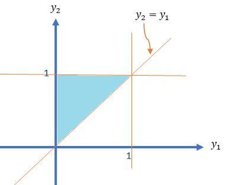
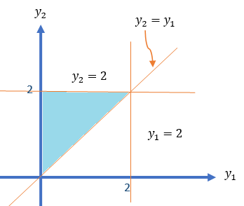

```{=html}
<style type="text/css">

div#TOC li {
    list-style:none;
    background-image:none;
    background-repeat:none;
    background-position:0;
}

h1.title {
  font-size: 24px;
  font-weight: bold;
  color: DarkRed;
  text-align: center;
}
h4.author { /* Header 4 - and the author and data headers use this too  */
    font-size: 18px;
    font-weight: bold;
  font-family: "Times New Roman", Times, serif;
  color: DarkRed;
  text-align: center;
}
h4.date { /* Header 4 - and the author and data headers use this too  */
  font-size: 18px;
  font-weight: bold;
  font-family: "Times New Roman", Times, serif;
  color: DarkBlue;
  text-align: center;
}
h1 { /* Header 3 - and the author and data headers use this too  */
    font-size: 22px;
    font-weight: bold;
    font-family: "Times New Roman", Times, serif;
    color: darkred;
    text-align: center;
}
h2 { /* Header 3 - and the author and data headers use this too  */
    font-size: 18px;
    font-weight: bold;
    font-family: "Times New Roman", Times, serif;
    color: navy;
    text-align: left;
}

h3 { /* Header 3 - and the author and data headers use this too  */
    font-size: 15px;
    font-weight: bold;
    font-family: "Times New Roman", Times, serif;
    color: navy;
    text-align: left;
}

h4 { /* Header 4 - and the author and data headers use this too  */
    font-size: 18px;
    font-weight: bold;
    font-family: "Times New Roman", Times, serif;
    color: darkred;
    text-align: left;
}
</style>
```


```{r setup, include=FALSE}
# code chunk specifies whether the R code, warnings, and output 
# will be included in the output files.
if (!require("knitr")) {
   install.packages("knitr")
   library(knitr)
}
# knitr::opts_knit$set(root.dir = "C:/Users/75CPENG/OneDrive - West Chester University of PA/Documents")
# knitr::opts_knit$set(root.dir = "C:\\STA490\\w05")

knitr::opts_chunk$set(echo = TRUE,       
                      warning = FALSE,   
                      results = TRUE,   
                      message = FALSE,
                      comment = NA)
```


\

# Introduction

This note discusses the expectation and variance of a special family of functions of random variables - a linear combination of random variables. **Sections 8 and 11 of chapter 5** in the textbook covers these topics.

\

# Linear Combination of Two Random Variables

Let $X$ and $Y$ be two random variables with joint density function $f(x,y)$. Define $U = aX + bY$ ($a$ and $b$ are constants). Then

$$
E[U] = E[aX + bY] = aE[X] + bE[Y]
$$
The variance of $U$ can be found in the following

$$
\text{V}[U] = E\left[\left( U-E[U] \right)^2 \right]= E\left[ \left(a[X-E[X]]+b[Y-E{Y}] \right)^2 \right]
$$

$$
=E\left[ \left(a^2[X-E[X]]^2+2ab[X-E[X]][Y-E{Y}] +b^2[Y-E{Y}]^2 \right)^2 \right]
$$

$$
=a^2E\left[ [X-E(X)]^2\right] + 2abE[X-E(X)][Y-E(Y)]+b^2 E[Y-E(Y)]^2
$$


$$
=a^2 \text{V}(X)+2ab\text{COV}(X,Y) + b^2\text{V}(Y)
$$


We know that $\text{V}[X] = E[X^2] - \left( E[X]\right)^2$. Similarly, we have

$\text{COV}(X,Y) = E\left[(X-E[X])(Y-E[Y]) \right] = E\left[XY - E[X]Y -E[Y]X + E[X]E[Y] \right] = E[XY]-E[X]E[Y]$

\

\


**Special Case**: If $X$ and $Y$ are uncorrelated, then $\text{COV}(X,Y) = 0$. Therefore,


$$
\text{V}[U] = a^2 \text{V}(X) + b^2\text{V}(Y).
$$

When the joint distribution of $X$ and $Y$ are given, we can find the mean and variance of the linear combination of $X$ and $Y$.


<font color = "darkred">**Example 1**</font>: Consider the following joint density function of $Y_1$ and $Y_2$

$$
\displaystyle f(y_1, y_2) = \begin{cases} 
 6(1-y_2) & \text{$0 \le y_1 \le y_2 \le 1$}, \\  
        0 & \text{elsewhere}.
 \end{cases}
$$

Find $\text{V}(Y_1-3Y_2)$.

**Solution**: We first draw the domain of the density function in the following.


```{r echo = FALSE, fig.align='center', out.width = '40%'}

```

Note that $\text{V}(Y_1-3Y_2) = \text{V}(Y_1) -6\text{COV}(Y_1,Y_2) + 9\text{V}(Y_2)$

The above variances and the covariance can be expressed into the first and second moments: $E[Y_1], E[Y_2], E[Y_1^2], E[Y_2^2],\text{ and } E[Y_1Y_2]$.

$$
E[Y_1] = \iint_{R_1} y_1f(y_1,y_2)dA = \int_0^1 6y_1\int_{y_1}^1 (1-y_2)dy_2  dy_1
$$

$$
=\int_0^1 6y_1(y_2-y_2^2/2)\Big|_{y_1}^1dy_1 = \int_0^1 6y_1(1/2-y_1 + y_1^2/2)dy_1
$$
$$
=\int_0^1 (3y_1-6y_1^2 + 3y_1^3)dy_1=\left[ 3y^2/2-2y_1^3+3y_2^4/4\right]\Big|_0^1 = 3/2-2+3/4 = 1/4.
$$


$$
E[Y_1^2] = \iint_{R_1} y_1^2f(y_1,y_2)dA = \int_0^1 6y_1^2\int_{y_1}^1 (1-y_2)dy_2  dy_1
$$
$$
=\int_0^1 6y_1^2(y_2-y_2^2/2)\Big|_{y_1}^1dy_1 =\int_0^1 6y_1^2(1/2-y_1 + y_1^2/2)dy_1
$$
$$
=\int_0^1 (3y_1^2-6y_1^3 + 3y_1^4)dy_1 =\left[y_1^3 -\frac{3y_1^4}{2} +\frac{3y_1^5}{5}\right]\Bigg|_0^1 = -\frac{1}{2} + \frac{3}{5} = \frac{1}{10}
$$

Therefore,

$$
\text{V}[Y_1] = \frac{1}{10}-\frac{1}{16} =  \frac{8}{80}-\frac{5}{80}= \frac{3}{80}
$$


$$
E[Y_2] = ] = \iint_{R_1} y_2f(y_1,y_2)dA = \int_0^1 \int_{y_1}^1 6y_2(1-y_2)dy_2  dy_1
$$

$$
= \int_0^1 \int_{y_1}^1 (6y_2-6y_2^2)dy_2 dy_1 = \int_0^1 (3y_2^2 -2y_2^3)\Bigg|_{y_1}^1 dy_1
$$

$$
=\int_0^1(1-3y_1^2 + 2y_1^3)dy_1 = \left(y_1-y_1^3 + \frac{y_1^4}{2} \right)\Bigg|_0^1 = \frac{1}{2}.
$$

$$
E[Y_2^2] = \iint_{R_1} y_2^2f(y_1,y_2)dA = \int_0^1 \int_{y_1}^1 6y_2^2(1-y_2)dy_2  dy_1
$$

$$
= \int_0^1 \int_{y_1}^1 (6y_2^2-6y_2^3)dy_2 dy_1 = \int_0^1 (2y_2^3 -\frac{3y_2^4}{2})\Bigg|_{y_1}^1 dy_1
$$

$$
=\int_0^1(\frac{1}{2}-2y_1^3 + \frac{3y_1^4}{2})dy_1 = \left(\frac{y_1}{2}-\frac{y_1^4}{2} + \frac{3y_1^5}{10} \right)\Bigg|_0^1 = \frac{3}{10}.
$$
We obtain

$$
\text{V}[Y_2] = E[Y_2^2] - (E[Y_2])^2 = \frac{3}{10} - \frac{1}{4}= \frac{1}{20}. 
$$
Next, we calculate $E[Y_1Y_2]$ in the following.

$$
E[Y_1Y_2] = \iint_{R_1} y_1y_2f(y_1,y_2)dA = \int_0^1 6y_1\int_{y_1}^1 y_2(1-y_2)dy_2  dy_1
$$
$$
= \int_0^1 6y_1 \left(\frac{y_2^2}{2}-\frac{y_2^3}{3}\right)\Bigg|_{y_1}^1  dy_1=\int_0^1 6y_1\left(\frac{1}{6}  -\frac{y_1^2}{2}+\frac{y_1^3}{3}\right) dy_1
$$

$$
=\int_0^1 (y_1-3y_1^3+2y_1^4)dy_1 = \left(\frac{y_1^2}{2} -\frac{3y_1^4}{4} + \frac{2y_1^5}{5} \right)\Bigg|_0^1 = \frac{10-15+8}{20} = \frac{3}{20}.
$$

The covariance between $Y_1$ and $Y_2$ is 

$$
\text{COV}(Y_1, Y_2) = E[Y_1Y_2]-E[Y_1]E[Y_2] = \frac{3}{20} - \frac{1}{4}\times \frac{1}{2} = \frac{1}{40}
$$

Finally, we calculate the variance

$$
\text{V}(Y_1-3Y_2) = \text{V}(Y_1) -6\text{COV}(Y_1,Y_2) + 9\text{V}(Y_2) = \frac{3}{80}-\frac{6\times 1}{40} + \frac{9\times 1}{20} = \frac{27}{80}.
$$


# General Linear Functions of RVs

In this section, we discuss expectations and variance (covariance) between to linear functions of two sets of random variables without using specific joint density functions of multiple random variables. The results are the generalizations of those discussed in the previous section.


## General Linear Functions


As our discussion involves more random variables, we will use the following notations in the subsequent results.

Let $\{X_1, X_2, \cdots, X_m \}$ and $\{Y_1, Y_2, \cdots, Y_n \}$ be two sets of random variables with

1. $E[X_i] = \mu_i$

2. $E[Y_j]=\xi_j$

3. $\text{V}[X_i] = \sigma_i^2$

4. $\text{V}[Y_j] = \delta_j^2$

5. $\text{COV}(X_i, Y_j) = \phi_{ij}$ for $i = 1, 2, \cdots, m,$ and $j=1,2,\cdots, n$. 

Furthermore, we denote 

6. $\text{COV}(X_i, X_k) = \theta_{ik}$ for $1 \le i, k \le I \text{ and } i \ne k$,

7. $\text{COV}(Y_j, Y_l) = \omega_{jl}$ for $1 \le j, l \le I \text{ and } j \ne l$.


Define

$$
U = \sum_{i=1}^m a_iX_i \ \text{ and } \ V = \sum_{j=1}^m b_jY_j
$$

We have defined the expectation of a linear function of random variables in the following

$$
E[U] = E[\sum_{i=1}^m a_iX_i] = \sum_{i=1}^ma_iE[X_i] = \sum_{i=1}^m a_i\mu_i.
$$

$$
\text{V}[U] = E\left[\left(\sum_{i=1}^m a_iX_i - \sum_{i=1}^m a_i\mu_i \right)^2\right] =  E\left[\left(\sum_{i=1}^m a_i(X_i - \mu_i) \right)^2\right]
$$

Note that

$$
\left(\sum_{i=1}^m a_i(X_i - \mu_i) \right)^2 = \sum_{i=1}^ma_i^2(X_i-\mu_i)^2 + 2\sum_{j<k}a_ia_k(X_i-\mu_i)(X_k-\mu_k)
$$

Therefore,

$$
\text{V}(U) = \sum_{i=1}^ma_i^2E\left[(X_i-\mu_i)^2\right] + 2\sum_{i<k}a_ia_kE\left[(X_i-\mu_i)(X_k-\mu_k)\right] = \sum_{i=1}^ma_i^2\sigma_i^2+2\sum_{i<k}a_ia_k \theta_{ik}
$$
Similarly,

$$
\text{V}(V) = \sum_{j=1}^nb_j^2E\left[(Y_j-\xi_j)^2\right] + 2\sum_{j<l}b_jb_lE\left[(Y_j-\xi_j)(Y_l-\xi_l)\right] = \sum_{j=1}^nb_j^2\delta_j^2+2\sum_{j<l}b_jb_l \omega_{jl}
$$

The covariance of $U$ and $V$ is given by

$$
\text{COV}(U,V) = \sum_{i=1}^m\sum_{j=1}^na_ib_j\text{COV}(X_i,Y_j) =\sum_{i=1}^m\sum_{j=1}^na_ib_j \phi_{ij} 
$$

\

**A Special Case**: When all $X_i$ and $Y_j$ $(1 \le i \le m, 1 \le j \le n)$ are mutually independent, all covariances are equal to 0. Therefore,  

1. $\text{V}[U] = \sum_{i=1}^ma_i^2\sigma_i^2$.

2. $\text{V}[V] = \sum_{j=1}^mb_j^2\sigma_j^2$.

3. $\text{COV}(U,V)=0$.


\


## Linear Functions of IID RVs

One of the basic assumptions of many statistical modeling is that the random sample is **i**ndependently taken from an **i**dentically **d**istributed population with a certain distribution. This sample is conventionally called the **iid** sample. 

Let $\{X_1, X_2, \cdots, X_n \}$ be an **iid** sample from a population with density function $f(x)$ with mean $\mu$ and standard deviation $\sigma$. If $f(x) is specified, it could be any distribution such as binomial, Poison, uniform, normal, or gamma distributions, etc. If we make an inference about the population mean, the best point estimate is the sample mean (will show this in STA506) which is the average of the sample

$$
\bar{X} = \frac{\sum_{i=1}^n X_i}{n} = \frac{X_1}{n} + \frac{X_2}{n} + \cdots + \frac{X_n}{n}
$$

The above estimate of the population mean is a linear function of the **iid** random variables with equal weight ($\frac{1}{n}$). The primary interest is to know the mean and variance of $\bar{X}$.

$$
\mu_{\bar{X}} = E\left[ \bar{X} \right] = \frac{\sum_{i=1}^n E[X_i]}{n} = \frac{\sum_{i=1}^n \mu}{n} = \frac{n\mu}{n} = \mu
$$
Since the sample is an **iid** sample, the covariance of any pairs of $X_i$ ($1 \le i \le n$) is equal to 0. So we can calculate the variance of $\bar{X}$ in the following

$$
\sigma_{\bar{X}}^2=\text{V}(\bar{X}) = \sum_{i=1}^n \text{V}\left( \frac{X_i}{n} \right) = \sum_{i=1}^n  \frac{\text{V}[X_i]}{n^2} = \frac{1}{n^2}\sum_{i=1}^n \sigma^2
 = \frac{n\sigma^2}{n^2} = \frac{\sigma^2}{n}.
 $$

The distribution of $\bar{X}$ is called the sampling distribution of sample means. The mean and the variance of the sampling distribution are given by $\mu$ and $\sigma^2/n$ respectively.

\

1. $n > 30$, by the *Central Limit Theorem*, 

$$
\bar{X} \to_{\text{approx.}} N\left(\mu, \frac{\sigma^2}{n} \right)
$$


2. If the population is normally distributed, then

$$
\bar{X} \to_{\text{exact}} N\left(\mu, \frac{\sigma^2}{n} \right)
$$


# Conditional Expectation

When two random variables are not independent, the mean and variance of one variable are dependent on the other variables. For example, Let $X = \text{income}$ and $Y = \text{level of eduxation}$. Assume the possible values of $Y$ are: high school diploma, associate degree, four-year college degree, and graduate degree. Then the expected income of each sub-population defined based on the level of education could be different depending on the education. 

We may be interested in the expectations such as $E\left[X| Y = \text{four-year college degree}\right]$. This is the logic of linear regression modeling.


We discuss conditional expectations in this section.


**Definition**: If $Y_1$ and $Y_2$ are any two random variables, the conditional expectation of $g(Y_1)$, given that $Y_2 = y_2$, is defined to be

$$
E[g(Y_1) | Y_2 = y_2)] = \int_{-\infty}^\infty
g(y_1) f (y_1 | y_2) dy_1
$$

if $Y_1$ and $Y_2$ are jointly continuous and

$$
E[g(Y_1) | Y_2 = y_2] = \sum_{\text{all }y_1} g(y_1)p(y_1 | y_2)
$$

if $Y_1$ and $Y_2$ are jointly discrete.

From the above definition, we can see that the conditional expectation of $g(X)$ given $Y=y$ is the expectation of the conditional distribution of $X|Y=y$.

\

<font color = "darkred">**Example 2**</font>: A soft-drink machine has a random amount $Y_2$ in supply at the beginning of a given day and dispenses a random amount $Y_1$ during the day (with measurements in gallons). It is not resupplied during the day, and hence $Y_1 \le Y_2$. It has been observed that $Y_1$ and $Y_2$ have a joint density given by

$$
\displaystyle f(y_1, y_2) = \begin{cases} 
 1/2 & \text{if $1/2, 0 \le y_1 \le y_2 \le 2$}, \\  
 0 & \text{otherwise}.
 \end{cases}
$$

Find the conditional expectation of the amount of sales, $Y_1$, given that $Y_2 = 1.5$.

**Solution**: We first find the marginal density function of $Y_2$ to define the conditional density $Y_1|Y_2 = y_2$ before calculate the expectation.

As usual, we sketch the domain of the density function in the following


```{r echo = FALSE, fig.align='center', out.width = '40%'}

```

$$
f_{Y_2}(y_2) = \int_1^{y_2}f(y_1,y_2)dy_1 = \frac{1}{2}\int_0^{y_2}dy_1 = \frac{y_2}{2}, \text{ for } 0 \le y_2 \le 2.
$$

Therefore, the conditional density function of $Y_1|Y_2 = y_2$ is given by

$$
f_{Y_1|Y_2}(y_1|y_2) = \frac{f(y_1,y_2)}{f_{Y_1}(y_1)} = \frac{1/2}{y_2/2} = \frac{1}{y_2}, \text{ for } 0 \le y_1 \le y_2 \le 2.
$$

Hence, the conditional expectation of $Y_1|Y_2 = 1.5$ is given by

$$
E[Y_1|Y_2 = 1.5] = \int_0^{y_2}y_1 f_{Y_1|Y_2}(y_1|y_2)dy_1 
$$

$$
= \int_0^{1.5}y_1 \times \frac{1}{1.5} = \frac{y_1^2}{3}\Bigg|_0^{1.5} = \frac{1.5^2}{3}=0.75.
$$
This means if the soft-drink machine contains 1.5 gallons at the start of the day, the expected amount to be sold that day is 0.75 gallons.

The above example shows the conditional expectation of $Y_1$ given $Y_2=y_2$ (i.e., conditioning on a specific value). If instead of conditioning on a specific value, we condition on the random variable, then we have 

$$
E[Y_1] = E_{Y_2}[E_{Y_1|Y_2}(Y_1|Y_2)]
$$
That is,

$$
E[Y_1] = \int_{-\infty}^\infty \left\{ \int_{-\infty}^\infty y_1f_{y_1|y_2}(y_1, y_2)dy_1\right\}f_{Y_2}(y_2)dy_2.
$$


We can also similarly define conditional variance.

$$
\text{V}(Y_1|Y_2 = y_2) = E[Y_1^2|Y_2 = y_2] - \left(E[Y_1|Y_2 = y_2] \right)^2
$$


