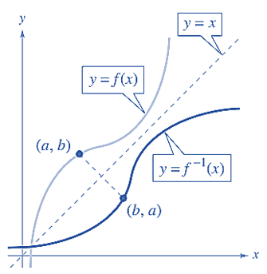
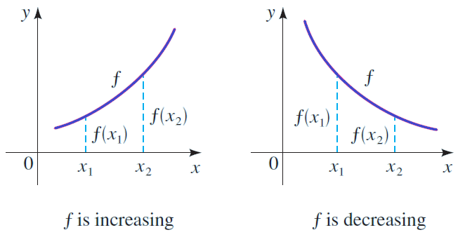
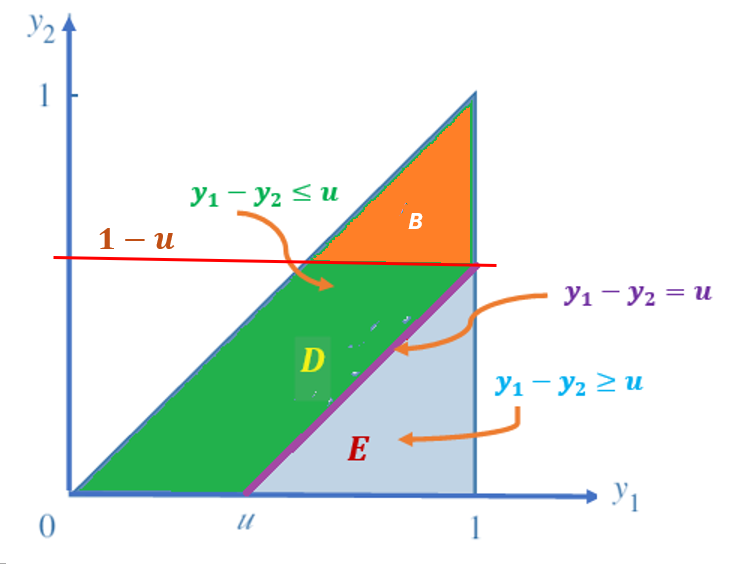

```{=html}
<style type="text/css">

div#TOC li {
    list-style:none;
    background-image:none;
    background-repeat:none;
    background-position:0;
}
h1.title {
  font-size: 24px;
  color: DarkRed;
  text-align: center;
}
h4.author { /* Header 4 - and the author and data headers use this too  */
    font-size: 18px;
  font-family: "Times New Roman", Times, serif;
  color: DarkRed;
  text-align: center;
}
h4.date { /* Header 4 - and the author and data headers use this too  */
  font-size: 18px;
  font-family: "Times New Roman", Times, serif;
  color: DarkBlue;
  text-align: center;
}

h1 { /* Header 3 - and the author and data headers use this too  */
    font-size: 20px;
    font-family: "Times New Roman", Times, serif;
    color: darkred;
    text-align: center;
}
h2 { /* Header 3 - and the author and data headers use this too  */
    font-size: 18px;
    font-family: "Times New Roman", Times, serif;
    color: navy;
    text-align: left;
}

h3 { /* Header 3 - and the author and data headers use this too  */
    font-size: 16px;
    font-family: "Times New Roman", Times, serif;
    color: navy;
    text-align: left;
}

</style>
```


```{r setup, include=FALSE}
# code chunk specifies whether the R code, warnings, and output 
# will be included in the output files.
#
if (!require("knitr")) {
   install.packages("knitr")
   library(knitr)
}
#
knitr::opts_chunk$set(echo = TRUE,       
                      warnings = FALSE,   
                      results = TRUE,   
                      message = FALSE,
                      fig.align='center', 
                      fig.pos = 'ht')
```


\

# Introduction

This note discusses the method of distribution for finding the probability distributions of functions of random variables.  **Sections 1 to 3 of chapter 6** in the textbook cover these topics.

\

# The Rationale

We have studied both univariate and multivariate (focused on bivariate) distributions in previous notes. A few well-known continuous random variables and their distributions as well as relevant properties.

Some numerical measures based on expectations such as variance and covariance of linear functions of random variables were also discussed. In statistics, many inferential methods and procedures are based on the Central Limit Theorem (CLT) and its variants. For example, let $\{X_1, X_2, \cdots, X_n \}$ be a set random variable taken from a population with density function $f(x:\theta)$, to make the inference about the population mean $\mu(\theta)$. A good estimator of $\mu(\theta)$ is

$$
\widehat{\mu(\theta)} = \frac{\sum_{i=1}^n X_i}{n}. 
$$

Another valid estimator of population variance $\sigma^2(\theta)$ is

$$
\widehat{\sigma^2(\theta)} = \frac{\sum_{i=1}^n [X_i-\mu(\theta)]^2}{n-1}
$$
The above estimators are **functions of random variables**. To study the distribution of the function of random variables, we need to know the joint distribution of $\{X_1, X_2, \cdots, X_n \}$, denoted by $f(x_1, x_2, \cdots, x_n:\theta)$.

If the random variables are independently distributed with $f(x_i:\theta)$, then the joint density function can be rewritten as

$$
f(x_1, x_2, \cdots, x_n: \theta) = f(x_1:\theta)f(x_2:\theta)\cdots f(x_n:\theta).
$$

Once the density function of the function of random variables is determined, we can make inferences about the population parameter of interest.

Different methods can be used to determine the probability distribution of the function of random variables. We use the method of distribution in the next section.


\


# Review of Inverse Function and Inequality

This section reviews the concepts of inverse functions and the steps for finding inverse functions and solving inequalities.

## Inverse Function

Let $f$ and $g$ be two functions such that 

$$
f[g(x)] = x, \text{ for every $x$ in the domain of $g$}
$$
 
and
$$
g[f(x)] = x, \text{ for every $x$ in the domain of $f$}
$$
 
Under these conditions, the function $g$ is the **inverse function** of the function $f$. The function $g$ is denoted by $f^{-1}$ (read “f -inverse”). So,

$$
f[f^{-1}(x)] = x \ \ \ \text{ and } \ \ g[g^{-1}(x)] = x.
$$

The domain of $f$ must be equal to the range of $f^{-1}$ and the range of $f$ must be equal to the domain of $f^{-1}$. 

If the function is the inverse function of the function it must also be true that the function is the inverse function of the function For this reason, you can say that the functions are inverse functions of each other.


**The geometry of an inverse function** is depicted in the following figure.

```{r echo = FALSE, fig.align='center', out.width = '40%'}

```

**Steps for Finding an inverse function of A Monotonic Function $y =f(x)$**. 

1. Replace $f(x$ by y in the equation describing the function.

2. Interchange $x$ and $y$. In other words, replace every $x$ with a $y$ and vice versa.

3. Solve for $y$.

4. Replace $y$ by $f^{-1}(x)$.


<font color = "darkred">**\color{red}Example 1**</font>: Find the inverse function of $f(x) = x^3 + 2$.

**Sketch of Solution**:

*Step 1*.	 $y = x^3 + 2$.

*Step 2*.	 $x = y^3 + 2$.

*Step 3*.	 $x - 2 = y^3$. which is equivalent to $(x - 2)^{1/3} = y$.

*Step 4*.	 $f^{-1}(x) = (x - 2)^{1/3}$.


## Definitions of Monotonic Functions

If $f(x)$ is a valid function of $x$, then $x_1 = x_2$ implies that $f(x_1) = f(x_2)$. <font color = "red"> **\color{blue} However,  $x_1 < x_2$ does not imply that $f(x_1) < f(x_2)$!**</font> It is dependent on whether the function is monotonically increasing or decreasing. Next, we write the definitions of the two monotonic functions.


<font color = "darkred">**\color{red} Definition**</font>:: Let $y = f(x)$ be a function with domain $\mathbb{D}$ and range $\mathbb{R}$.


* $f$ is said to be increasing **if and only if** given $x_1$ and $x_2$ in $\mathbb{D}$, with $x_1 \le x_2$, then $f(x_1) \le f(x_2)$.

* $f$ is said to be decreasing **if and only if** given $x_1$ and $x_2$ in $\mathbb{D}$, with $x_1 \le x_2$, then $f(x_1) \ge f(x_2)$.

* $f$ is said to be monotonic **if and only if** either $f$ is increasing, or $f$ is decreasing.

* $f$ is said to be strictly increasing **if and only if** given $x_1$ and $x_2$ in $\mathbb{D}$, with $x_1 < x_2$, then $f(x_1) < f(x_2)$.

* $f$ is said to be strictly decreasing **if and only if** given $x_1$ and $x_2$ in $\mathbb{D}$, with $x_1 < x_2$, then $f(x_1) > f(x_2)$.

* $f$ is said to be strictly monotonic **if and only if** either $f$ is strictly increasing, or $f$ is strictly decreasing.

We can visualize the above definitions in the following figure.


```{r echo = FALSE, fig.align='center', out.width = '60%'}

```


The next fact of **Inverses for strictly monotonic functions** will be used in the method of distribution.

<font color = "darkred">**\color{red} Theorem**</font>: Suppose that $f$ is a monotonic function with domain $\mathbb{D}$ and $f(\mathbb{D}) = \mathbb{R}$, the range of $f$.  Then $f$ has an inverse iff $f$ is strictly monotonic and then the inverse $f^{-1}$ is also strictly monotonic. More specifically,

* If $f$ is strictly increasing, then so is $f^{-1}$.

* If $f$ is strictly decreasing, then so is $f^{-1}$.


# Method of Distribution

**The method of distribution functions** is typically used in two situations.

1. when the new random variable, U, is a **monotonic function** of the existing random variable $Y$ with a known probability density function. To find the cumulative distribution function for $U$, $F_U (u) = P(U \le u)$, we can use the inverse function methods to express the existing random variable $Y$ in terms of the new random variable $U$ and then use the distribution of $Y$. The density function of $U$ is the derivative of $f_U(u) = F_U(u)$. <font color = "blue"> **\color{blue}This method is also called transformation method**</font>.

2. If U is not a monotonic function of the existing univariate random variable or it is a function of bivariate variables with a known joint density function, we can simply use the definition to solve inequalities to find the CDF of $U$.  <font color = "blue"> **\color{blue}This method is also called the cumulative distribution function (CDF) method**</font>.


In summary, we used the distribution function technique to find the probability density function (pdf) of the random function $U=u(Y)$ by the following steps:

1.  finding the cumulative distribution function:
    $$F_U(u) = P[U < u]$$

2. differentiating the cumulative distribution function $F_U(u)$ to get the probability density function . That is, $$f_U(u) = F^\prime_U(u).$$


Since both methods start with CDF, we first introduce the CDF method.


\

## CDF Method

The key step in the CDF method is to solve the inequality, $u(Y) \le u$, in the argument of cumulative probability $P[u(Y) \le u]$ provided the solution of the inequality exists. The solution exists if $u(X)$ is monotonic. Next, we use examples to illustrate how to use the CDF method to find the PDF of a function of a random variable(s).


<font color = "darkred">**\color{red}Example 2**</font>: A process for refining sugar yields up to 1 ton of pure sugar per day, but the actual amount produced, $Y$, is a random variable because of machine breakdowns and other slowdowns. Suppose that $Y$ has a density function given by


$$
\displaystyle f(y) = \begin{cases} 
 2y & \text{if $0 \le y \le 1$}, \\  
 0 & \text{otherwise}.
 \end{cases}
$$

The company is paid at the rate of \$300 per ton for the refined sugar, but it also has a fixed overhead cost of \$100 per day. Thus the daily profit, in hundreds of dollars, is $U = 3Y-1$. Find the probability density function for $U$.

**Solution**: Since $0 \le y \le 1$ implies $-1 \le U \le 2$, the cumulative distribution function (PDF) of $U$ is defined to be

$$
F_U(u) = P[U < u] = P[3Y-1 < u] = P\left[ Y < \frac{1+u}{3} \right] = \int_{0}^{\frac{1+u}{3}} 2y dy = y^2\bigg|_0^{(1+u)/2}=\left(\frac{1+u}{3}\right)^2   
$$

for $-1 \le u \le 2$. The complete form of the CDF is given by

$$
\displaystyle F_U(u) = \begin{cases} 
 0 & \text{if $ u \le -1$}, \\  
  \left(\frac{1+u}{3}\right)^2 & \text{if $-1 \le u \le 2$}, \\ 
 1 & \text{$u>2$}.
 \end{cases}
$$


By taking the derivative of the CDF of $U$, we have the following probability distribution function (pdf)


$$
\displaystyle f_U(u) = \frac{dF_U(u)}{du} = \begin{cases} 
 \frac{2(1+u)}{9} & \text{if $-1 \le u \le 2$}, \\ 
 0 & \text{elsewhere}.
 \end{cases}
$$

\


In **Example 2**, we define a new random variable defined based on a univariate distribution. In the next example, we define a new random variable based on bivariate distribution and find the density function of the new random variable.


<font color = "darkred">**\color{red}Example 3**</font>: We considered the random variables Y1 (the proportional amount of gasoline stocked at the beginning of a week) and Y2 (the proportional amount of gasoline sold during the week). The joint density function of Y1 and Y2 is given by


$$
\displaystyle f(y_1, y_2) = \begin{cases} 
 3y_1 & \text{if $0 \le y_2 \le y_1 \le 1$}, \\ 
 0 & \text{elsewhere}.
 \end{cases}
$$


Find the probability density function for $U = Y_1 - Y_2$, the proportional amount of gasoline remaining at the end of the week. Use the density function of $U$ to find $E(U)$.


**Solution**: We first find the CDF of $U = Y_1 - Y_2$, $F_U(u) = P[U \le u] = P[Y_1 - Y_2 \le u]$, that is, the integral of the density function over the region defined by $0 \le y_2 \le y_1 \le 1$ and $y_1 - y_2 \le u$ (see the following figure).


```{r echo = FALSE, fig.align='center', out.width = '40%'}

```

Clearly, when $u < 0$, $F_U(u) = P[U < u] = 0$ and $u > 1$, $F_U(u) = P[U < u] = 1$. Next, we find $F_U(u) = P[U < u]$ for $0 \le u \le 1$ in the following. Region D is neither type I nor type II region, but region E is both type I and II region. Therefore


$$
F_U(u) = P[U \le u] = \iint_{D}f(y_1, y_2)dA =1- \iint_{E}f(y_1, y_2)dA = 1-\int_u^1\int_0^{y_1-u} 3y_1  dy_2 dy_1 
$$


$$
= 1-\int_u^13y_1(y_1-u)dy_1 = 1-\int_u^1 (3y_1^2-3uy_1)dy_1 = 1-\left( y_1^3 - \frac{3uy_1^2}{2}\right)\bigg|_u^1 
$$


$$
= 1-\frac{3u}{2} = \frac{u(3-u^2)}{2}
$$

That is,

$$
\displaystyle F_U(u) = \begin{cases} 
 0 & \text{if $ u < 0$}, \\  
 \frac{u(3-u^2)}{2} & \text{if $0 \le u \le 1$}, \\ 
 1 & \text{$u>1$}.
 \end{cases}
$$

Taking deritve of $F_U(u)$, we have the density function in the following

$$
\displaystyle f_U(u) = \frac{dF_U(u)}{du} = \begin{cases} 
 \frac{3(1-u^2)}{2} & \text{if $0 \le u \le 1$}, \\ 
 0 & \text{elsewhere}.
 \end{cases}
$$


\

<font color = "darkred">**\color{red}Example 3**</font>: $\chi^2$-distribution. Let $Y \sim N(0, 1)$ be the standard normal random variable, and let $g(Y) = Y^2$. Then the distribution of $g(Y)$ is the well-known $\chi^2$ distribution with one degree of freedom. What is the density function of $\chi_1^2$ ($\chi^2$ with one degree of freedom)?

**Solution**: First of all, $U=g(Y) = Y^2$ is not a monotonic function. Note that the density of the standard normal random variable is given by
$$
f(y) = \frac{1}{\sqrt{2\pi}}e^{-\frac{y^2}{2}}
$$
and $CDF$ is 


$$
\Phi(y) = \int_{-\infty}^y \frac{1}{\sqrt{2\pi}}e^{-\frac{x^2}{2}}dx
$$


We now use the CDF method to derive the CDF of $U$.

$$
F_U(u) = P[U \le u] = P[Y^2 \le u] = P[-\sqrt{u} \le U \le \sqrt{u}] = P[U \le \sqrt{u}] - P[U \le -\sqrt{u}] 
$$

$$
= \Phi(\sqrt{u}) - \Phi(-\sqrt{u}) = \int_{-\infty}^{\sqrt{u}} \frac{1}{\sqrt{2\pi}}e^{-\frac{x^2}{2}}dx - \int_{-\infty}^{-\sqrt{u}} \frac{1}{\sqrt{2\pi}}e^{-\frac{x^2}{2}}dx
$$

Taking derivative of $F_U(u)$ to get the following density function

$$
f_U(u) = \frac{dF_U(u)}{du} =\left( \int_{-\infty}^{\sqrt{u}} \frac{1}{\sqrt{2\pi}}e^{-\frac{x^2}{2}}dx\right)^\prime - \left( \int_{-\infty}^{-\sqrt{u}} \frac{1}{\sqrt{2\pi}}e^{-\frac{x^2}{2}}dx\right)^\prime
$$

$$
=\frac{1}{\sqrt{2\pi}}e^{-\frac{(\sqrt{u})^2}{2}}\times (\sqrt{u})^\prime -\frac{1}{\sqrt{2\pi}}e^{-\frac{(-\sqrt{u})^2}{2}}\times (-\sqrt{u})^\prime
$$

$$
=\frac{1}{\sqrt{2\pi}}e^{-\frac{u}{2}}\times \frac{1}{2\sqrt{u}} -\frac{1}{\sqrt{2\pi}}e^{-\frac{u}{2}}\times (-\frac{1}{2\sqrt{u}})
$$

$$
=2\times\frac{1}{\sqrt{2\pi}}e^{-\frac{u}{2}}\times \frac{1}{2\sqrt{u}} = \frac{1}{\sqrt{2\pi u}}e^{-\frac{u}{2}} \ \ \text{ for } \ \ u \ge 0.
$$
Therefore, the final form of the density function of $U$ is

$$
\displaystyle f_U(u) = \frac{dF_U(u)}{du} = \begin{cases} 
 \frac{1}{\sqrt{2\pi u}}e^{-\frac{u}{2}} & \text{if $ u \ge 0$}, \\ 
 0 & \text{elsewhere}.
 \end{cases}
$$


<font color = "darkred">**\color{red}Comment**</font>: We have learnt from Chapter 4 that $\chi^2$ is a special member of gamma family of distributions. To express the $\chi^2_1$ in the form of gamma density function, we need to use the result $\Gamma(1/2) = \sqrt{\pi}$. 
$$
f_U(u) = \frac{u^{1/2-1}}{\Gamma(1/2)(1/2)^{1/2}}e^{-u/2}.
$$

The above density function is a typical gamma density with shape $\alpha = 1/2$ and scale $\beta = 1/2$.

\
 