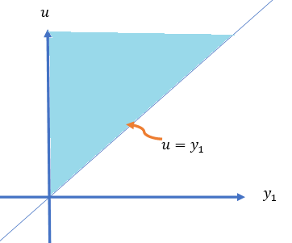
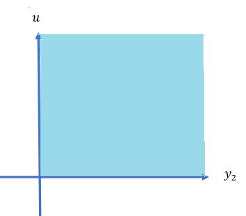
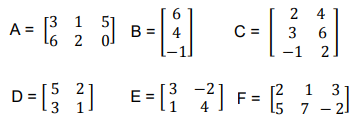
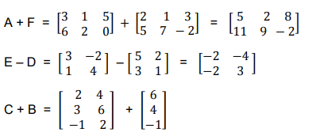
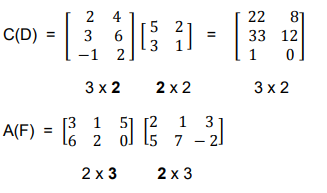
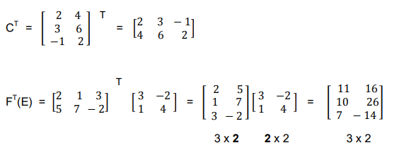

```{=html}
<style type="text/css">

div#TOC li {
    list-style:none;
    background-image:none;
    background-repeat:none;
    background-position:0;
}
h1.title {
  font-size: 24px;
  color: DarkRed;
  text-align: center;
}
h4.author { /* Header 4 - and the author and data headers use this too  */
    font-size: 18px;
  font-family: "Times New Roman", Times, serif;
  color: DarkRed;
  text-align: center;
}
h4.date { /* Header 4 - and the author and data headers use this too  */
  font-size: 18px;
  font-family: "Times New Roman", Times, serif;
  color: DarkBlue;
  text-align: center;
}

h1 { /* Header 3 - and the author and data headers use this too  */
    font-size: 20px;
    font-family: "Times New Roman", Times, serif;
    color: darkred;
    text-align: center;
}
h2 { /* Header 3 - and the author and data headers use this too  */
    font-size: 18px;
    font-family: "Times New Roman", Times, serif;
    color: navy;
    text-align: left;
}

h3 { /* Header 3 - and the author and data headers use this too  */
    font-size: 16px;
    font-family: "Times New Roman", Times, serif;
    color: navy;
    text-align: left;
}

</style>
```
```{r setup, include=FALSE}
# code chunk specifies whether the R code, warnings, and output 
# will be included in the output files.
#
if (!require("knitr")) {
   install.packages("knitr")
   library(knitr)
}
#
knitr::opts_chunk$set(echo = TRUE,       
                      warnings = FALSE,   
                      results = TRUE,   
                      message = FALSE,
                      fig.align='center', 
                      fig.pos = 'ht')
```


\

# Introduction

This note discusses the method of transformation for finding the probability distributions of functions of random variables in both univariate and multivariate cases. **Sections 4 and 6 of chapter 6** in the textbook cover these topics.

\

# Univariate Transformation Method

We first derive a general result of the density function of the function of a univariate random variable.

## *Monotonically Increasing Function*

Let $X$ be a continuous random variable with a generic pdf $f(x)$ defined over the domain $c_1 < x < c_2$ and $Y=h(X)$ be a continuous, increasing function of $X$ with inverse function $X=h^{-1} (Y)$ <font color = "red">(*\color{red}which is also increasing*</font>). The objective is to find the probability distribution of $Y$.

By definition, the CDF of $Y$ is defined to be $G(y) = P[Y \le y]$. Next, we will express $G(y)$ in terms of the distribution of $X$ via its density function $f(x)$.

$$
G(y) = P[Y \le y] = P[h(X) \le y] = P[h^{-1}h(X) \le h^{-1}(y)]
$$

$$
=P[X \le h^{-1}(y)]=\int_{c_1}^{h^{-1}(y)} f(x)dx.
$$ The probability density function is given by

$$
g(x) = G^\prime (y) = f(h^{-1}(y))\times [h^{-1}(y)]^\prime.
$$

## *Monotonically Decreasing Function*

Let $X$ be a continuous random variable with a generic pdf $f(x)$ defined over the domain $c_1 < x < c_2$ and $Y=h(X)$ be a continuous, decreasing function of $X$ with inverse function $X=h^{-1} (Y)$ <font color = "blue">(*\color{blue}which is also decreasing*</font>). The objective is to find the probability distribution of $Y$.

By definition, the CDF of $Y$ is defined to be $G(y) = P[Y \le y]$. Next, we will express $G(y)$ in terms of the distribution of $X$ via its density function $f(x)$.

$$
G(y) = P[Y \le y] = P[h(X) \le y] = P[h^{-1}h(X) > h^{-1}(y)]
$$

$$
=P[X > h^{-1}(y)]= 1 - P[X \le h^{-1}(y)] = 1 - \int_{c_1}^{h^{-1}(y)} f(x)dx.
$$

The probability density function is given by

$$
g(x) = G^\prime (y) = -f(h^{-1}(y))\times [h^{-1}(y)]^\prime.
$$

The following definition combines the above two cases.

## Univariate Transformation

Let $X$ be a continuous random variable with generic probability density function $f(x)$ defined over the support $c_1< x < c_2$. And, let $Y=u(x)$ be an **invertible** function of $X$ with inverse function $u^{-1}(x)$. Then, using the change-of-variable technique, the probability density function of $X$. is:

$$
f_Y(y) = f_X(u^{-1}(y))\times \bigg|(u^{-1}(y))^\prime\bigg|
$$

defined over the support $u(c_1) < y < u(c_2)$.

<font color = "red">**\color{red} Example 1**</font>: A process for refining sugar yields up to 1 ton of pure sugar per day, but the actual amount produced, $Y$, is a random variable because of machine breakdowns and other slowdowns. Suppose that $Y$ has a density function given by

$$
\displaystyle f(y) = \begin{cases} 
 2y & \text{if $0 \le y \le 1$}, \\  
 0 & \text{otherwise}.
 \end{cases}
$$

The company is paid at the rate of \$300 per ton for the refined sugar, but it also has a fixed overhead cost of \$100 per day. Thus the daily profit, in hundreds of dollars, is $U = 3Y-1$. Find the probability density function for $U$ using the transformation method.

**Solution**: We now use the above **transformation method** to obtain the density function. Note that $U=u(Y) = 3Y -1$ and $u^{-1}(u) = \frac{u+1}{3}$. Since $[u^{-1}(u)]^\prime = 1/3$, from the definition of the transformation method, we have

$$
f_U(u) = 2\times \frac{u+1}{3}\times \frac{1}{3} = \frac{2(u+1)}{9} \ \ \text{ for } \  -1 \le u \le 2.
$$

The function of the random variable in the above example is defined based on the univariate distribution. We can also use the transformation method to find the distribution based on bivariate distribution.

Let $U = u(Y_1, Y_2)$ be a function of two random variables $Y_1$ and $Y_2$ with joint density function $f(y_1, y_2)$. To find the density of $U$, we follow the steps below.

1.  Fix one of the random variables, say $Y_1 = y_1$, and $U = u(y_1, Y_2)$ is a function of random variable $Y_2$.

2.  If $u(y_1, Y_2)$ is monotonic with respect to $Y_2$, we can use the transformation method to find the density of $U$ that contains $y_1$.

3.  Integrating $y_1$ from the resulting density obtained in 2 to obtain the final density function.

\

<font color = "red">**\color{red} Example 2**</font>: Let $Y_1$ and $Y_2$ have a joint density function given by

$$
\displaystyle f(y_1, y_2) = \begin{cases} 
 e^{-(y_1+y_2)} & \text{if $ y_1 \ge 0, y_2 \ge 0$}, \\  
 0 & \text{otherwise}.
 \end{cases}
$$

Find the density function for $U = Y_1 + Y_2$ using the transformation method.

**Solution**: Let $U=h(y_1, Y_2) = y_1 + Y_2$ be a function of random variable $Y_2$. Obviously, $h(Y_2)$ is increasing in $Y_2$. The inverse of $Y_2 = h^{-1}(u) = u - y_1$ is

$$
h^{-1}(u) = u-y_1  \ \ \text{ and } \ \ \left( h^{-1}(u)\right)^\prime = 1
$$

Therefore,

$$
g(y_1,u) = e^{-[y_1 + h^{-1}(u)]}\times \frac{dh^{-1}(u)}{du} = e^{-u}
$$

for $y_1>0$ and $y_2 >0$, which is equivalent to $y_1 > 0$ and $u-y_1 >0$, which can be rewritten as $0 <y_1 \le u$. $g_1(y_1,u) = 0$, elsewhere. Therefore,

$$
\displaystyle g(y_1, u) = \begin{cases} 
 e^{-u} & \text{if $ 0< y_1 \le u$}, \\  
 0 & \text{otherwise}.
 \end{cases}
$$

Although $y_1$ does not appear in the expression of $g(y_1,u)$,  it is involved in the domain of $g(y_1,u)$. Next, we integrate $y_1$ out of $g(y_1,u)$ to get the density function of $U$. Note that the domain of $g(y_1,u)$ is given by

```{r echo = FALSE, fig.align='center', out.width = '40%'}

```

The final density function is given by

$$
f(u) = \int_{-\infty}^\infty g(y_1,u)dy_1 = \int_0^u e^{-u}dy_1 = e^{-u}\times y_1\Bigg|_0^u = ue^{-u}, \text { for } u \ge 0.
$$

$f(u)=0$ for $u < 0$. Hence the desired density function is given by

$$
\displaystyle f( u) = \begin{cases} 
 ue^{-u} & \text{if $ u \ge 0$}, \\  
 0 & \text{otherwise}.
 \end{cases}
$$

<font color = "red">**\color{red} Example 3**</font>: The joint distribution for the length of life of two different types of components operating in a system was given by

$$
\displaystyle f(y_1,y_2) = \begin{cases} 
 (1/8)y_1e^{-(y_1+y_2)/2} & \text{if $y_1 > 0, y_2 > 0$}, \\  
 0 & \text{otherwise}.
 \end{cases}
$$

The relative efficiency of the two types of components is measured by $U = Y_2/Y_1$. Find the probability density function for U.

**Solution**: Without loss of generality, we fix $Y_2 = y_2$ and define $U = h(Y_1, y_2) = y_2/Y_1$. $U$ is a decreasing function of random variable $Y_1$. The inverse of $h$ and its derivative are $y_1 = h^{-1}(u) = y_2/u$ and $[h^{-1}(u)]^\prime = -y2/u^2$. By using the transformation method, we have

$$
g(u, y_2) = f[h^{-1}(u), y_2]\times [h^{-1}(u)]^\prime = \frac{1}{8}y_1e^{-(y_1+y_2)/2} = \frac{1}{8}\times \frac{y_2}{u}e^{-\frac{(1+u)y_2}{2u}}\times \Bigg|\frac{-y_2}{u^2}\Bigg| 
$$

$$
= \frac{y^2_2}{8u^3}\times e^{-\frac{(1+u)y_2}{2u}} = \frac{\Gamma(3)}{8}\frac{y_2^{3-1}}{\Gamma(3)  \left(\frac{2u}{1+u} \right)^3 \left(\frac{1+u}{2u} \right)^3 u^3}\times e^{-\frac{y_2}{2u/(1+u)}} 
$$

$$
=\frac{\Gamma(3)}{8\left(\frac{1+u}{2u} \right)^3 u^3} \frac{y_2^{3-1}}{\Gamma(3)\left(\frac{2u}{1+u} \right)^3 }\times e^{-\frac{y_2}{2u/(1+u)}} = \Gamma(3)\left(\frac{1}{1+u}\right)^3 \times \frac{y_2^{3-1}}{\Gamma[3]\left(\frac{2u}{1+u} \right)^3 }\times e^{-\frac{y_2}{2u/(1+u)}}
$$

for $y_2 > 0$ and $y_2/u > 0$. Since $Y_1$ and $Y_2$ are both greater than 0, therefore, $u > 0$. Hence, the domain of $g(y_2, u)$ is $y_2 > 0$ and $u > 0$, which is depicted in the following.

```{r echo = FALSE, fig.align='center', out.width = '40%'}

```

Note that

$$
\frac{y_2^{3-1}}{\Gamma[3]\left(\frac{2u}{1+u} \right)^3 }\times e^{-\frac{y_2}{2u/(1+u)}}
$$ is a valid gamma density function of random variable $Y_2$. Therefore, the desired density of $U$ is given by

$$
=\Gamma(3)\left(\frac{1}{1+u}\right)^3 \times \int_0^\infty \frac{y_2^{3-1}}{\Gamma[3]\left(\frac{2u}{1+u} \right)^3 }\times e^{-\frac{y_2}{2u/(1+u)}}dy_2 = 2\left(\frac{1}{1+u}\right)^3, \ \ \text{ for } u > 0.
$$

That is, $$
f_U(u) = \frac{2}{(1+u)^3} \ \ \text{ for } u > 0.
$$

# Review of Concepts Matrices

We have discussed how to find the density of single new random variables defined by a function of one or more random variables with a given (univariate or multivariate) density function. This section discusses the joint distribution of two new random variables defined based on two or more existing random variables with given joint distributions. To discuss these types of joint distribution, we need some basic matrix operations.

## Matrix Operations

A rectangular array of numbers (real numbers in our case), with $n$ rows and $m$ columns, is a matrix. The following are examples of various matrices.

### 

```{r echo = FALSE, fig.align='center', out.width = '40%'}

```

With the above matrices, we perform basic matrix operations in the following

```{r echo = FALSE, fig.align='center', out.width = '40%'}

```

The multiplication of two compatible matrices

```{r echo = FALSE, fig.align='center', out.width = '30%'}

```

The transpose of a matrix is in the following examples

```{r echo = FALSE, fig.align='center', out.width = '60%'}

```

## Jacobian Matrix and Determinant

For ease of representation, we consider the following two functions of $x_1$ and $x_2$.

$$
\left\{
\begin{array}{rrr}
   y_1 & = & f_1(x_1, x_2) \\
   y_2 & = & f_2(x_1, x_2) 
\end{array}
\right.
$$

The Jacobian matrix of the above set of functions is defined by

$$
J(x_1, x_2) = \begin{bmatrix}
\frac{\partial y_1}{\partial x_1} & \frac{\partial y_1}{\partial x_2} \\
\frac{\partial y_2}{\partial x_1} & \frac{\partial y_2}{\partial x_2}  
\end{bmatrix}
$$

The determinant of the above Jacobian matrix (usually called *Jacobian*) is defined by

$$
\Big| J(x_1, x_2) \Big| = \begin{vmatrix}
\frac{\partial y_1}{\partial x_1} & \frac{\partial y_1}{\partial x_2} \\
\frac{\partial y_2}{\partial x_1} & \frac{\partial y_2}{\partial x_2}  
\end{vmatrix} = \frac{\partial y_1}{\partial x_1}\times \frac{\partial y_2}{\partial x_2} - \frac{\partial y_2}{\partial x_1} \times \frac{\partial y_1}{\partial x_2}
$$

<font color = "red">**\color{red} Example 4**</font>: Consider the following two functions of $x$ and $y$: $U = x^2+y^2$ and $V = x^3+y$. Find the Jacobian matrix and determinant of the above two functions.

**Solution**: By the definition of the Jacobian matrix

$$
J_{UV}(x, y) = \begin{bmatrix}
\frac{\partial U}{\partial x} & \frac{\partial U}{\partial y} \\
\frac{\partial V}{\partial x} & \frac{\partial V}{\partial y}  
\end{bmatrix} = \begin{bmatrix}
2x   & 2y \\
3x^2 & 1  
\end{bmatrix}.
$$

The Jacobian determinant is

$$
\Big| J_{UV}(x, y) \Big| = \begin{vmatrix}
2x   & 2y \\
3x^2 & 1  
\end{vmatrix} = 2x\times 1-3x^2\times 2y = 2x-6x^2y.
$$

\

# Bivariate Transformation

The bivariate transformation is a natural generalization of the univariate transformation discussed in the previous note. The idea is to find the joint density function of two new random variables defined based on existing random variables $X$ and $Y$ with a known joint density function. It can also be used to find the distribution of a single function of two random variables discussed in the method of PDF.

## Joint Distribution of Two Functions of RVs

For ease of presentation, we consider the system

$$
\left\{
\begin{array}{rrr}
   U & = & f(X, Y) \\
   V & = & g(X, Y) 
\end{array}\right.
$$

Assume that the above system has a unique solution

$$
\left\{
\begin{array}{rrr}
   X & = & f^{-1}(U, V) \\
   Y & = & g^{-1}(U, V) 
\end{array}\right.
$$

Furthermore, assume that $f^{-1}(U, V)$ and $g^{-1}(U, V)$ have partial derivatives and the corresponding determinant is not equal to zero. That is,

$$
\Big| J(u, v) \Big| = \begin{vmatrix}
\frac{\partial f^{-1}(u, v)}{\partial u} & \frac{\partial f^{-1}(u, v)}{\partial v} \\
\frac{\partial g^{-1}(u, v)}{\partial u} & \frac{\partial g^{-1}(u, v)}{\partial v}  
\end{vmatrix} = \frac{\partial f^{-1}(u, v)}{\partial u}\times \frac{\partial g^{-1}(u, v)}{\partial v} - \frac{\partial g^{-1}(u, v)}{\partial u} \times \frac{\partial f^{-1}(u, v)}{\partial v} \ne 0.
$$

With the above notations and assumptions, the joint density function of $U$ and $V$ is given by

$$
f_{U,V}(u,v) = f_{X,Y}\left(f^{-1}(u, v), g^{-1}(u, v)\right) \times \Big| J(u, v) \Big|.
$$

<font color = "red">**\color{red} Example 5**</font>: $Y_1$ and $Y_2$ were independent exponentially distributed random variables, both with mean $\beta$. We defined $U = Y_1/(Y_1 + Y_2)$ and $V = Y_1 + Y_2$.

(1). Find the joint density function of $U$ and $V$.

(2). Find the marginal functions of $U$ and $V$.

(3). Are $U$ and $V$ independent?

**Solution**: (1) the joint density distribution of $U$ and $V$.

Since $Y_1$ and $Y_2$ are independent and identical exponential distributions with density $$
f_{Y_1}(y_1) = \frac{1}{\beta}e^{-y_1/\beta}
$$

and

$$
f_{Y_2}(y_2) = \frac{1}{\beta}e^{-y_2/\beta}.
$$

The joint distribution of $(Y_1, Y_2)$ is

$$
f_{Y_1Y_2}(y_1,y_2) = \frac{1}{\beta^2}e^{-(y_1+y_2)/\beta}.
$$

Note that $u = f(y_1,y_2)=y_1/(y_1 + y_2)$ and $v = g(y_1, y_2)=Y_1 + Y_2$.

$$
y_1 =uv = f^{-1}(u,v) \ \ \text{ and } \ \ y_2 = v(1-u) = g^{-1}(u, v)
$$

The Jacobian determinant is

$$
\Big| J(u, v) \Big| = \begin{vmatrix}
\frac{\partial f^{-1}(u, v)}{\partial u} & \frac{\partial f^{-1}(u, v)}{\partial v} \\
\frac{\partial g^{-1}(u, v)}{\partial u} & \frac{\partial g^{-1}(u, v)}{\partial v}  
\end{vmatrix}  = \begin{vmatrix}
v  & u \\
-v & 1-u  
\end{vmatrix} = v(1-u)-(-uv) = v
$$

The joint density function of $U$ and $V$ is given by

$$
f_{UV}(u,v) = \frac{1}{\beta^2}e^{-(f^{-1}(u,v)+g^{-1}(u,v))/\beta}\times \Big| J(u, v) \Big|
$$

$$
=\frac{1}{\beta^2}e^{-[uv+v(1-u)]/\beta}\times v = \frac{v}{\beta^2}e^{-v/\beta} = \frac{v^{2-1}}{\beta^2\Gamma(2)}e^{-v/\beta}
$$

Since both $y_1 > 0$ and $y_2 > 0$, therefore, $0 < y_1/(y_2 + y_2) < 1$, hence, $0 < u < 1$ and $v > 0$. The final expression of the joint density function is given by

$$
\displaystyle f_{UV}(u,v) = \begin{cases} 
 \frac{v^{2-1}}{\beta^2\Gamma(2)}e^{-v/\beta} & \text{if $0 < u < 1, v > 0$}, \\  
 0 & \text{otherwise}.
 \end{cases}
$$

(2). Marginal densities of $U$ and $V$.

$$
f_U(u) = \int_0^\infty \frac{v^{2-1}}{\beta^2\Gamma(2)}e^{-v/\beta} dv = 1 \ \ \text{ for } 0 < u < 1.
$$ This means that $U$ is a uniform distribution defined on $(0, 1)$. Similarly,

$$
f_V(v) = \int_0^1 \frac{v^{2-1}}{\beta^2\Gamma(2)}e^{-v/\beta} du = \frac{v^{2-1}}{\beta^2\Gamma(2)}e^{-v/\beta} \int_0^1 du = \frac{v^{2-1}}{\beta^2\Gamma(2)}e^{-v/\beta}.
$$

This implies that $Y$ is a gamma random variable with shape $\alpha = 2$ and scale $\beta$.

(3). Independence between $U$ and $V$.

Since $f_U(u) f_V(v) = \frac{v^{2-1}}{\beta^2\Gamma(2)}e^{-v/\beta} = f_{UV}(u,v)$, $U$ and $V$ are independent.

## Applications of Bivariate Transformations

In this subsection, we use an example to illustrate how to use the bivariate transformation to find a function two random variables.

<font color = "red">**\color{red} Example 6**</font>: Suppose that $Y_1$ and $Y_2$ have an exponential distribution with parameter $\beta$and that $Y_1$ and $Y_2$ are independent. Let $U = Y_1 + Y_2$. Find the probability density function of $U$.

**Solution**: In this example, we use the above bivariate transformation method. We let $V = Y_2$. Then we have new variables $U$ and $V$.

$$
\left\{
\begin{array}{rrrrr}
   U & = & f(Y_1, Y_2) & = & Y_1 + Y_2 \\
   V & = & g(Y_1, Y_2) & = & Y_2.
\end{array}\right.
$$

We can express $Y_1$ and $Y_2$ uniquely in the following form

$$
\left\{
\begin{array}{rrrrr}
   Y_1 & = & f^{-1}(U, V) & = & U - V\\
   Y_2 & = & g^{-1}(U, V) & = & V
\end{array}\right.
$$ 


Note that $Y_1 > 0$ and $Y_2 > 0$ implies that $U > V > 0$.  The Jacobian is given by


$$
\Big| J(u, v) \Big| = \begin{vmatrix}
\frac{\partial f^{-1}(u, v)}{\partial u} & \frac{\partial f^{-1}(u, v)}{\partial v} \\
\frac{\partial g^{-1}(u, v)}{\partial u} & \frac{\partial g^{-1}(u, v)}{\partial v}  
\end{vmatrix}  = \begin{vmatrix}
1  & -1 \\
0 &  1  
\end{vmatrix} = 1.
$$

Since the two gamma distributions are independent, the joint distribution is

$$
f_{Y_1 Y_2}(y_1,y_2) = \frac{1}{\beta^2}e^{-(y_1+y_2)/\beta}, \ \ \ \text{ for } \  \ \ \beta > 0.
$$

Therefore,

$$
f_{UV}(u,v) =  \frac{1}{\beta^2}e^{-(u-v+v)/\beta}
\times 1 =  \frac{1}{\beta^2}e^{-u/\beta},
$$

for $u > v > 0$. Therefore, the distribution of $U$ is given by

$$
f_U(u) = \int_0^u  \frac{1}{\beta^2}e^{-u/\beta} dv 
= \frac{1}{\beta^2}e^{-u/\beta} \int_0^u dv = \frac{1}{\beta^2}ue^{-u/\beta} \ \ \text{ for } \ \ u > 0.
$$

This is a gamma distribution. 


<font color = "red">**\color{red} Example 7**</font>: Suppose that $Y_1$ and $Y_2$ have a gamma distribution with scale parameter $\beta_1$ and $\beta_2$ and shape parameters $\alpha_1$ and $\alpha_2$, respectively. Assume also that $Y_1$ and $Y_2$ are independent. Let $U = Y_1 + Y_2$. Find the probability density function of $U$.

**Solution**: In this example, we use the above bivariate transformation method. We let $V = Y_2$. Then we have new variables $U$ and $V$. We first write the joint density function of ($Y_1, Y_2$) in the following.

$$
f_{Y_1Y_2}(y_1, y_2)=\frac{y_1^{\alpha_1-1}y_2^{\alpha_2-1}}{\Gamma(\alpha_1)\Gamma(\alpha_2)\beta_1^{\alpha_1}\beta_2^{\alpha_2}}e^{-y_1/\beta_1 -y_2/\beta_2}
$$

$$
\left\{
\begin{array}{rrrrr}
   U & = & f(Y_1, Y_2) & = & Y_1 + Y_2 \\
   V & = & g(Y_1, Y_2) & = & Y_2.
\end{array}\right.
$$

We can express $Y_1$ and $Y_2$ uniquely in the following form

$$
\left\{
\begin{array}{rrrrr}
   Y_1 & = & f^{-1}(U, V) & = & U - V\\
   Y_2 & = & g^{-1}(U, V) & = & V
\end{array}\right.
$$ 

where $u > v > 0$. The Jacobian determinant of the bivariate transformation is $det|J| = 1$ Therefore, the joint distribution of ($U, V$) is given by

$$
f_{UV}(u,v) = \frac{(u-v)^{\alpha_1-1}v^{\alpha_2-1}}{\Gamma(\alpha_1)\Gamma(\alpha_2)\beta_1^{\alpha_1}\beta_2^{\alpha_2}}e^{-(u-v)/\beta_1 -v/\beta_2}
$$
The distribution of $U$ is 

$$
f_U(u) = \int_0^u \frac{(u-v)^{\alpha_1-1}v^{\alpha_2-1}}{\Gamma(\alpha_1)\Gamma(\alpha_2)\beta_1^{\alpha_1}\beta_2^{\alpha_2}}e^{-(u-v)/\beta_1 -v/\beta_2} dv
$$

If $\beta_1 = \beta_2 = \beta$, the above density can be re-written as

$$
f_U(u) = \int_0^u \frac{(u-v)^{\alpha_1-1}v^{\alpha_2-1}}{\Gamma(\alpha_1)\Gamma(\alpha_2)\beta^{\alpha_1+\alpha_2}}e^{-u/\beta } dv = \frac{e^{-u/\beta }}{\Gamma(\alpha_1)\Gamma(\alpha_2)\beta^{\alpha_1+\alpha_2}} \int_0^u (u-v)^{\alpha_1-1}v^{\alpha_2-1} dv
$$
Note that

$$
=\int_0^u (u-v)^{\alpha_1-1}v^{\alpha_2-1} dv = u^{\alpha_1+\alpha_2-1}\int_0^u\frac{(u-v)^{\alpha_1-1}}{u^{\alpha_1-1}}\frac{v^{\alpha_2-1}}{u^{\alpha_2-1}}d\frac{v}{u}
$$

$$
=u^{\alpha_1+\alpha_2-1}\int_0^u \left(1-\frac{v}{u} \right)^{\alpha_1-1} \left(\frac{v}{u}\right)^{\alpha_2-1}d \left(\frac{v}{u}\right).
$$

We change variable $w = v/u$ and obtain

$$
=u^{\alpha_1+\alpha_2-1}\int_0^1 \left(1-w \right)^{\alpha_1-1} w^{\alpha_2-1}d w = u^{\alpha_1+\alpha_2-1} B(\alpha_1, \alpha_2) = u^{\alpha_1+\alpha_2-1}\frac{\Gamma(\alpha_1)\Gamma(\alpha_2)}{\Gamma(\alpha_1+\alpha_2)}.
$$
Therefore, the above density function of $U$ can be re-written as

$$
f_U(u)= \frac{e^{-u/\beta }}{\Gamma(\alpha_1)\Gamma(\alpha_2)\beta^{\alpha_1+\alpha_2}} \int_0^u (u-v)^{\alpha_1-1}v^{\alpha_2-1} dv
$$

$$
= \frac{e^{-u/\beta }}{\Gamma(\alpha_1)\Gamma(\alpha_2)\beta^{\alpha_1+\alpha_2}}\times u^{\alpha_1+\alpha_2-1}\frac{\Gamma(\alpha_1)\Gamma(\alpha_2)}{\Gamma(\alpha_1+\alpha_2)}.  
$$

After simplification, we have

$$
f_U(u) = \frac{u^{\alpha_1+\alpha_2-1}}{\Gamma(\alpha_1+\alpha_2)\beta^{\alpha_1+\alpha_2}} e^{-u/\beta}.
$$

$U$ is a gamma random variable with shape parameter $\alpha_1 + \alpha_2$ and scale parameter $\beta$.


