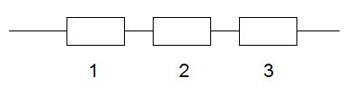
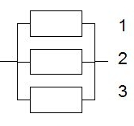
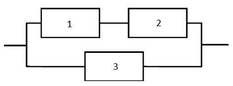

```{=html}
<style type="text/css">

div#TOC li {
    list-style:none;
    background-image:none;
    background-repeat:none;
    background-position:0;
}
h1.title {
  font-size: 24px;
  color: DarkRed;
  text-align: center;
}
h4.author { /* Header 4 - and the author and data headers use this too  */
    font-size: 18px;
  font-family: "Times New Roman", Times, serif;
  color: DarkRed;
  text-align: center;
}
h4.date { /* Header 4 - and the author and data headers use this too  */
  font-size: 18px;
  font-family: "Times New Roman", Times, serif;
  color: DarkBlue;
  text-align: center;
}

h1 { /* Header 3 - and the author and data headers use this too  */
    font-size: 20px;
    font-family: "Times New Roman", Times, serif;
    color: darkred;
    text-align: center;
}
h2 { /* Header 3 - and the author and data headers use this too  */
    font-size: 18px;
    font-family: "Times New Roman", Times, serif;
    color: navy;
    text-align: left;
}

h3 { /* Header 3 - and the author and data headers use this too  */
    font-size: 16px;
    font-family: "Times New Roman", Times, serif;
    color: navy;
    text-align: left;
}

</style>
```
```{r setup, include=FALSE}
# code chunk specifies whether the R code, warnings, and output 
# will be included in the output files.
#
if (!require("knitr")) {
   install.packages("knitr")
   library(knitr)
}
#
knitr::opts_chunk$set(echo = TRUE,       
                      warnings = FALSE,   
                      results = TRUE,   
                      message = FALSE,
                      fig.align='center', 
                      fig.pos = 'ht')
```


\

# Introduction and Motivation

This note discusses the method of transformation for finding the probability distributions of functions of random variables in both univariate and multivariate cases. **Section 7 of chapter 6** in the textbook covers these topics.


**A Motivational Example**: Consider a n-component reliability system in which the component lifetimes $\{ X_1, X_2, \cdots, X_n \}$ are exponential random variables with rate parameters $\lambda_1, \lambda_2, \cdots, \lambda_n$, respectively. We can define the <font color = "red">**\color{red} order statistics**</font> in the following

$X_{(1)} = \min \{X_1, X_2, \cdots, X_n \}$

$X_{(2)} = \text{ the 2nd smallest of } X_1, X_2, \cdots, X_n$

$X_{(3)} = \text{ the 3rd smallest of } X_1, X_2, \cdots, X_n$

$\cdots \cdots \cdots \cdots \cdots\cdots$

$X_{(n)} = \max \{X_1, X_2, \cdots, X_n \}$

The general objective is to find the distribution of $X_{(i)}$ for $i = 1, 2, \cdots, n$. Since order statistic $X_{(i)}$ is defined on the set of all existing random variables $\{ X_1, X_2, \cdots, X_n \}$, So $X_{(i)}$ is a function of $\{ X_1, X_2, \cdots, X_n \}$. In this note, we will discuss some special order statistics.


\

# Distribution of Minimum Statistic **$X_{(1)}$**

In a reliability system, a series system needs all of its components to function for the system itself to be functional. Assuming the serial system has $n$ independent components with corresponding lifetimes $\{ X_1, X_2, \cdots, X_n \}$. In this situation, the lifetime of a serial system is  $X_{(1)} = \min \{X_1, X_2, \cdots, X_n \}$. We next derive the distribution of $X_{(1)}$ so we can calculate the mean, variance, and other numeric measures of $X_{(1)}$.


```{r echo = FALSE, fig.align='center', out.width = '50%'}

```


<font color = "darkred">**\color{red}Example 1**</font> Consider an <font color = "red"> **\color{red} independent**</font> n-component series system in which the component lifetimes $\{ X_1, X_2, \cdots, X_n \}$ are exponential random variables with rate parameters rates $\lambda_i$ for $i = 1,2, \cdots, \lambda_n$. Let $Y$ denote the lifetime that the system fails. What is the distribution of $Y$?

**Solution**: Since the density function of $i$-th component's lifetime is given by

$$
f_i(x) = \lambda_i e^{-\lambda x}, \ \ \ \text{ for } \ \ x > 0.
$$

Its CDF is given by

$$
F_i(x) = 1 - e^{-\lambda_i x}.
$$

Using the CDF method, we derive the distribution of $Y_{(1)}$ as follows.

$$
f_{Y_{(1)}}(y) = P[Y_{(1)} \le y] = P[\min \{X_1, X_2, \cdots, X_n \} \le y] = 1-P[\min \{X_1, X_2, \cdots, X_n \} > y]
$$

Since the smallest lifetime is bigger than $y$, therefore,  every $X_i$ is greater than $Y$. Equivalently, event $\min \{X_1, X_2, \cdots, X_n \} > y$ is identical to $\{X_1 >y \cap X_2 >y \cap \cdots \cap X_n >y\}$. Using the assumption that the components' lifetimes are independent, we have

$$
P[\min \{X_1, X_2, \cdots, X_n \} > y] = P[X_1 >y \cap X_2 >y \cap \cdots \cap X_n >y] 
$$

$$
= P[X_1 >y] \times P[ X_2 >y] \times  \cdots \times P[ X_n >y] = \big(1-P[X_1 \le y]\big) \times \big( 1-P[ X_2 >y]\big) \times  \cdots \times \big( 1- P[ X_n >y] \big)
$$

$$
= \big(1-[1-e^{-\lambda_1y}]\big) \times \big( 1-[1-e^{-\lambda_2y}]\big) \times  \cdots \times \big( 1- [1-e^{-\lambda_ny}] \big) = e^{-\lambda_1y}\times e^{-\lambda_2y}\times  \cdots \times e^{-\lambda_ny} = e^{-(\lambda_1 + \lambda_2 + \cdots + \lambda_n)y}.
$$

Hence, the CDF of $Y_{(1)}$ is given by

$$
F_{Y_{(1)}}(y) = 1 - e^{-(\lambda_1 + \lambda_2 + \cdots + \lambda_n)y}.
$$

The corresponding PDF is given by

$$
f_{Y_{(1)}}(y) = (\lambda_1 + \lambda_2 + \cdots + \lambda_n) e^{-(\lambda_1 + \lambda_2 + \cdots + \lambda_n)y}.
$$

We can see that the minimum statistics is also an exponential distribution with rate $\lambda = \lambda_1 + \lambda_2 + \cdots + \lambda_n$. 


<font color = "darkred">**\color{red}Example 2**</font>: We now look at a numerical example. Consider a 3-component **series system**: where each component has an exponential lifetime with rates $0.2, 0.3$, and $0.5$, respectively. Find the probability that the system fails in one unit of time.

**Solution**: From the result of the above example, the time to failure of the series system is $Y_{(1)}$ that has distribution 

$$
F_{Y_{(1)}} (y) = 1 - e^{-(0.1 + 0.2 + 0.5)y} = 1 - e^{-y}.
$$

The probability that the system fails in one unit of time is given by

$$
P(Y_{(1)} < 1) = 1-e^{-1} \approx 0.632.
$$


# Distribution of Minimum Statistic **$X_{(m)}$**


We also use a reliability system as an example. A parallel system is one that <font color = "red">*\color{red}needs only one of its components to function in order for the system itself to be functional* </font>. Assuming the parallel system has $n$ independent components with corresponding lifetimes $\{ X_1, X_2, \cdots, X_n \}$. In this situation, the lifetime of a serial system is  $X_{(n)} = \max \{X_1, X_2, \cdots, X_n \}$. We next derive the distribution of $X_{(n)}$ so we can calculate the mean, variance, and other numeric measures of $X_{(n)}$.


```{r echo = FALSE, fig.align='center', out.width = '35%'}

```


<font color = "darkred">**\color{red}Example 3**</font> Consider an <font color = "red"> **\color{red} independent**</font> n-component **parallel** system in which the component lifetimes $\{ X_1, X_2, \cdots, X_n \}$ are exponential random variables with rate parameters rates $\lambda_i$ for $i = 1,2, \cdots, \lambda_n$. Let $Y$ denote the lifetime that the system fails. What is the distribution of $Y$?

**Solution**: Since the density function of $i$-th component's lifetime is given by


$$
f_i(x) = \lambda_i e^{-\lambda x}, \ \ \ \text{ for } \ \ x > 0.
$$

Its CDF is given by

$$
F_i(x) = 1 - e^{-\lambda_i x}.
$$

Using the CDF method, we derive the distribution of $Y_{(1)}$ as follows.

$$
f_{Y_{(n)}}(y) = P[Y_{(n)} \le y] = P[\max \{X_1, X_2, \cdots, X_n \} \le y] 
$$

Since the largest lifetime is less than $y$, therefore,  every $X_i$ is less than $Y$. Equivalently, event $\max \{X_1, X_2, \cdots, X_n \} \le y$ is identical to $\{X_1 \le y \cap X_2 \le y \cap \cdots \cap X_n \le y\}$. Using the assumption that the components' lifetimes are independent, we have

$$
P[\max \{X_1, X_2, \cdots, X_n \} \le y] = P[X_1  \le y \cap X_2 \le y \cap \cdots \cap X_n \le y] 
$$

$$
= P[X_1 \le y] \times P[ X_2 \le y] \times  \cdots \times P[ X_n \le y] =[1-e^{-\lambda_1y}]\times [1-e^{-\lambda_2y}]\times \cdots \times [1-e^{-\lambda_ny}].
$$

Therefore,

$$
F_{Y_{(n)}}(y) = [1-e^{-\lambda_1y}]\times [1-e^{-\lambda_2y}]\times \cdots \times [1-e^{-\lambda_ny}].
$$


<font color = "darkred">**\color{red}Example 4**</font>: We now modify the system we discussed in **Example 2**. Consider a 3-component **parallel system**: where each component has an exponential lifetime with rates $0.2, 0.3$, and $0.5$, respectively. Find the probability that the system fails in one unit of time.


**Solution**: We use the $CDF$ derived in the above **example 3**

$$
F_{Y_{(3)}}(y) = [1-e^{-0.2y}]\times [1-e^{-0.3y}]\times [1-e^{-0.5y}].
$$

The probability that the system fails in one unit of time is given by

$$
P(Y_{(1)} < 1) = [1-e^{-0.2}]\times [1-e^{-0.3}]\times [1-e^{-0.5}] \approx 0.0185.
$$

This means the probability the parallel system's lifetime is less than one unit of time is 1.85\%, that much less 63.2\% for a series system.


# Combined Reliability System

We have discussed the simplest reliability systems: series and parallel systems. The actual reliability systems usually consist of combined series and parallel components. For example, the following figure depicts a system with both series and parallel components.


```{r echo = FALSE, fig.align='center', out.width = '35%'}

```


We now use the derived CDF in Sections 1 and 2 to derive the lifetime distribution of the combined system shown in the above system.

<font color = "darkred">**\color{red}Example 5**</font>: Consider the above combined system. Let $\{X_1, X_2, X_3 \}$ be the random variables representing lifetimes of three **independent components** in the above system respectively. Assume also that all three systems follow the same exponential distributions with rates $\lambda_1, \lambda_2$, and $\lambda_3$, respectively. Find the probability distribution of lifetime.

**Solution**: First we know that the lifetime of the above combined three-component system $Y= \max \{ \min\{X_1, X_2 \}, X_3 \}$ (think about why?). The CDF of $Y$ is defined to be

$$
F_Y(y) = P[Y \le y] = P[\max \{ \min\{X_1, X_2 \}, X_3 \}  \le y] = P[ \min\{X_1, X_2 \} \le y \cap X_3 \le y]
$$

$$
= P[ \min\{X_1, X_2 \} \le y] \times P[ X_3 \le y] = \left( 1 - P[\min\{X_1, X_2 \} > y] \right) \times P[ X_3 \le y]
$$

$$
= \left( 1 - P[X_1 >y]\times P[X_2 \} > y] \right) \times P[ X_3 \le y]
$$

$$
=\bigg( 1 - [1-e^{-\lambda_1 y}]\times [1-e^{-\lambda_2 y}] \bigg) \times \bigg( 1-\lambda_2 e^{-\lambda_3 y}\bigg)
$$


$$
=\bigg(e^{-\lambda_1y} + e^{-\lambda_2 y} - e^{-(\lambda_1 + \lambda_2)y} \bigg)\bigg( 1- e^{-\lambda_3 y}\bigg).
$$

Next, we modify examples 2 and 4 with numerical rates.


<font color = "darkred">**\color{red}Example 6**</font>:  Consider the above 3-component **combined system**: where each component has an exponential lifetime with rates $\lambda_1 =0.2, \lambda_2 = 0.3$ and $\lambda_3 =0.5$, respectively. Find the probability that the system fails in one unit of time.


**Solution**: Using the above derived CDF of the combined system, we 

$$
P[Y \le 1] = \bigg(e^{-0.2} + e^{-0.3} - e^{-(0.2 + 0.3)} \bigg)\bigg( 1- e^{-0.5}\bigg) \approx 0.375.
$$

The probability that the combined system fails in one unit of time is about 37.5\%, as expected, that is between 1.85\% (for the parallel system) and 63.2\% (for the series system).


